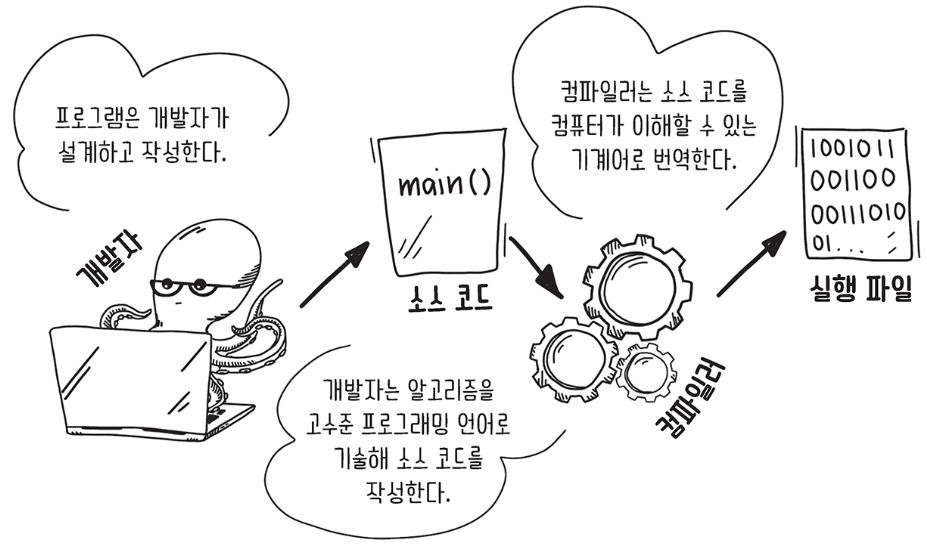
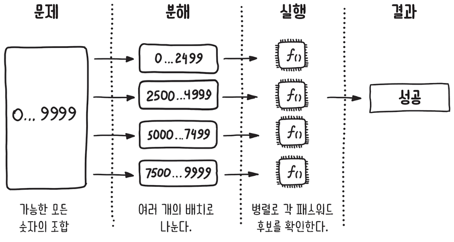
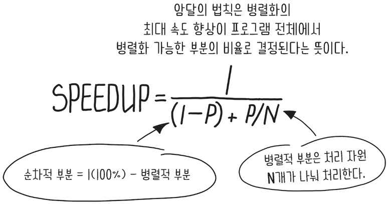
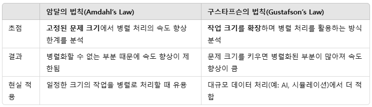
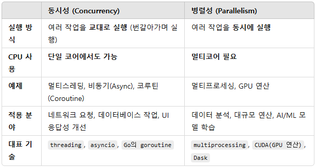
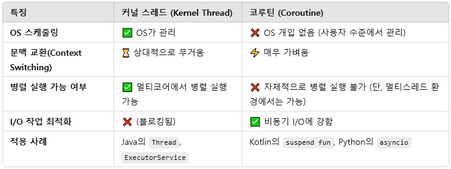
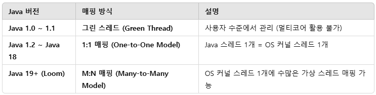

# 순차 실행과 병렬 실행

## 1. 프로그램

개발자는 프로세서에게 수행시키려는 작업을 프로그래밍 언어로 기술한다. 그러나 CPU는 프로그래밍 언어를 곧바로 이해할 수 없다. 그래서 소스 코드를 먼저 CPU가 이해할 수 있는 기계어로 번역해야 한다. 이 번역 과정은 컴파일러(compiler)라는 특별한 프로그램이 맡는다. 컴파일러는 번역 결과물로 실행 파일(executable)을 내놓는데, 이 파일은 CPU가 이해하고 실행할 수 있는 기계어 명령으로 쓰여 있다.

 - CPU가 여러 명령을 다루는 가장 기본적인 방식은 순차 실행이다.

<div align="center">
    
</div>
<br/>

## 2. 순차 컴퓨팅

 - __장점(단순성)__
    - 명확하며 예측이 가능한 개념으로 일반적으로 쓰인다.
    - 이전 단계가 실행됐는지 확인할 필요가 없다. 이전 작업이 끝나야 현재 작업이 실행된다.
 - __단점(오버헤드)__
    - 시스템의 가용 자원을 모두 사용하지 않아 효율성이 떨어지거나 불필요한 비용이 발생한다.

<br/>

## 3. 병렬 컴퓨팅을 위해 필요한 것

 - __작업 독립성__
    - 여러 처리 자원이 작업을 임의의 순서로 처리해도 결과가 동일해야 한다. (여러 개의 서로 독립적인 작업)
    - 모든 프로그램이나 알고리즘이 독립적인 작업만으로 구서오댔을 리는 없다. 일부 작업은 독립적이지만, 이전 작업의 실행이 필요한 작업도 섞여 있다. 이런 경우 개발자가 서로 의존적인 작업의 순서를 맞춰 동기화 해야 정확한 처리 결과를 얻을 수 있다. 동기화는 다른 작업에 의존하는 작업의 실행을 잠시 블로킹하고 자신이 의존하는 작업이 끝날 때 까지 대기시킨다는 뜻이다.
 - __하드웨어 지원__
    - 여러 개의 처리 자원을 갖춘 하드웨어가 있어야 한다.
    - 두 개 이상의 처리 자원을 갖추고 있지 못하면 실질적인 병렬성을 달성할 수 없다.

<br/>

## 4. 병렬 컴퓨팅

FBI의 IT 부서에서 세계를 파괴하려는 시스템에 접근하기 위한 패스워드를 깨는 임무를 진행한다.

패스워드를 찾는 기본적인 방법은 예상 패스워드를 추측하고, 이를 해시화한 다음, 시스템에 저장된 패스워드 해시와 비교하는 과정을 반복 수행(브루트 포스)하는 것이다. 여기서 패스워드의 암호화 해시를 이미 확보했다고 가정한다.

 - 무차별 대입 공격은 가능한 모든 조합의 목록을 만들고 이 목록의 요소를 일일이 대입해 해답을 찾는 일반적인 해법이다.

```python
#!/usr/bin/env python3.9

"""숫자로만 이루어진 비밀번호를 브루트 포스 방식으로 순차적으로 크랙하는 프로그램"""

import time
import math
import hashlib
import typing as T


def get_combinations(*, length: int, min_number: int = 0,
                     max_number: T.Optional[int] = None) -> T.List[str]:
    """주어진 길이의 숫자 비밀번호 조합을 생성"""
    combinations = []
    if not max_number:
        # 최대 숫자 계산 (예: 길이가 3이면 999까지)
        max_number = int(math.pow(10, length) - 1)

    # min_number부터 max_number까지 숫자를 문자열로 변환하여 저장
    for i in range(min_number, max_number + 1):
        str_num = str(i)
        # 비밀번호 길이를 맞추기 위해 앞쪽에 0 채우기
        zeros = "0" * (length - len(str_num))
        combinations.append("".join((zeros, str_num)))
    return combinations


def get_crypto_hash(password: str) -> str:
    """비밀번호의 SHA-256 해시값을 계산"""
    return hashlib.sha256(password.encode()).hexdigest()


def check_password(expected_crypto_hash: str,
                   possible_password: str) -> bool:
    """해시값을 비교하여 비밀번호가 일치하는지 확인"""
    actual_crypto_hash = get_crypto_hash(possible_password)
    return expected_crypto_hash == actual_crypto_hash


def crack_password(crypto_hash: str, length: int) -> None:
    """브루트 포스 방식으로 비밀번호 크랙"""
    print("비밀번호 조합을 순차적으로 시도 중...")
    start_time = time.perf_counter()  # 시작 시간 기록

    # 가능한 모든 비밀번호 조합 생성
    combinations = get_combinations(length=length)
    
    # 생성된 조합을 하나씩 해시값과 비교
    for combination in combinations:
        if check_password(crypto_hash, combination):
            print(f"비밀번호 찾음: {combination}")
            break

    # 총 실행 시간 출력
    process_time = time.perf_counter() - start_time
    print(f"총 실행 시간: {process_time:.4f}초")


if __name__ == "__main__":
    # 해시화된 정답 비밀번호 (예제)
    crypto_hash = \
        "e24df920078c3dd4e7e8d2442f00e5c9ab2a231bb3918d65cc50906e49ecaef4"
    
    # 비밀번호 길이 설정 (예제에서는 8자리 숫자로 가정)
    length = 8

    # 비밀번호 크랙 실행
    crack_password(crypto_hash, length)
```

### 이 프로그램의 속도를 올리려면 어떻게 해야 할까?

제일 먼저 생각할 수 있는건 CPU의 성능을 올리는 방법이다. CPU의 최고 속도에는 물리적 한계가 있다.

또 다른 방법은 문제를 서로 독립적인 여러 작업으로 나누어 두 개 이상의 처리 자원에 이를 분배한 다음 동시에 실행하는 것이다. 처리 자원이 많고 분해한 작업의 수가 적을수록 처리 속도가 빨라진다.

 - __이 문제를 독립적인 작업으로 분해할 수 있을까?__
    - 패스워드를 하나하나 확인하는 과정을 작업으로 분할하면, 서로 독립적인 작업이 가능하다.
    - 특정 패스워드를 확인하기 전에 먼저 확인해야 하는 후보 같은 것은 없다.
    - 이 작업은 서로 의존하지 않으므로 동기화가 필요한 지점도 없다.

### 문제의 해법

첫 번째 단계는 각 처리 자원에 배정할 패스워드 후보의 범위(청크)를 나누는 단계다.

<div align="center">
    
</div>
<br/>

 - `청크 실행 의사 코드`
```python
ChunkRange = T.Tuple[int, int]

# 정수 범위를 일정한 크기의 청크로 나누어 병렬 처리할 수 있도록 분할
def get_chunks(num_ranges: int, length: int) -> T.Iterator[ChunkRange]:
    max_number = int(math.pow(10, length) - 1)  # 가능한 최대 숫자 계산
    # 각 청크의 시작 값 계산
    chunk_starts = [int(max_number / num_ranges * i) for i in range(num_ranges)]
    # 각 청크의 종료 값 계산 (다음 청크 시작 - 1, 마지막 청크는 max_number)
    chunk_ends = [start_point - 1 for start_point in chunk_starts[1:]] + [max_number]
    return zip(chunk_starts, chunk_ends)  # (시작, 종료) 범위 튜플 반환

# 병렬로 비밀번호 크랙 수행
def crack_password_parallel(crypto_hash: str, length: int) -> None:
    num_cores = cpu_count()  # 사용 가능한 CPU 코어 수
    chunks = get_chunks(num_cores, length)  # 코어 개수만큼 청크 생성

    # 각 청크에 대해 병렬로 크랙 실행
    for chunk_start, chunk_end in chunks:
        crack_chunk(crypto_hash, length, chunk_start, chunk_end)
```

 - `전체 코드`
```python
import math
import hashlib
import typing as T
from multiprocessing import cpu_count, Process

ChunkRange = T.Tuple[int, int]


def get_chunks(num_ranges: int, length: int) -> T.Iterator[ChunkRange]:
    """전체 숫자 범위를 여러 개의 청크로 나누기"""
    max_number = int(math.pow(10, length) - 1)
    chunk_starts = [int(max_number / num_ranges * i) for i in range(num_ranges)]
    chunk_ends = [start_point - 1 for start_point in chunk_starts[1:]] + [max_number]
    return zip(chunk_starts, chunk_ends)


def get_crypto_hash(password: str) -> str:
    """SHA-256 해시값을 계산"""
    return hashlib.sha256(password.encode()).hexdigest()


def check_password(expected_crypto_hash: str, possible_password: str) -> bool:
    """비밀번호의 해시값이 일치하는지 확인"""
    return expected_crypto_hash == get_crypto_hash(possible_password)


def crack_chunk(crypto_hash: str, length: int, chunk_start: int, chunk_end: int) -> None:
    """특정 범위에서 비밀번호를 브루트 포스 방식으로 크랙"""
    print(f"Processing range {chunk_start} to {chunk_end}...")

    for i in range(chunk_start, chunk_end + 1):
        possible_password = str(i).zfill(length)  # 앞에 0을 채워 고정된 길이 유지
        if check_password(crypto_hash, possible_password):
            print(f"PASSWORD CRACKED: {possible_password}")
            return  # 비밀번호를 찾으면 종료


def crack_password_parallel(crypto_hash: str, length: int) -> None:
    """멀티프로세싱을 활용해 병렬로 비밀번호 크랙"""
    num_cores = cpu_count()  # 사용 가능한 CPU 코어 수
    chunks = get_chunks(num_cores, length)

    processes = []

    # 각 범위를 독립적인 프로세스로 실행
    for chunk_start, chunk_end in chunks:
        process = Process(target=crack_chunk, args=(crypto_hash, length, chunk_start, chunk_end))
        processes.append(process)
        process.start()

    # 모든 프로세스가 종료될 때까지 대기
    for process in processes:
        process.join()
```

<br/>

## 5. 암달의 법칙

암달의 법칙(Amdahl’s Law)은 병렬 컴퓨팅에서 성능 향상의 한계를 설명하는 법칙입니다. 즉, 프로그램의 일부를 병렬화한다고 해도, 병렬화할 수 없는 부분(순차 실행 부분)이 전체 성능 향상을 제한하게 된다는 개념입니다.


### 병렬 알고리즘에도 순차적인 부분이 일부 있다.

예를 들어 많은 양의 색인 카드가 있다고 가정한다. 이때 동시성과 관련된 단어가 쓰인 카드만을 골라 따로 모아두려고 한다. 

이떄 카드를 여러 무더기로 나누어 한 사람씩 주고 카드를 찾으려고 한다. 동시성과 관련된 단어가 쓰인 카드를 찾으면 다른 사람들에게 이를 알리고 찾은 카드를 따로 모아둔다.

카드를 찾을 인원을 늘리면 속도를 늘릴 수 있지만, 순차적인 부분은 속도를 높일 수 없기 때문에 처리 자원을 늘려도 소용이 없다. 즉, __병렬 컴퓨팅을 적용할 수 있는 최고 속도가 프로그램의 순차적 부분에 의해 제약을 받는다.__

순차적인 부분이 프로그램 전체의 2/3라면 아무리 많은 프로세서를 추가하더라도 1.5배 이상의 속도 향상을 얻을 수 없다.

 - 카드 무더기를 여러 개로 나누어 한 사람당 하나씩 배정한다. (순차적)
 - 모두가 동시성과 관련된 카드를 찾기 시작한다. (병렬적)
 - 동시성과 관련된 카드를 찾으면 따로 모아둔다. (순차적)

<div align="center">
    
</div>
<br/>

알고리즘의 오버헤드가 없다고 가정했을 때 프로세서 2,500개로 100배의 성능 향상을 얻으려면 프로그램의 병렬적 부분의 비율은 얼마나 되어야 할까? 암달의 법칙으로 S를 계산하면 프로그램에서 순차적인 부분은 1% 이하여야 한다는 결과가 나온다.

__암달의 법칙은 프로그램을 병렬화하는 이익이 어느 정도인가를 간단히 가늠해 볼 수 있는 편리한 도구이다.__

 - 순차 실행 부분(병렬화 불가능한 부분)이 크면 병렬 성능 향상이 제한됨
    - 예를 들어, P가 50%(즉, 프로그램의 절반이 순차 실행)인 경우, 아무리 많은 코어를 추가해도 성능 향상은 최대 2배를 넘을 수 없음
 - 코어 수가 많아도 일정 수준 이상에서 성능 향상이 둔화됨
    - N이 증가해도, 순차 실행 부분이 존재하는 한 무한한 성능 향상은 불가능

<br/>

## 6. 구스파트슨의 법칙

암달의 법칙은 문제의 크기는 고정한 채 병렬 프로그램의 실행 시간이 얼마나 줄어드는지만 다룬다. 그러나 실행 시간을 상수로 고정하고 문제의 크기를 증가시켜도 실행 속도(처리율)의 증가를 관찰할 수 있다. 구스타프슨의 법칙(Gustafson’s Law)은 암달의 법칙(Amdahl's Law)의 한계를 극복하는 개념으로, 병렬화의 효과를 더 현실적으로 분석하는 법칙이다.

 - 암달의 법칙: 순차 실행 부분(α) 때문에 병렬화의 한계가 있다
 - 구스타프슨의 법칙: 작업 크기(병렬화할 수 있는 부분)를 증가시키면 성능 향상이 계속된다

<div align="center">
    
</div>
<br/>

## 7. 동시성 vs 병렬성

일반적으로 동시(concurrent)와 병렬(parallel)은 대부분 서로 동의어로 쓰인다. 하지만, 동시 프로그래밍과 병렬 프로그래밍은 잘 구별해서 써야 한다. 이 두가지는 서로 다른 개념적 수준에서 다른 목표를 추구하기 때문이다.

 - __동시성__
    - 여러 작업을 시작, 실행, 완료하는 과정이 서로 중첩된 시간에서 특별히 정해진 순서 없이 일어나는 것
 - __병렬성__
    - 여러 작업을 여러 컴퓨팅 자원을 이용해 병렬로 동시에 실행하는 것
    - 작업을 물리적으로 동시 실행하는 것이므로 처리 자원을 여러 개 갖춘 하드웨어가 필요하다.

동시 계산은 결과의 정확도를 해치지 않는 선에서 병렬화할 수 있지만, 동시성 그 자체는 병렬성을 담보하지 않는다. 병렬성 역시 그 자체로는 동시성을 담보하지 않는다.

동시성은 여러 가지를 한 번에 다루는 것이지만, 병렬성은 여러 가지 일을 동시에 하는 것이다.

__싱글 코어 CPU만으로는 동시성은 달성할 수 있어도 병렬성은 달성할 수 없다.__ 하지만 동시성과 병렬성 모두, 동시에 두 가지 이상의 일이 일어날 수 있다는 점에서 고전적인 순차 모형을 넘어선 것이라 할 수 있다.

 - 애플리케이션은 동시적이지만 병렬적이지 않을 수 있다. 일정한 시간 동안 두 가지 이상의 일을 처리한다. (동시에 하지 않더라도 두 가지 일을 번갈아가며 할 수 있다.)
 - 애플리케이션은 병렬적이지만 동시적이지 않을 수 있다. 단일 작업의 하위 작업 여러 개를 동시에 처리하는 경우가 이에 해당한다.
 - 애플리케이션은 병렬적이지도 동시적이지도 않을 수 있다. 한 번에 한 가지 작업을 순차적으로 처리하며, 이 작업을 구성하는 하위 작업이 없을 때 해당한다.
 - 애플리케이션은 병렬적이면서 동시적일 수 있다. 여러 개의 작업을, 또는 단일 작업의 하위 작업 여러 개를 동시에 처리할 때 해당한다.

<div align="center">
    <br/>
    
</div>

## 8. Java & Kotlin

### Java Thread(스레드)

Java의 Thread는 OS가 관리하는 커널 스레드이기 때문에, 만약 멀티코어 CPU 환경이라면, OS가 여러 개의 스레드를 각각 다른 CPU 코어에서 실행할 수도 있습니다.

 - __멀티코어 환경__
    - OS 스케줄러가 스레드를 여러 개의 CPU 코어에 분배하면, 진짜 병렬 실행(Parallelism)이 가능함.
    - 하지만 Java의 Thread 자체는 병렬 처리를 강제하지 않음, OS가 결정하는 부분임.
 - __병렬 실행이 보장되는 방법__
    - 멀티프로세싱 (예: ProcessBuilder, ForkJoinPool)
    - 병렬 스트림 (Parallel Stream): Java의 parallelStream()은 내부적으로 ForkJoinPool의 Common Pool을 이용하여 여러 개의 스레드를 생성하고, 데이터 처리를 여러 스레드에 분배하여 병렬 실행합니다. 즉, 병렬성(Parallelism)을 활용하는 것입니다.
    - Executor 프레임워크 (Executors.newFixedThreadPool())

### Kotlin Coroutin(코루틴)

코루틴(Coroutine)은 OS가 관리하는 커널 스레드를 사용하지 않습니다. 대신, 사용자 수준(User-Level)에서 실행되는 경량 스레드로 동작하며, OS의 스케줄링을 받지 않습니다.

 - 코루틴은 하나의 스레드에서 여러 작업을 번갈아 실행하므로 동시성(Concurrency) 개념에 속함.
 - 비동기적으로 실행되지만, 실제로 한 번에 하나의 작업만 실행됨 → 병렬 실행이 아님.
 - 싱글스레드 환경 → 동시성만 가능 (asyncio, suspend fun 단독 실행)
 - 멀티스레드 환경 → 병렬성 가능 (Dispatchers.IO, ThreadPoolExecutor 사용)

<div align="center">
    
</div>
<br/>

### Java 버전별 스레드 매핑 방식

 - `Java 1.0 ~ 1.1(Green Thread, 그린 스레드)`
    - __특징__
        - 모든 스레드는 사용자 수준에서 실행 → OS 커널 스레드를 사용하지 않음
        - 멀티코어 활용 불가능 → 모든 스레드가 싱글 코어에서 실행됨
        - JVM이 자체적인 스케줄러를 이용해 스레드를 번갈아 실행 (동시성만 제공, 병렬 실행 불가)
    - __문제점__
        - 멀티코어 환경에서 성능이 낮음 → 코어가 여러 개여도 하나의 코어만 사용
        - I/O 작업 중 스레드가 전체적으로 멈출 수 있음
 - `Java 1.2 ~ Java 18(One-to-One Model, 1:1 매핑)`
    - __특징__
        - OS가 직접 스레드를 관리 → 멀티코어 활용 가능 (병렬 실행 가능)
        - OS의 스케줄러가 컨텍스트 스위칭 수행 → 성능 최적화 가능
        - POSIX 스레드(PThreads) 같은 OS 스레드 라이브러리 활용
    - __문제점__
        - 스레드 생성 비용이 높음 → new Thread()를 실행하면 OS 커널 스레드를 직접 생성해야 함
        - 컨텍스트 스위칭 비용 발생 → OS가 여러 커널 스레드를 관리해야 하므로 스위칭 오버헤드 발생
        - 수많은 스레드를 생성하기 어려움 → OS 커널 스레드 개수 제한이 있음
    - __한계__
        - I/O 바운드 작업에서는 비효율적 → 수천 개의 요청을 처리하려면 그만큼 많은 OS 스레드가 필요하여 메모리 낭비가 심함
 - `Java 19+ ()`
    - __특징__
        - OS 커널 스레드 수와 관계없이 수많은 가상 스레드 생성 가능
        - 컨텍스트 스위칭 비용이 거의 없음 (사용자 수준에서 전환)
        - I/O 바운드 작업에 매우 적합 → 가상 스레드는 블로킹 없이 실행됨
        - Java 19+부터 Thread.ofVirtual() 방식 지원

<div align="center">
    
</div>

