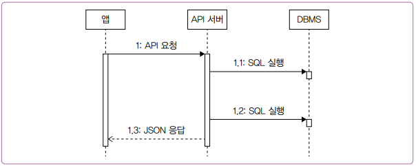
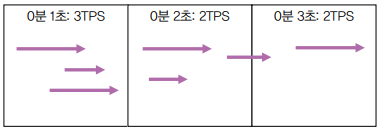
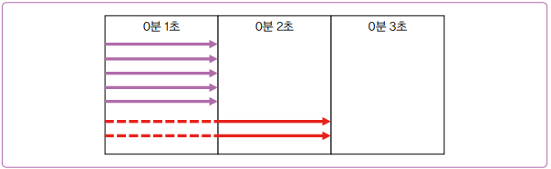
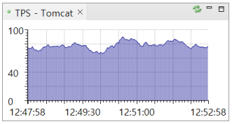
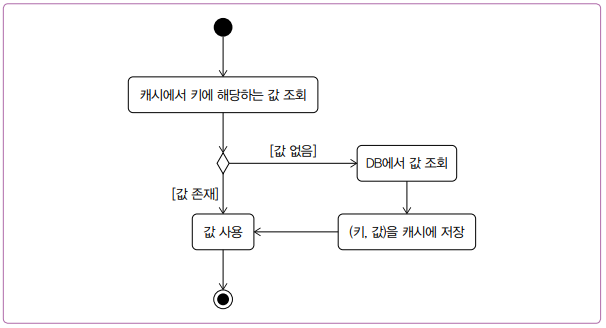
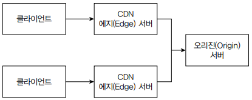

# 느려진 서비스, 어디부터 봐야 할까

## 1. 처리량과 응답 시간

성능이 저하되면 가장 눈에 띄는 현상은 결과가 늦게 표시되는 것이다. 너무 오래 걸려서 타임아웃(시간초과) 에러가 발생하기도 한다.

사용자는 무언가를 실행할 때 동작하기까지 걸린 시간으로 성능을 판단하지만 실제로는 다양한 지표가 성능과 관련되어 있다. 네트워크 속도, 디스크 속도, 메모리 크기, 디바이스의 CPU 속도 등이 여기에 해당한다. 이런 다양한 지표 중에서 서버 성능과 관련 있는 중요한 지표를 2가지 꼽자면 응답 시간과 처리량을 들 수 있다.

### 1-1. 응답 시간

응답 시간은 사용자의 요청을 처리하는 데 걸리는 시간을 의미한다.

<div align="center">
    
</div>
<br/>

 - __클라이언트가 서버로 요청을 보내는 과정은 크게 2단계로 이루어진다.__
    - 서버에 연결: TCP를 이용해서 서버에 연결한다.
    - 데이터 전송: 정해진 규격(프로토콜)에 따라 데이터를 서버에 전송한다.
 - __서버는 로직을 실행한 다음에 응답 데이터를 클라이언트에 전송한다. 응답 시간은 2가지로 나누어 측정하기도 한다.__
    - TTFB(Time to First Byte): 응답 데이터 중 첫 번째 바이트가 도착할 때까지 걸린 시간
    - TTLB(Time to Last Byte): 응답 데이터의 마지막 바이트가 도착할 때까지 걸린 시간
    - 응답 데이터의 크기가 작다면 TTFB와 TTLB의 차이가 크지 않다. 하지만 파일 다운로드처럼 전송할 데이터가 크거나 네트워크 속도가 느리면 차이가 커질 수 있다. 따라서 서버 성능을 올바르게 평가하려면 데이터 특성이나 네트워크 환경을 고려해 TTFB와 TTLB 중 적절한 지표를 선택해 측정해야 한다.
 - __응답 시간은 API 요청 전송 시간, 서버의 처리 시간, API 응답 전송 시간으로 나뉜다.__
    - 로직 수행(if, for 등)
    - DB 연동(SQL 실행)
    - 외부 API 연동
    - 응답 데이터 생성(전송)
    - 대부분 DB 연동과 외부 API 연동 시간에 많은 시간이 들어간다.

<br/>

### 1-2. 처리량

처리량은 단위 시간당 시스템이 처리하는 작업량을 의미하는데 흔히 TPS나 RPS로 처리량을 나타낸다.

TPS는 초당 트랜잭션 수를 의미하는 transaction per second의 약자이고, RPS는 초당 요청 수를 의미하는 request per second의 약자이다. 서버의 성능 지표를 표현할 때 TPS나 RPS를 구분 없이 혼용하기도 한다.

<div align="center">
    
</div>
<br/>


최대 TPS는 시스템이 처리할 수 있는 최대 요청 수를 의미한다. 예를 들어, 서버가 한 번에 5개의 요청을 처리할 수 있다고 가정한다. 이때, 요청당 처리 시간이 1초라면 최대 TPS는 5가 된다. 동시에 들어오는 요청 수가 최대 TPS를 초과하면 서버는 초과한 요청을 나중에 처리한다.

 - 처리 과정
    - 최대 TPS가 5인 서버에 동시에 7개의 요청이 들어오면 이 중 5개만 바로 처리할 수 있다.
    - 나머지 2개는 먼저 실행된 5개의 요청이 끝난 후에야 처리할 수 있다.
    - 사용자 입장에서 나중에 처리된 2개의 요청은 응답 시간이 2초가 된다.
 - 방지하기 위한 2가지 방법
    - 서버가 동시에 처리할 수 있는 요청 수를 늘려 대기 시간 줄이기
    - 처리 시간 자체를 줄여 대기 시간 줄이기

<div align="center">
    
</div>
<br/>

성능을 개선하려면 먼저 현재 서버의 TPS와 응답 시간을 알아야 한다. 막연히 성능이 느리다고 이것저것 시도하면 안 된다. 트래픽이 많은 시간대의 TPS와 응답 시간이 얼마인지 측정하고, 이 결과를 바탕으로 목표 TPS와 응답 시간을 설정하고 효과적인 성능 개선안을 도출해야 한다.

TPS를 확인하는 가장 간단한 방법은 모니터링 시스템을 활용하는 것이다. 스카우터, 핀포인트, 뉴렐릭 같은 도구를 사용하면 실시간 TPS뿐 아니라 과거 특정 시점의 TPS도 확인할 수 있다.

<div align="center">
    
</div>
<br/>

## 2. 서버 성능 개선 기초

### 2-1. 병목 지점

서비스 초기에는 성능 문제가 잘 발생하지 않는다. 사용자 수, 트래픽, 데이터베이스 크기 등이 모두 작기 때문이다. 성능 문제는 사용자가 늘면서 점차 나타난다. 트래픽이 늘고 데이터가 쌓이면서 간헐적으로 응답 시간이 느려지는 현상이 발생한다.

 - `전형적인 증상`
    - 순간적으로 모든 사용자 요청에 대한 응답 시간이 심각하게 느려진다. 10초 이상 걸리는 요청이 늘어나고 다수의 요청에서 연결 시간 초과와 같은 오류가 발생한다.
    - 서버를 재시작하면 잠시 괜찮다가 다시 응답 시간이 느려지는 현상이 반복된다.
    - 트래픽이 줄어들 때까지 심각한 상황이 계속된다.

<br/>

트래픽이 증가하면서 __성능 문제가 발생하는 주된 이유는 시스템이 수용할 수 있는 최대 TPS를 초과하는 트래픽이 유입되기 때문이다.__ 시스템이 제공할 수 있는 최대 TPS를 높이지 않으면 증가하는 트래픽을 적절히 처리할 수 없다. TPS를 높이려면 먼저 성능 문제가 발생하는 지점을 찾는 것이다.

이때, 모니터링 도구를 이용할 수 있다. 대부분 모니터링 도구는 실행 시간 추적 기능을 제공하므로 이 기능을 활용하면 성능 문제가 발생하는 시점에 어떤 코드에서 실행 시간이 오래 걸렸는지 찾을 수 있다. __적절한 모니터링 도구가 없다면 로그라도 남겨야 한다.__ 의심되는 코드의 실행 시간을 로그로 남겨두면 나중에 성능 문제가 다시 발생했을 때 개선할 부분을 찾는 데 도움이 된다.

<br/>

### 2-2. 수직 확장과 수평 확장

수직 확장은 CPU, 메모리, 디스크 등의 자원을 증가시키는 것을 말한다. 더 빠른 CPU로 바꾸거나 CPU 코어수를 늘리고 메모리를 확장하고 디스크를 SSD로 바꾸는 것만으로도 성능이 개선될 수 있다.

 - 수직 확장은 즉각적인 효과를 바로 얻을 수 있지만 트래픽이 지속해서 증가하면 언젠가 결국 또다시 성능 문제가 발생한다.
 - 수직 확장은 비용이 많이 들고, 또한 한 대의 장비가 감당할 수 있는 용량에 한계가 있다.

<br/>

트래픽이 증가하면 서버를 추가로 투입해 TPS를 높이는 방법을 고려해야 하는데, 이렇게 서버를 늘리는 방법을 수평 확장이라고 한다.

TPS를 높이기 위해 무턱대고 서버를 추가해서는 안 된다. 실제 병목 지점이 어디인지 파악하는 게 중요하다.
 - DB에서 성능 문제가 발생하고 있는데 서버를 추가로 투입하면 불에 기름을 붓는 격이다. DB에 문제가 있는 상황에서 DB를 사용하는 서버를 더 늘리면 DB에 가해지는 부하가 더 커지고 성능 문제는 더 악화된다.
 - 외부 API의 성능 문제인 경우도 마찬가지다. 외부 API의 성능이 개선되지 않는 한 서버를 추가한다고 해도 TPS는 향상되지 않는다.

<br/>

### 2-3. DB 커넥션 풀

서버와 DB는 네트워크 통신을 통해 연결된다. 이때 네트워크 연결을 생성하고 종료하는 데 걸리는 시간은 0.5초에서 1초 이상 소요되기도 한다.

실행 시간이 10ms에 불과한 짧은 쿼리를 실행하기 위해 연결과 종료에 50ms가 걸린다고 하면, 전체 처리 시간인 60ms 중 80% 이상이 DB 연결 및 종료에 쓰이게 된다.

이런 문제를 피하기 위해 DB 커넥션 풀을 사용한다. DB 커넥션 풀은 DB에 연결된 커넥션을 미리 생성해서 보관한다. 애플리케이션은 DB 작업이 필요할 때 풀에서 커넥션을 가져와 사용하고, 작업이 끝나면 다시 풀에 반환한다. 커넥션 풀을 사용하면 이미 연결된 커넥션을 재사용하기 때문에 응답 시간이 줄어드는 장점이 있다.

많이 사용하는 프레임워크나 언어도 DB 커넥션 풀을 지원한다. 스프링 부트는 HikariCP를 커넥션 풀로 사용하며 Go 언어는 자체적으로 DB 커넥션 풀을 지원한다.

 - `커넥션 풀의 다양한 설정`
    - __커넥션 풀 크기(최소 크기, 최대 크기)__
        - 커넥션 풀에 미리 생성해둘 커넥션 개수를 지정하는 설정
        - 풀에서 커넥션을 얻기 위해 대기하는 시간을 줄이려면 전체 응답 시간과 TPS를 고려하여 커넥션 풀 크기를 지정해야 한다.
    - __커넥션 대기 시간__
        - 풀에 커넥션이 없을 때 커넥션을 구할 때까지 대기할 시간 설정
        - 대기 시간을 짧게 설정하면 커넥션 풀이 모두 사용 중일 때 빠르게 '일시적 오류'와 같은 에러 응답을 사용자에게 보여줄 수 있다.
        - 에러를 응답하는 게 부정적으로 보일 수도 있지만, 대기 시간 떄문에 긴 시간 동안 무응답 상태로 유지되는 것보다는 빠르게 에러를 반환하는 것이 더 낫다.
        - 커넥션을 얻지 못했을 때 빠르게 에러를 응답해야 서버의 부하가 증가하는 것도 방지할 수 있다.
            - 커넥션 풀의 크기가 10개이고 대기 시간이 1초인 경우 30개의 요청이 들어왔다고 가정한다.
            - 풀에서 컨게션을 확보한 10개의 요청은 쿼리를 2초간 실행한다.
            - 커넥션을 확보하지 못한 20개의 요청은 오류 응답을 받는다.
            - 서버가 처리 중인 동시 요청 수는 10개. 새로운 요청이 들어오더라도 커넥션을 구하지 못하면 1초 뒤에 바로 에러 응답. 대기 시간을 짧게 설정하면 서버 부하를 일정 수준으로 유지할 수 있다.
    - __커넥션의 유지 시간(최대 유휴 시간, 최대 유지 시간)__
        - 근무 시간대에는 지속적으로 서버에 요청이 들어오지만, 요청이 없는 시간대에는 풀에 있는 커넥션도 사용되지 않는다. 이때, __커넥션이 사용되지 않는 시간이 길어지면 연결이 끊길 수 있다.__
        - 이러한 연결 끊김으로 인해 발생하는 에러를 방지하기 위해 커넥션 풀은 '최대 유휴 시간 지정', '유효성 검사 지원' 기능을 제공한다.
        - 최대 유휴 시간은 사용되지 않는 커넥션을 풀에 유지할 수 있는 최대 시간을 의미한다.
        - 유효성 검사는 커넥션이 정상적으로 사용할 수 있는 상태인지 여부를 확인하는 절차이다. 커넥션 풀의 구현 방식에 따라 커넥션을 풀에서 가져올 때 유효성을 검사하거나 주기적으로 검사할 수 있다.
        - 일부 커넥션 풀은 유효성 검사를 위해 실제 쿼리를 실행하기도 한다. 이떄는 'SELECT 1 FROM dual'이나 'SELECT 1' 같이 간단한 쿼리를 사용한다.

### 2-4. 서버 캐시

응답 시간을 줄이고 처리량을 높이기 위해 DB 서버를 수직 확장하거나 수평 확장할 수 있다. 하지만 DB 서버를 확장하려면 비용이 많이 든다. 또한 DB 서버를 수평 확장하더라도 처리량은 늘릴 수 있지만 실행 시간이 획기적으로 줄어들지는 않는다.

__DB 서버를 확장하지 않고도 응답 시간과 처리량을 개선하고 싶다면 캐시 사용을 고려할 수 있다.__

<div align="center">
    
</div>
<br/>

### 2-6. 적중률과 삭제 규칙

적중률이 높을 수록 DB와의 연동이 줄어들고 곧 응답 시간 감소, 처리량 증가, DB 부하 감소로 이어진다.

적중률을 높이는 가장 간단한 방법은 캐시에 최대한 많은 데이터를 저장하는 것이다. 하지만, 캐시는 메모리 자원을 사용하기 때문에 메모리 용량의 한계로 캐시에 저장할 수 있는 데이터 개수나 크기가 제한된다. 즉, __캐시에 보관할 수 있는 데이터에 제한이 있으므로, 캐시가 가득 차 있는 상태에서 새로운 데이터를 캐시에 저장하면 기존에 있던 데이터 중 하나를 제거해야 한다.__

 - LRU(Least Recently Used): 가장 오래전에 사용된 데이터 제거
 - LFU(Least Frequently Used): 가장 적게 사용된 데이터 유지
 - FIFO(First In First Out): 먼저 추가된 데이터 먼저 삭제

많은 서비스에서는 오래된 데이터보다 최신 데이터를 더 자주 조회하는 경향이 있다. 최신 기사나 최신 영상의 조회수는 높지만 반대로 시간이 지난 데이터는 조회 수가 낮다. 즉, 오래된 데이터는 캐시에 있어도 사용되지 않을 가능성이 크다. 따라서 캐시가 가득 차 있지 않더라도 오래된 데이터는 미리 삭제하는 것이 좋다. 이렇게 하면 불필요한 메모리 사용을 줄일 수 있다. 이를 위해 캐시에는 유효 시간(만료 시간)을 설정하는 방식도 함께 사용한다. 일정 시간이 지나면 캐시에서 해당 데이터를 자동으로 제거하여 메모리를 효율적으로 관리할 수 있다.

<br/>

### 2-7. 로컬 캐시와 리모트 캐시

 - `로컬 캐시`
    - 로컬 캐시는 서버 프로세스와 동일한 메모리를 캐시 저장소로 사용한다.
    - 로컬 캐시 구현 기술로는 Caffein(Java), go-cache(Go), node-cache(Node.js) 등이 있다.
    - 장점: 서버 프로세스와 캐시가 동일한 메모리 공간을 사용하므로 캐시 데이터에 빠르게 접근할 수 있으며, 별도의 외부 연동이 필요하지 않아 구조를 단순하게 유지할 수 있다.
    - 단점: 캐시에 저장할 수 있는 데이터 크기에 제한이 있고, 서버 프로세스를 재시작하면 메모리에 존재하던 캐시 데이터가 모두 삭제되어 캐시 효율(적중률)이 순간적으로 떨어진다.
 - `리모트 캐시`
    - 장점: 캐시 크기를 유연하게 확장할 수 있고, 서버 프로세스가 재시작되더라도 저장된 캐시 데이터를 그대로 유지할 수 있다.
    - 단점: 서버 프로세스에서 캐시 프로세스와 데이터를 주고받기 위해 네트워크 통신을 해야 한다. 메모리에 저장된 데이터에 직접 접근하는 것과 비교하면 네트워크 통신은 상대적으로 느리다. 또한, 리모트 캐시를 위한 서버 구성으로 시스템 구조가 복잡해진다.
 - `로컬 캐시 vs 리모트 캐시`
    - 캐시에 보관할 데이터 규모가 작고 변경 빈도가 매우 낮다면 로컬 캐시로 충분하다.
    - 데이터 규모가 크다면 리모트 캐시를 사용해야 한다.
    - 배포 빈도가 높은 서비스라면 리모트 캐시 사용을 적극적으로 고려한다. (캐시 데이터 유지)

<br/>

### 2-8. 캐시 사전 적재

트래픽이 순간적으로 급증하는 패턴을 보인다면 캐시에 데이터를 미리 저장하는 것도 고려할 필요가 있다.

 - `사례`
    - 아래 사례에서 푸시를 받자마자 50%의 사용자가 바로 확인한다면, 단시간에 150만 명이 동시에 접속하게 된다.
    - 이때 요금 정보에 대한 캐시 적중률은 순간적으로 0%에 가까워질 수 있다. 캐시 적중률이 낮아지면 전체 응답 시간이 느려질 뿐만 아니라 DB에 전달되는 부하도 급격히 증가한다.
    - 이런 상황을 방지하기 위해 300 만 명의 사용자에게 푸시 알림을 보내기 전에 각 사용자의 요금 정보를 캐시에 저장해두면 캐시 적중률을 99% 가깝게 유지할 수 있다.
```
# 상황
 - G 앱 사용자는 300만 명이다.
 - G 앱 서비스는 사용자에게 매달 정해진 날에 이달의 요금 정보를 보여준다.
 - 해당 일자가 되면 전체 회원을 대상으로 요금 안내 푸시 알림을 발송한다.
 - 푸시를 받은 사용자 중 일부는 G 앱을 통해 이달의 요금 정보를 조회한다.
```

<br/>

### 2-9. 캐시 무효화

캐시를 사용할 때 반드시 신경 써야 할 점은 유효하지 않은 데이터를 적절한 시점에 캐시에서 삭제하는 것이다.

캐시에 보관된 데이터의 원본이 바뀌면, 그에 맞춰 캐시에 보관된 데이터도 함꼐 변경하거나 삭제해야 한다. 원본이 변경됐는데 캐시에 저장된 데이터가 갱신되지 않으면 사용자는 오래된 잘못된 정보를 확인하게 되는 문제가 발생할 수 있다.

 - __변경에 민감한 데이터는 로컬 캐시가 아닌 리모트 캐시에 보관한다.__
    - 로컬 캐시는 자시느이 데이터만 변경하지 다른 서버의 로컬 캐시는 변경하지 않는다.
 - __변경에 민감하지 않고 데이터 크기가 작다면 캐시의 유효 시간을 설정하여 주기적으로 갱신하는 방식을 사용해도 된다.__
    - 최근 인기 글 목록을 캐시에 저장한 경우, 최근 인기 글 목록이 바뀌고 몇 분 뒤에 캐시 데이터가 변경되더라도 서비스에 심각한 문제는 일어나지 않는다.
    - 캐시 유효 시간을 10분으로 지정하면 10분 주기로 최신 인기 게시글 목록을 갱신하는 효과를 얻을 수 있다.

<br/>

### 2-10. 가비지 컬렉터와 메모리 사용

자바, Go, 파이썬 등의 언어는 가비지 컬렉터를 사용한다. 가비지 컬렉터를 사용하는 언어는 사용이 끝난 객체를 힙 메모리에서 바로 삭제하지 않고 정해진 규칙에 따라 사용하지 않는 메모리를 찾아서 반환한다.

가비지 컬렉터는 개발자가 메모리를 직접 관리해야 하는 부담을 줄여준다. 코드로 메모리를 관리할 수 없기 떄문에 보안 이슈를 줄여주는 장점도 있다. 하지만 가비지 컬렉터는 응답 시간에 영향을 줄 수 있다. 자바에서는 가비지 컬렉터가 실행되는 동안 애플리케이션의 실행이 일시 중단되는데, 이것을 모든 실행이 멈춘다고 해서 'Stop-The-World'라고도 표현한다.

 - 파일 다운로드같은 기능을 구현할 때는 스트림을 활용한다.
    - 파일 크기와 동시 사용자 수에 따라 메모리 사용량이 급증할 수 있다.
    - 30MB 크기의 파일을 100명이 동시에 다운로드하면 약 3GB의 메모리가 필요하게 된다.
```java
// 파일을 한 번에 메모리에 로딩
byte[] bytes = Files.readAllBytes(Path.of("path"));
out.write(bytes);

// 파일을 한 번에 읽지 않고 8KB씩 끊어서 읽기
// 100명이 다운로드 요청하더라도 필요한 메모리는 800KB에 불과하다.
InputStream is = Files.newInputStream(Path.of("path"));
byte[] buffer = new byte[8192]; // 8KB 메모리
int read;
while ((read = is.read(buffer, 0, 8192)) >= 0) {
    out.write(buffer, 0, read);
}
```

<br/>

### 2-11. 응답 데이터 압축

응답 시간에는 데이터 전송 시간이 포함되며, 이 전송 시간은 네트워크 속도, 전송 데이터 크기의 영향을 받는다.

 - 응답 데이터를 압축해 데이터 전송량을 줄이는 것은 응답 시간뿐만 아니라 비용에도 영향을 준다.
 - 클라우드 환경에서는 트래픽 자체가 비용으로 직결된다. 따라서 응답 데이터 압축은 반드시 적극 검토해야 한다.
 - 아파치나 Nginx와 같은 웹 서버는 압축 기능을 제공하고 있으므로 약간의 설정만 추가하면 즉시 효과를 볼 수 있다.
 - `알아두기`
    - Accept-Encoding 요청 헤더와 Content-Encoding 응답 헤더
        - 웹 브라우저나 HTTP 클라이언트는 Accept-Encoding 헤더를 통해 서버에 처리할 수 있는 압축 알고리즘을 알린다.
        - 웹 서버는 Accept-Encoding 헤더에 명시된 알고리즘 중에서 자신이 지원하는 방식이 있을 경우, 해당 압축 알고리즘으로 응답 데이터를 압축해서 전송한다.
        - 이때 사용된 압축 알고리즘은 Content-Encoding 응답 헤더를 통해 클라이언트에 전달된다.
    - 압축 고려 사항
        - html, css, js, json과 같은 텍ㄷ스트 형식의 응답은 압축률이 높아 효과적이다.
        - 반면 jpeg 이미지나 zip 파일 처럼 이미 압축한 데이터에는 다시 압축해도 효과가 없다.
        - 따라서 모든 응답에 압축을 적용하지 말고 텍스트 형식의 데이터에 압축을 적용하자.
        - 웹 서버에서 압축을 적용했더라도 방화벽이 이를 해제해 응답할 수 있다. 즉, 웹 서버에 압축 설정을 적용했음에도 실제 응답 데이터가 압축되지 않았다면 방화벽 설정도 확인해야 한다.

<br/>

### 2-12. 정적 자원과 브라우저 캐시

HTTP 프로토콜에서는 데이터를 응답할 때 Cache-Control이나 Expires 헤더를 이용해 클라이언트가 응답 데이터를 일정 시간 동안 저장해둘 수 있도록 설정할 수 있다.

 - https://domain/a.png 이미지의 응답 헤더에 Cache-Control 헤더 값이 60초로 지정되어 있다고 가정한다.
 - 브라우저는 a.png 파일을 다운로드하면, 해당 파일을 로컬 캐시에 보관한다. 이후 같은 주소를 60초 이내에 다시 요청하면 서버에 요청을 보내지 않고 로컬에 보관한 데이터를 사용해서 표시한다.

브라우저 캐시를 활용하면 서버 입장에서도 전송해야 할 트래픽이 줄어들어 그만큼 네트워크 전송 비용을 아낄 수 있다.

<br/>

### 2-13. 정적 자원과 CDN

브라우저 캐시를 사용하면 네트워크 트래픽을 줄일 수 있지만 여전히 문제가 발생할 수 있다. 브라우저 캐시는 브라우저 단위로 동작하기 때문에 동시에 많은 사용자가 접속하면 순간적으로 많은 양의 이미지, JS, CSS를 전송하게 된다. 이로 인해 빠르게 네트워크가 포화되어 응답 시간이 급격히 느려진다.

이런 문제를 해결하는 방법 중 하나는 CDN(콘텐츠 전송 네트워크)을 사용하는 것이다. 대표적인 CDN 서비스로는 Amazon CloudFront, Akamai, Cloudflare 등이 있다. CDN은 콘텐츠를 제공하기 위한 별도의 네트워크를 의미한다.

<div align="center">
    
</div>
<br/>

사용자는 CDN이 제공하는 URL을 통해 콘텐츠에 접근한다. CDN 서버에 요청한 콘텐츠가 없으면 오리진 서버에서 읽어와 제공한다. 오리진 서버에서 읽어온 콘텐츠는 캐시에 보관한다. 이후 동일한 콘텐츠에 대한 요청이 들어오면 오리진 서버가 아닌 캐시에 보관한 데이터를 응답한다.

<br/>

### 2-14. 대기 처리

사용자가 순간적으로 폭증할 때가 있다. 대표적인 예로 콘서트 예매를 들 수 있다.

이렇게 짧은 시간 동안 폭증하는 트래픽은 어떻게 처리해야 할까? __생각할 수 있는 방법 중 하나는 서버를 미리 증설하는 것이다.__ 클라우드를 사용하고 있다면 서버를 쉽게 증설할 수 있다. 하지만 서버 증설로 끝나지 않는다. DB 성능도 문제가 된다. DB는 쉽게 증설할 수 없기에 예상되는 트래픽에 맞춰 미리 증설해야 한다.

순간적으로 폭증하는 트래픽 처리를 위해 서버와 DB를 증설하는 것이 잘못된 방법은 아니지만 비용 문제가 있다. 클라우드에서 증설한 서버는 다시 줄일 수 있지만 DB는 그렇지 않다. 최대 트래픽에 맞춰 DB 성능을 높여 놓으면 다시 DB 성능을 줄이기가 쉽지 않다.

__반대의 접근 방법도 있다. 처리할 수 있는 시스템의 처리량을 무작정 늘리기보다는 수용할 수 있는 수준의 트래픽만 받아들이고 나머지는 대기 처리하는 것이다.__ 
 - 대표적인 예로 사용자 대기 시스템이 있다.
 - 서버를 증설하지 않고도 서비스를 안정적으로 제공할 수 있다.
 - 사용자의 지속적인 새로 고침으로 인한 트래픽 폭증도 방지할 수 있다. 사용자는 새로 고침할 경우 순번이 뒤로 밀리기 때문에 불필요한 새로 고침을 자제하게 된다.
