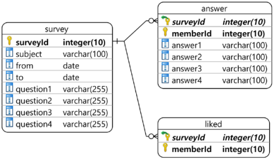
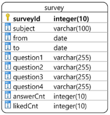
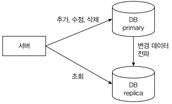
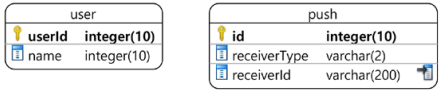

# 성능을 좌우하는 DB 설계와 쿼리

 - 성능과 DB
 - 인덱스 설계
 - 조회 성능 개선 방법
 - 주의 사항


## 1. 성능에 핵심인 DB

DB 성능은 연동하는 모든 서버 성능에 영향을 준다. 쿼리 실행 시간이 길어지면서 전체 서비스가 느려지는 성능 문제는 흔히 발생하는 문제다. 하지만 DB 자체가 문제인 상황은 많지 않다. 오히려 DB를 잘 못 사용해서 발생한 문제가 더 많다.

<br/>

## 2. 조회 트래픽을 고려한 인덱스 설계

일반적인 시스템에서는 조회 기능의 실행 비율이 높다. DB 테이블을 설계할 때는 조회 기능과 트래픽 규모를 고려해야 한다. 이를 고려하지 않으면 성능에 심각한 문제가 발생할 수 있다.

```sql
-- 카테고리별 게시판 테이블
CREATE TABLE article (
    id INTEGER(10) PRIMARY KEY,
    category INTEGER(10) NOT NULL,
    writerId INTEGER(10) NOT NULL,
    title VARCHAR(255),
    content CLOB,
    regDttm TIMESTAMP
);

-- 특정 카테고리 게시글 조회
-- category 컬럼에 인덱스를 추가해서 조회 성능을 개선
SELECT id, category, writerId, title, content
FROM article
WHERE category = 10
ORDER BY regDttm DESC
LIMIT 20, 10;

-- 특정 사용자가 작성한 글 목록 조회
-- writerId 컬럼을 포함한 인덱스를 추가해서 조회 성능 개선
SELECT id, category, writerId, title, content
FROM article
WHERE writer = 10
ORDER BY regDttm DESC
LIMIT 20, 10;

-- 중간에 포함된 단어를 검색하기 위한 LIKE 조건은 풀 스캔을 유발한다.
-- 엘라스틱서치 같은 검색 엔진을 사용하면 DB를 사용하지 않고 검색 기능을 구현할 수 있다.
-- 하지만, 별도의 검색 엔진을 구성하기 힘든 상황이라면 DB가 제공하는 전문 검색 기능 사용을 고려해본다.
-- Oracle Text나 MySQL의 FULLTEXT 인덱스를 사용하면 풀 스캔 없이 문자열 검색 쿼리를 실행할 수 있다.
SELECT id, category, writerId, title, content
FROM article
WHERE title LIKE '%검색어%'
ORDER BY regDttm DESC
```

 - `MySQL FULLTEXT 인덱스`
    - MySQL의 FULLTEXT 인덱스는 __자연어 기반의 텍스트 검색(Natural Language Full-text Search)__ 을 위해 사용되는 인덱스입니다. __일반적인 인덱스(INDEX, UNIQUE)가 정확한 값 또는 범위__ 를 빠르게 찾는 데 사용되는 반면, __FULLTEXT 인덱스는 긴 텍스트 컬럼에서 단어나 문장 단위__ 로 빠르게 검색할 수 있도록 도와줍니다.
    - 사용 가능한 타입: CHAR, VARCHAR, TEXT(TINYTEXT, TEXT, MEDIUMTEXT, LONGTEXT)
```sql
-- 1. 테이블 생성 시 지정
CREATE TABLE articles (
  id INT AUTO_INCREMENT PRIMARY KEY,
  title VARCHAR(200),
  body TEXT,
  FULLTEXT (title, body)
);

-- 2. 기존 테이블에 추가
ALTER TABLE articles ADD FULLTEXT (title, body);

-- 3. 검색 방법: MATCH ... AGAINST
-- MATCH(column1, column2): 검색 대상 컬럼을 지정. 컬럼이 여러개면 OR 조건처럼 작동
-- AGAINST('검색어'): 검색어를 입력
SELECT * FROM articles
WHERE MATCH(title, body) AGAINST('database performance');

-- 4. 검색 모드
-- 4-1. Natural Language Mode(기본값): 불용어(Stopwords) 제외, 단어 빈도 기반 자동 스코어링
-- '영화'라는 정확한 단어만 검색된다. '영화는', '영화가' 등은 검색 불가
SELECT * FROM newspaper WHERE MATCH(article) AGAINST('영화');
SELECT * FROM newspaper WHERE MATCH(article) AGAINST('영화' in natural language mode);
SELECT * FROM newspaper WHERE MATCH(article) AGAINST('영화 배우'); -- 영화 OR 배우 단어가 포함된 레코드

-- 4-2. Boolean Mode: +, -, *, " 등 논리 연산자 사용 가능
-- +: 해당 단어가 포함되면 출력
-- -: 해당 단어가 포함되면 제외
-- ~: 해당 단어가 포함되면 아래 순위
-- *: 부분 검색
-- ": 부분 검색 "" 안에 있는 구문과 정확히 동일한 철자의 구문

-- '영화'가 포함된 텍스트
SELECT * FROM newspaper
WHERE match(article) against ('영화*' in boolean mode);

-- '영화 배우'가 포함된 텍스트
SELECT * FROM newspaper
WHERE match(article) against('영화 배우' in boolean mode);

-- '영화 배우'가 포함된 텍스트에서 '공포' 단어가 포함된 레코드
SELECT * FROM newspaper
WHERE match(article) against('영화 배우 +공포' in boolean mode);

-- '영화 배우'가 포함된 텍스트에서 '남자' 단어가 없는 레코드
SELECT * FROM newspaper
WHERE match(article) against('영화 배우 -남자' in boolean mode);

-- '영화'로 시작하는 단어 OR '배우'로 시작하는 단어가 포함된 레코드
SELECT * FROM newspaper
WHERE match(article) against('영화* 배우*' in boolean mode);

-- '영화'로 시작하는 단어 AND '배우'로 시작하는 단어가 포함된 레코드
SELECT * FROM newspaper
WHERE match(article) against('+영화* +배우*' in boolean mode);

-- 4-3. Query Expansion Mode: 결과 기반으로 관련 단어 확장하여 재검색
-- 1차 결과 기반: 사용자가 입력한 키워드로 1차 검색 후 상위 결과에서 연관 키워드 추출
-- 자동 확장: 연관된 단어를 포함하여 2차 검색 수행
-- 정교한 검색: 검색 결과를 넓혀서 놓치는 문서를 줄이는 데 효과적
-- 예측 불가성: 어떤 키워드가 확장될지는 내부 알고리즘에 따라 다름

-- 1차 검색: 'mysql indexing'으로 MATCH(title, content)를 검색
-- 연관 단어 추출: 1차 검색 결과의 텍스트에서 자주 등장하는 단어를 추출함. (예: 'query', 'performance')
-- 2차 검색: 'mysql indexing query performance'처럼 확장된 키워드로 전체 테이블을 재검색
-- 최종 결과 반환: 확장된 키워드로 검색한 결과를 반환
SELECT * FROM articles
WHERE MATCH(title, content) AGAINST('mysql indexing' WITH QUERY EXPANSION);
```

<br/>

### 2-1. 단일 인덱스와 복합 인덱스

```sql
-- 사용자의 모든 활동 내역을 보관하기 위한 테이블
CREATE TABLE activityLog (
    id INTEGER(10) PRIMARY KEY,
    userId INTEGER(10) NOT NULL,
    activityType VARCHAR(20),
    activityDate DATE,
    activityDatetime TIMESTAMP,
    memo VARCHAR(200)
);

-- 일평균 방문 회원이 10만 명이고, 평균 5번의 활동을 한다면 하루에 50만 건의 데이터가 쌓이고 한 달이면 1,500만 건이 쌓인다.

-- 특정 사용자의 일자별 활동 내역 조회
-- 단일 인덱스: userId만 인덱스로 사용
-- 복합 인덱스: userId, activityDate를 인덱스로 사용
-- 회원들의 활동성이 좋다면 복합 인덱스 사용을 고려해야 한다.
SELECT *
FROM activityLog
WHERE userId = 123 AND activityDate = '2025-05-28'
ORDER BY activityDatetime DESC

-- 특정 일자의 활동 타입별 개수 조회
-- 풀 스캔을 하지 않기 위해 activityDate 컬럼을 인덱스로 사용해야 한다.
-- 고민할 점은 activityType 컬럼을 인덱스에 포함시키느냐 여부다.
-- 하루에 쌓이는 데이터가 50만 개면 적지 않은 숫자다. 실행 시간이 10초 이상 걸릴 수 있다.
-- 그런데 이 쿼리를 하루에 한 번만 실행해서 그 결과를 별도 테이블에 저장한다고 하자. 그러면 쿼리 실행 시간이 30초가 걸려도 문제 될 게 없다. 하루에 1 번만 실행하기 때문이다.
-- 서비스가 성장해서 하루에 쌓이는 데이터가 수백만 개에 달하면 상황이 달라진다. DB 성능에 따라 쿼리 실행 시간이 급격히 증가할 수 있다. 이런 상황이 오면 복합 인덱스를 적용해야 한다.
SELECT activityDate, activityType, COUNT(activityType)
FROM activityLog
WHERE activityDate = '2025-05-28'
GROUP BY activityType;
```
<br/>

### 2-2. 선택도를 고려한 인덱스 컬럼 선택

인덱스를 생성할 때는 선택도가 높은 컬럼을 골라야 한다. 선택도는 인덱스에서 특정 컬럼의 고유한 값 비율을 나타낸다. 선택도가 높으면 해당 컬럼에 고유한 값이 많다는 뜻이며, 선택도가 낮으면 고유한 값이 적다는 뜻이다. __선택도가 높을수록 인덱스를 이용한 조회 효율이 높아진다.__

```sql
CREATE TABLE member (
    memberId INTEGER(10) NOT NULL PRIMARY KEY,
    gender CHAR(10),
    -- 생략
);

-- gender 컬럼이 M, F, N의 3개 값중 하나를 갖고, 인덱스를 사용한다고 가정한다.
-- 전체 회원 데이터 중 M이 50만개, F가 50만개, N이 천 개일때 쿼리 실행시 여전히 50만 개의 데이터를 확인해야 한다.
-- 선택도가 낮아 인덱스 효율이 떨어진다.
SELECT *
FROM member
WHERE gender = 'F';
```
<br/>

 - __인덱스로 사용할 컬럼을 고를 떄 선택도가 항상 높아야 하는 것은 아니다.__
    - 선택도가 낮아도 인덱스 컬럼으로 적합한 상황도 있다.
```sql
-- 작업 큐를 구현한 테이블
CREATE TABLE jobqueue (
    jobid VARCHAR(16) NOT NULL PRIMARY KEY,
    status CHAR(1) NOT NULL,
    -- 생략
);

-- status 컬럼은 W(대기), P(처리중), C(완료) 3가지 값을 가진다.
-- 작업 큐의 특성상 대부분 데이터의 status 컬럼값은 C이고, 적은 수의 데이터만 W와 P를 값으로 가진다.
-- 고유한 값이 3개뿐으로 선택도가 낮은 컬럼이지만, 실제 사용하는 쿼리를 보면 status 컬럼은 인덱스로 사용하기에 좋은 컬럼이다.
SELECT *
FROM jobqueue
WHERE status = 'W'
ORDER BY jobid ASC;
```
<br/>

### 2-3. 커버링 인덱스 활용하기

__커버링 인덱스는 특정 쿼리를 실행하는 데 필요한 컬럼을 모두 포함하는 인덱스를 말한다.__ 커버링 인덱스를 사용하면 쿼리 실행 효율을 높일 수 있다.

```sql
-- 인덱스를 이용해서 읽을 데이터를 선택한 뒤에 컬럼값을 조회하기 위해 각 데이터를 읽어와야 한다.
-- activityDate, activityType으로 복합 인덱스가 걸린 경우 실제 데이터에 접근하지 않는다. (인덱스에 2개 컬럼 값이 모두 포함되어 있다.)
SELECT activityDate, activityType
FROM activityLog
WHERE activityDate = '2025-05-28' AND activityType = 'VISIT'
```
<br/>

### 2-4. 인덱스는 필요한 만큼만 만들기

인덱스는 조회 속도를 빠르게 해주지만 데이터 추가, 변경, 삭제 시에는 인덱스 관리에 따른 비용(시간)이 추가된다. 또 인덱스 자체도 데이터이기 떄문에 인덱스가 많아질수록 메모리와 디스크 사용량도 함께 증가한다.

 - 새로 추가할 쿼리가 기존에 존재하는 인덱스를 사용하지 않을 때는 요구사항을 일부 변경할 수 있는지 검토해본다.
 - 작은 변경만으로도 인덱스를 활용할 수 있다.
```sql
CREATE TABLE reservation (
    id BIGINT NOT NULL PRIMARY KEY,
    name VARCHAR(30) NOT NULL,
    reserveDate DATE NOT NULL,
    state CHAR(2) NOT NULL,
    regDt TIMESTAMP NOT NULL,
);
CREATE INDEX idxRdate ON reservation (reserveDate);

-- 예약자 이름으로 조회하는 기능을 구현해야 할 경우 name 컬럼을 비교할 수 있다.
SELECT *
FROM reservation
WHERE name = '예약자 이름'
ORDER BY regDt DESC;

-- reservation 테이블은 name 컬럼을 인덱스로 갖고 있지 않으므로 풀 스캔이 발생한다.
-- 풀 스캔을 방지하기 위해 name 컬럼을 인덱스로 추가할 수도 있지만, 요구사항을 일부 변경하면 인덱스를 추가하지 않아도 된다.
-- 요구사항 변경: 특정 일자에 예약한 예약자 이름으로 조회
SELECT *
FROM reservation
WHERE reserveDate = '2025-05-28' AND name = '예약자 이름'
ORDER BY regDt DESC;
```
<br/>

## 3. 몇 가지 조회 성능 개선 방법

### 3-1. 미리 집계하기

다음 기능을 제공하는 간단한 설문 조사 기능을 만든다고 가정한다.

 - 각 설문은 질문이 4개로 고정되어 있다.
 - 회원은 각 설문 조사마다 '좋아요'를 할 수 있다.
 - 설문 조사 목록을 보여줄 때 답변 수와 '좋아요' 수를 표시한다.

<div align="center">
    
</div>
<br/>

```sql
-- 목록을 표시할 때 '답변 수'와 '좋아요 수'를 표시한다는 요건이 있다.
-- 설문 목록 조회 쿼리의 SELECT 절에 서브 쿼리를 사용할 수 있다.
SELECT s.id,
    s.subject,
    (SELECT COUNT(*) FROM answer a WHERE a.surveyId = s.id) AS answerCount,
    (SELECT COUNT(*) FROM liked a WHERE a.surveyId = s.id) AS likeCount,
FROM survey s
ORDER BY id DESC
LIMIT 30;
```

위 쿼리는 논리적으로 정확하지만 성능에는 문제가 발생할 수 있다. 30개의 설문이 있을 때 설문마다 평균 답변자 수가 10만 명이고, '좋아요'를 한 회원 수가 1만 명이라고 가정한다.

 - 목록 조회 1번
 - 답변자 수를 세는 쿼리 30번
    - SELECT 쿼리가 30개의 설문 데이터를 조회하므로 각 설문마다 답변자 수를 구하기 위한 서브 쿼리가 30번 실행
    - 각 쿼리는 10만 개를 센다.
 - 좋아요  수를 세는 쿼리 30번
    - 각 설문마다 좋아요를 한 회원 수를 구하기 위한 서브 쿼리가 30번 실행된다.
    - 각 쿼리는 1만개를 센다.

논리적으로 61번의 쿼리가 실행된다. 목록 조회 쿼리가 0.01초, 답변자를 세는 서브 쿼리가 설문당 0.1초, 좋아요 수를 세는 쿼리가 0.05초가 걸린다고 할 경우 쿼리 시간은 0.01 + 0.1 * 30 + 0.05 * 30 = 4.51 초가 걸린다.

<br/>

COUNT나 SUM과 같은 집계 쿼리를 조회 시점에 실행하면서 발생하는 성능 문제를 제거하는 방법은 간단하다. __집계 데이터를 미리 계산해서 별도 컬럼에 저장하면 된다.__

<div align="center">
    
</div>
<br/>

```sql
-- 답변수와 좋아요수를 보관할 컬럼을 추가한 뒤 
-- 설문에 답변할 떄나 좋아요를 누를 떄마다 해당 컬럼값을 증가시키는 방법으로 미리 집계할 수 있다.

-- 답변 등록
INSERT INTO answer VALUES (...);
UPDATE survey SET answerCnt = answerCnt + 1 WHERE surveyId = '아이디';

-- 좋아요 취소
DELETE FROM liked WHERE answerId = '설문ID' AND memberId = '회원ID';
UPDATE usrvey SET likedCnt = likedCnt - 1 WHERE surveyId = '설문ID'

-- 설문 조사 목록 조회 (답변수, 좋아요수)
SELECT s.id, s.subject, answerCnt, likeCnt
FROM survey s
ORDER BY id DESC
LIMIT 30;
```

 - survey 테이블에 answerCnt 컬럼을 추가하는 것은 데이터를 중복하는 것이다. 또한 answerCnt 컬럼이 가지는 값과 answer 테이블의 개수가 불일치하는 무결성이 깨지는 문제가 발생할 수 있다.
 - 하지만  설문 예제에서는 약간의 불일치를 감수하더라도 실시간 집계용 컬럼을 추가하는 것이 맞다고 생각한다. 실제 특정 설문에 대한 answer 테이블의 개수가 10,150인데 answerCnt 컬럼의 값이 10,149 라고 해도 심각한 문제는 아니다.
 - 또한 정확한 값은 언제든지 구할 수 있다. 관리툴에서 최종 보고서를 생성할 때는 answerCnt, likedCnt 컬럼을 사용하는 대신 answer 테이블과 liked 테이블을 사용해서 실제 개수를 구하면 된다.
 - __동시성 문제는 없을까?__
    - DB가 UPDATE 쿼리를 원자적 연산으로 처리하면 문제 없다.
    - 원자적 연산으로 처리하지 않으면 answerCnt 값이 어떻게 될지 예측할 수 없다.
    - 트랜잭션 격리 수준에 따라 그리고 사용하는 DBMS에 따라 해당 쿼리가 원자적으로 실행되기도 하고 그렇지 않기도 하다.
    - 따라서 증가/감소 쿼리를 사용할 때는 DBMS가 지정한 트랜잭션 격리 수준에서 원자적으로 처리하는지 검증해야 한다.


<br/>

### 3-2. 페이지 기준 목록 조회 대신 ID 기준 목록 조회 방식 사용하기

 - `첫 페이지 읽기`
```sql
SELECT id, subject, writer, redDt
FROM article
ORDER BY id DESC
LIMIT 10 OFFSET 0;
```

 - `마지막 1만 번쨰 페이지 읽기`
    - 99,991번쨰 id부터 바로 조회하면 좋겠지만, DB는 어떤 id 값이 99,991번쨰인지 알지 못한다.
    - DB는 역순으로 id를 99,990개 세고 나서 10개 데이터를 조회한다.
```sql
SELECT id, subject, writer, redDt
FROM article
ORDER BY id DESC
LIMIT 10 OFFSET 99990;
```

 - `인덱스에 포함되어 있지 않은 컬럼이 WHERE 절에 포함되면 실행 시간은 더 증가한다.`
    - 주요 키를 이용해서 id 컬럼을 역순으로 차례대로 세는 과정은 동일하다.
    - 하지만, deleted 값이 false인지 판단해야 하기 떄문에 DB는 각 행의 deleted 값을 읽어야 한다.
    - 실제 데이터를 읽어오므로 실행 시간은 더 길어진다.
```sql
SELECT id, subject, writer, redDt
FROM article
WHERE deleted = false
ORDER BY id DESC
LIMIT 10 OFFSET 99990;
```

 - `지정한 오프셋으로 이동하기 위해 데이터를 세는 시간을 줄이는 방법은 특정 ID 기준으로 조회하는 것이다.`
    - id는 인덱스이므로 DB는 9985보다 작은 id 값인 9984를 바로 찾을 수 있다.
    - 오프셋을 사용했을 때는 지정한 오프셋만큼 데이터를 세는 시간이 필요한데 이 과정이 생략되어 실행 시간이 빠르다.
```sql
SELECT *
FROM article
WHERE id < 9985 AND deleted = false
ORDER BY id DESC
LIMIT 10;
```

 - `모바일 화면에서는 ID 방식이 유용하다.`
    - 페이지 단위로 이동하는 방식보다 스크롤을 통해 다음 데이터를 읽어오는 방식이 많다. 이런 조회 방식은 ID를 기준으로 조회하는 방식이 더 잘 들어맞는다.
    - 클라이언트에서 페이지 번호를 받는 대신 마지막으로 조회한 ID를 기준으로 다음 데이터를 요청함으로써 조회 속도를 높일 수 있다.
```sql
-- 프론트엔드 개발자가 다음에 읽어올 데이터가 존재하는지 알려주는 속성을 응답 결과에 포함시켜 달라고 요청하면, 1개만 더 읽어 판단하면 된다.
-- 예를 들어, 10개만큼 데이터를 내려주고 추가로 더 읽은 데이터가 있는지 여부를 응답으로 제공해야 한다면 읽어올 개수를 11개로 제한한다.
-- 조회 결과가 11개면 다음 읽을 데이터가 존재. 이때 10개를 응답으로 제공하고, 추가 데이터 존재 여부를 true로 응답.
SELECT *
FROM article
WHERE id < 1001 AND deleted = false
ORDER BY id DESC
LIMIT 11;
```
<br/>

### 3-3. 조회 범위를 시간 기준으로 제한하기

조회 성능을 개선하는 방법 중 하나는 조회 범위를 시간 기준으로 제한하는 것이다.

 - 국내 주요 포털은 기사 목록을 제공할 떄 일자별로 분류해서 제공하고 있다. 즉, 기사 조회 범위를 일자 기준으로 제한하는 것이다.
 - 쇼핑 사이트에서 회원의 주문 내역 조회 기능도 유사하다. 30개씩 순서대로 조회하는 방식이 아닌, 월별로 주문 내역을 조회하는 방식을 사용할 수 있다.
    - 필요한 인덱스는 customerId, orderDt 이다. 페이지 기준 목록 조회나 ID 기준 목록 조회에 비해 쿼리가 단순해지고 성능 문제도 발생하지 않는다.
```sql
SELECT *
FROM news
WHERE regDt BETWEEN '2025-05-01' AND '2025-05-31'
ORDER BY regDt DESC
LIMIT 100;

SELECT *
FROM order
WHERE customerId = 100
  AND orderDt BETWEEN '2025-05-01' AND '2025-05-31'
ORDER BY orderDt DESC;
```
<br/>

 - 조회 범위를 제한하는 또 다른 방법은 최신 데이터만 조회하는 것이다.
    - 고객에게 매달 한 번씩 제공하는 점검 결과가 있다고 하자. 대부분 고객은 최근 점검 결과가 정상인지에 관심이 있다. 3년전에 받은 결과에는 관심이 없다. 이런 경우 최근 6개월간의 점검 결과만 제공해도 서비스에는 문제가 되지 않는다.
    - 공지사항도 며칠 또는 몇 달 이내의 공지는 읽을 수 있지만, 3년 전 공지사항은 아무도 읽지 않는다.
 - 최신 데이터 위주로 조회하게 기능을 변경하면 DB 성능 또한 향상된다.
    - DB는 성능을 높이기 위해 메모리 캐시를 사용한다.
    - 데이터 조회가 발생하면 이를 메모리에 캐시해, 다음에 동일한 요청이 들어올 때 더 빠르게 응답할 수 있다.
    - 일반적으로 최신 데이터가 더 많이 조회되기 때문에, 캐시에 최신 데이터가 적재될 확률이 높다. 따라서 조회 범위를 최신 데이터로 제한하면 캐시 효율을 높일 수 있다.

<br/>

### 3-4. 전체 개수 세지 않기

데이터가 적을 때는 COUNT 쿼리를 실행해도 큰 문제가 없다. 데이터가 많아질수록 COUNT 실행 시간도 증가하는데, 그 이유는 조건에 해당하는 모든 데이터를 탐색해야 하기 때문이다. 커버링 인덱스를 사용하더라도 전체 인덱스를 스캔해야 하며, 커버링 인덱스가 아닌 경우에는 실제 데이터를 전부 읽어야 한다.

__조회 속도가 조금씩 느려지고 있는데, 그 원인 중 하나가 전체 개수를 세는 쿼리에 있다면 해당 쿼리를 실행하지 않는 방법을 고려해야 한다. 서비스 담당자에게 앞으로 성능 문제가 발생할 수 있다는 점을 알리고, 전체 개수를 화면에 표시하지 않는 방향으로 협의할 필요가 있다.__

<br/>

### 3-5. 오래된 데이터 삭제 및 분리 보관하기

데이터 개수가 늘어나면 늘어날수록 쿼리 실행 시간은 증가한다. 즉, 데이터 개수가 증가하지 않으면 실행 시간을 일정 수준으로 유지할 수 있다.

 - `예시`
    - 과거 데이터 삭제할 수 있는 예로 로그인 시도 내역을 들 수 있다.
    - 자주 접속하지 않는 새로운 지역에서 로그인 시도가 발생하면, 이를 사용자에게 알려 위험에 대비할 수 있도록 한다. 이 기능을 개발하려면 로그인 시도 내역을 일정 기간 보관해야 한다.
    - 로그인 시도 내역은 장기간 보관할 필요가 없다.
        - 이상 징후를 탐지하기 위한 목적이기 떄문에, 최근 몇 달 치 내역만 있으면 충분하다.
        - 몇 년 전의 패턴은 필요하지 않다.
    - 사용자에게는 180일 이내 로그인 내역만 제공하더라도, 내부 관리 시스템에서는 그 이전 데이터가 필요한 경우가 있다.
        - 이럴 때는 서비스 DB에는 180일 이내 데이터만 유지하고, 181일 이전 데이터는 별도의 저장소로 분리 보관하면 된다.
        - 이렇게 하면 사용자 서비스는 적절한 성능을 유지할 수 있고 관리 시스템은 필요한 데이터를 조회할 수 있다.

<br/>

### 3-6. DB 장비 확장하기

DB에 부하가 증가해 성능 문제가 발생하고 있다. 성능 개선 방법을 찾지 못한 상태에서 헤매다 보면, 며칠 동안 장애 상황이 지속될 수 있다.

__빠르게 성능 개선할 방법을 찾지 못했거나, 개선에 시간이 필요한 경우라면 DB 장비를 수직으로 확장해 서비스를 가능한 상태로 유지하고 개선할 시간을 벌어야 한다.__

 - 클라우드를 사용하면 DB 장비 성능을 짧은 시간 안에 높일 수 있다.
 - 더 빠른 CPU로 교체하고 더 많은 CPU를 사용하면 메모리를 증설할 수 있다.
 - 해당 조치만으로 성능은 눈에 띄게 향상된다. __일단 DB가 버틸 수 있는 상태가 되면 그 다음엔 효과적인 개선 방안을 찾아 적용하면 된다.__

<br/>

수평 확장도 고려해볼 수 있다. 조회 트래픽 비중이 높은 서비스의 경우, 주 DB - 복제 DB(Primary - Replica) 구조를 사용해 처리량을 효과적으로 증가시킬 수 있다.

<div align="center">
    
</div>
<br/>

 - `우리 회사에는 DBA가 없어요`
    - 복제 DB를 구성하는 작업은 일반 서버 개발제에게는 부담스러운 작업이다.
    - 대부분 DB 운영에 익숙하지 않기 때문이다.
    - 필자도 운영 중인 DB에 레플리카 DB를 직접 추가해본 경험이 없고 복제 DB 구성 작업은 DBA가 처리했엇다.
    - 규모가 작은 회사는 DBA 채용이 쉽지 않다. 이럴 때는 DB 전문 회사와 컨설팅 계약을 맺는 것도 하나의 방법이다. (정기적인 DB 점검, 장애 대응, 운영 지원 등의 서비스를 받을 수 있다.)

<br/>

### 3-7. 별도 캐시 서버 구성하기

서비스가 잘되어 트래픽이 급격히 증가하면, DB만으로 모든 트래픽을 처리하기 어려워질 수 있다.

 - 캐시 서버를 잘 활용하면 DB 확장 대비 적은 비용으로 더 많은 트래픽을 처리할 수 있다.
 - 엔지니어 입장에서도, DB를 확장하는 것보다 레디스와 같은 캐시 서버를 구성하는 것이 상대적으로 부담이 적다.
 - 물론 캐시를 도입하면 코드를 수정해야 한다. 하지만, 코드 수정에 드는 비용 대비 캐시로 증가 시킬 수 있는 처리량이 크다면, 코드를 수정하는 것이 더 합리적인 선택이다.

<br/>

## 4. 알아두면 좋을 몇 가지 주의 사항

### 4-1. 쿼리 타임아웃

동시 사용자가 증가할 때 응답 시간이 길어지면 그에 반비례해 처리량은 감소한다. 하지만 단순히 처리량만 떨어지는 데서 끝나지 않는다.

동시 접속으로 특정 쿼리 실행 시간이 늘어났다고 가정한다. 사용자는 몇 초만 지나도 서비스가 느리다고 느끼고 다시 몇 초 후에 재시도를 하게 된다. __응답 지연으로 인한 재시도는 서버 부하를 더욱 가중시킨다. 앞선 요청을 아직 처리 중인 상황에서 새로운 요청이 유입되기 때문이다.__ 이런 식으로 재시도가 반복되면 동시에 처리해야 하는 요청 수가 기하급수적으로 늘어나고 서버 부하는 폭증하게 된다.

 - 이런 상황을 방지하는 방법 중 하나는 쿼리 실행 시간을 제한(타임아웃 설정)하는 것이다.
 - 쿼리 실행 시간이 5초를 넘기면 제한 시간 초과로 에러가 발생한다. 사용자는 에러 화면을 보게 되지만 서버 입장에서는 해당 요청을 정상적으로 종료(처리)/한 셈이다.

<br/>

### 4-2. 상태 변경 기능은 복제 DB에서 조회하지 않기

주 DB - 복제 DB 구조를 사용할 떄 변경은 주 DB를 사용하고 조회는 복제 DB는 사용한다.

그런데 이를 잘못 이해해 모든 SELECT 쿼리를 무조건 복제 DB에서 실행하는 경우가 있는데, 이는 두 가지 측면에서 문제를 일으킬 수 있다.

 - 주 DB와 복제 DB는 순간적으로 데이터가 일치하지 않을 수 있다.
 - 트랜잭션 문제가 발생할 수 있다.
    - 데이터 복제는 트랜잭션 커밋 시점에 이뤄진다.
    - 주 DB의 트랜잭션 범위 내에서 데이터를 변경하고, 복제 DB에서 변경 대상이 될 수 있는 데이터를 조회하면 데이터 불일치로 인해 문제가 생긴다.

<br/>

__회원 가입, 변경, 등록, 삭제와 같이 INSERT, UPDATE, DELETE 쿼리를 실행하는 기능에서 변경 대상 데이터를 조회해야 한다면, 복제 DB가 아닌 INSERT, UPDATE, DELETE 쿼리를 실행하는 주 DB에서 SELECT 쿼리를 실행한다. 그래야 데이터 불일치로 인해 발생할 수 있는 오류를 방지할 수 있다.__

<br/>

### 4-3. 타입이 다른 컬럼 조인 주의

 - push 테이블
    - receiverType: 푸시 수신 타입
    - receiverId: 수신 타입 기준 식별값으로 varchar로 저장
    - 수신 대상에 대한 푸시 목록을 자주 조회하기 때문에 receiverId 컬럼에 인덱스 추가

<div align="center">
    <br/>
    user와 push 테이블
</div>
<br/>

 - 두 컬럼의 값을 비교하는 과정에서 DB는 타입 변환을 수행한다. receiverId 컬럼은 VARCHAR 타입이므로 userId와 비교하려면 DB는 receiverId 값을 INTEGER 타입으로 변환해야 한다. 이 변환은 각 행마다 발생하며, 결과적으로 receiverId 인덱스를 온전히 활용하지 못하게 된다.
 - 전체 데이터를 스캔하지 않고 인덱스만 스캔하는 경우에도 push 테이블의 데이터가 많다면 이 변환 작업으로 인해 쿼리 실행 시간이 길어질 수 밖에 없다.
```sql
-- user 테이블에서 주요 키인 userId 컬럼을 기준으로 비교하고,
-- push 테이블의 인덱스가 설정된 receiverId 컬럼과 조인하여 인덱스를 사용할 것으로 보인다.
-- 하지만, 실제로는 인덱스를 활용하지 못할 수도 있다.
-- user 테이블의 userId 컬럼은 INTEGER 타입
-- push 테이블의 receiverId 컬럼은 VARCHAR 타입
SELECT u.userId, u.name, p.*
FROM user u, push p
WHERE u.userId = 145
  AND u.userId = p.receiverId
  AND p.receiverType = 'MEMBER'
ORDER BY p.id DESC
LIMIT 100;
```
<br/>

 - 비교 타입이 달라서 인덱스 활용을 못하는 상황이라면, 두 컬럼의 타입을 맞춰서 비교해야 한다.
 - 비교 대상 컬럼의 타입을 맞추면 쿼리 실행 중 발생하는 불필요한 타입 변환을 줄일 수 있다.
 - 문자열 타입을 비교할 때 컬럼의 캐릭터셋이 같은지도 확인해야 한다. 캐릭터셋이 다르면 그 자체로도 변환이 발생할 수 있다.
```sql
SELECT u.userId, u.name, p.*
FROM user u, push p
WHERE u.userId = 145
  AND CAST(u.userId as char character set utf8mb4) collate 'utf8mb4_unicode_ci' = p.receiverId
  AND p.receiverType = 'MEMBER'
ORDER BY p.id DESC
LIMIT 100;
```
