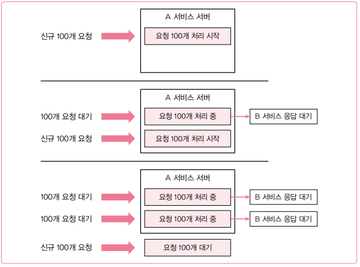
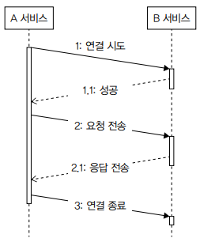
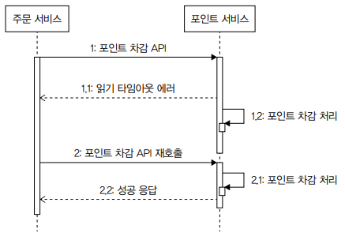
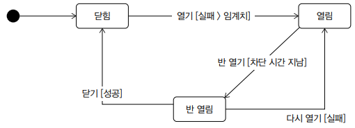
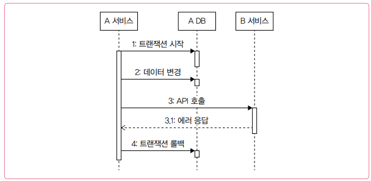
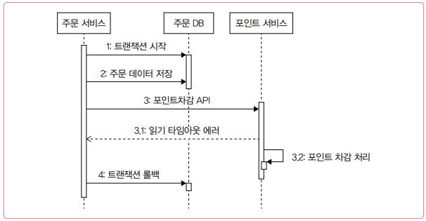
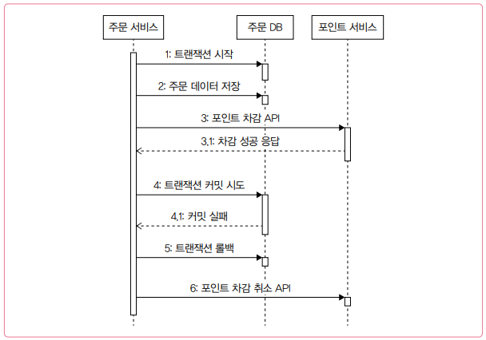

# 외부 연동이 문제일 때 살펴봐야 할 것들

 - 외부 연동 문제
 - 타임아웃과 재시도
 - 동시 요청 제한과 서킷 브레이커
 - DB와 외부 연동
 - HTTP 커넥션 풀
 - 이중화

## 1. 외부 연동 문제

연동하는 서비스에 장애가 발생하면 우리 서비스도 영향을 받는다. 서비스 간 연동이 많아질수록 연동 시스템의 품질도 함께 신경 써야 한다.

<br/>

## 2. 타임아웃

외부 연동에서 가장 중요한 설정 중 하나는 타임아웃이다. 연동 서비스를 호출할 대 타임아웃을 적절히 설정하지 않으면, 연동 서비스에 장애가 발생했을 때 전체 서비스의 품질이 급격히 나빠질 수 있다.

 - `타임아웃 미설정 예시`
    - A 서비스는 톰캣을 사용하고 있으며 쓰레드 풀 크기는 200이다. (200개의 요청 처리)
    - A 서비스는 B 서비스를 호출한다.
    - B 서비스에 성능 문제가 생겨 응답 시간이 60초를 넘기기 시작했다.

<div align="center">
    
</div>
<br/>

만약, __세 번째 100개 요청이 B 서비스 연동이 필요 없는 기능이라면 어떻게 될까? B 서비스의 성능 문제가 다른 기능도 사용하지 못하게 만든다.__

또한 __사용자는 응답이 올 때까지 기다리지 않는다. 새로 고침과 같은 방법으로 새로운 요청을 보낸다.__ 이는 문제를 더 악화시킨다. 사용자 입장에서는 앞서 보낸 요청을 취소한 것이지만 A 서비스는 그 사실을 바로 인지하지 못한다. 앞서 사용자가 보낸 요청을 여전히 처리 중이다. 이 상태에서 새로운 요청이 하나 더 들어오게 된다. 즉, 서버가 받는 부하가 배가 되는 상황이 발생한다.

### 2-1. 2가지 타임아웃: 연결 타임아웃, 읽기 타임아웃

API 연동에서 통신 과정을 단순화하면 연결, 요청, 응답, 종료 4단계를 거친다.

<div align="center">
    
</div>
<br/>

첫 번째 단계는 네트워크 연결 시도 단계다. 연결에는 시간이 걸린다. __네트워크 상황이나 연결할 서버의 상태에 따라 연결에 오랜 시간이 걸릴 수도 있다.__ 대기 시간이 무한정 길어지면 성능 문제가 발생하므로, __연결 타임아웃을 설정해 연결 대기 시간을 제한해야 한다.__

연결이 되면, 요청을 전송하고 응답을 기다리게 된다. 이때 응답을 받기까지 시간이 오래 걸리면 앞서 말한 대기 시간 문제가 다시 발생한다. 따라서 __읽기 타임아웃을 설정해서 응답 대기 시간을 제한해야 한다.__

타임아웃 시간이 너무 짧으면 연동 서비스가 정상 처리했음에도 불구하고 타임아웃 에러가 발생할 수 있다.

```
1. 고객은 상품 결제를 커머스 서버에 요청한다.
2. 커머스 서버는 승인 처리를 위해 PG 서버 API를 호출한다. 이때 읽기 타임아웃을 5초로 지정한다.
3. PG 서버는 카드 결제를 위해 카드사 시스템과 통신을 시작한다. 카드사가 승인 처리하는 데 5초 이상 걸린다.
4. 커머스 서버는 PG 서버로부터 5초 동안 응답을 받지 못해 타임아웃 에러가 발생하며 상품 결제에 실패한다.
5. 커머스 서버는 고객에게 실패 응답을 전송한다.
6. 카드사 서버는 10초 만에 결제 승인에 성공하고 그 결과를 PG 서버에 응답한다.
```

결제처럼 민감한 긴으은 읽기 타임아웃 시간을 약간 길게 설정해서 간헐적으로 연동 시간이 길어지더라도 정상적으로 처리할 수 있어야 한다.

<div align="center">
    
</div>
<br/>

### 2-2. 소켓 타임아웃과 읽기 타임아웃

__읽기 타임아웃을 지정할 때는 실제로 설정하는 값이 무엇인지 확인해야 한다.__

예를 들어, Apache HttpClient는 소켓 타임아웃을 설정한다. 소켓 타임아웃은 네트워크 패킷 단위를 기준으로 하므로, 전체 응답 시간에 대한 타임아웃을 의미하지 않는다. 따라서 소켓 타임아웃을 5초로 지정해도 전체 응답 시간은 5초 이상 걸릴 수 있다.

OkHttp는 읽기 타임아웃과는 별개로 호출 타임아웃을 설정할 수 있다. 호출 타임아웃은 요청 시작부터 응답까지의 전체 시간 기준으로 설정된다.

<br/>

## 3. 재시도

외부 연동에 실패했을 때 처리 방법 중 하나는 재시도를 하는 것이다. 네트워크 통신 과정에서 간헐적으로 연결에 실패하거나 일시적으로 응답이 느려지는 경우가 있다. 이럴 때는 재시도를 통해 연동 실패를 성공으로 바꿀 수 있다.

### 3-1. 재시도 가능 조건

재시도를 통해 연동 실패를 줄일 수 있지만, 항상 재시도를 할 수 있는 것은 아니다. 연동 API를 다시 호출해도 되는 조건인지 확인해야 한다.

 - `예시`
    - 포인트 서비스가 제공하는 API를 호출해 포인트를 차감하는 상황
    - 포인트 서비스를 호출하는 과정에서 읽기 타임아웃이 발생했을 때 재시도를 하게 되면 포인트 차감이 두 번 발생할 수 있다.
    - __읽기 타임아웃이 발생하더라도 포인트 서비스는 차감 처리를 계속 진행하기 떄문이다.__

<div align="center">
    
</div>
<br/>

 - `재시도를 해도 되는 조건`
    - __단순 조회 기능__
        - 포인트 내역 조회 같은 기능은 다시 호출해도 포인트 중복 차감 같은 데이터 문제가 생기지 않는다.
        - 일시적인 문제였다면 다시 조회할 경우 정상적으로 처리될 가능성이 높다.
    - __연결 타임아웃__
        - 연결 타임아웃이 발생했다는 것은 연동 서비스에 아직 연결되지 않은 상태라는 뜻이다.
        - 연동 서비스가 요청을 처리하고 있지 않은 상태이므로, 순간적인 네트워크 문제였다면 재시도를 통해 연결에 성공할 가능성이 있다.
    - __멱등성을 가진 변경 기능__
        - 멱등성이란 __연산을 여러번 적용해도 결과가 달라지지 않는 성질__ 을 말한다.
        - 예를 들어, 좋아요 기능에서 한 사용자가 동일한 콘텐츠에 대해 여러 번 좋아요 API를 실행해도 좋아요하는 한 번만 반영된다. 즉, __해당 API를 실행하는 동안 읽기 타임아웃이 발생해서 재시도해도 데이터는 이상 상태를 갖지 않는다.__
    - 같은 API라도 실패 원인에 따라 재시도 여부를 결정해야 한다. 검증 오류가 발생했다면 재시도를 해도 동일하게 실패할 가능성이 높다.

<br/>

### 3-2. 재시도 횟수와 간격

 - `재시도 횟수`
    - 재시도를 무한정 할 수는 없다. 재시도 횟수만큼 응답 시간도 함께 증가한다.
    - __대부분 1~2번 정도의 재시도가 적당하다.__
    - 2번 재시도를 하면 총 3번 시도한 것인데, 이 모두 실패했다면 간헐적 오류보다는 다른 근본적인 문제일 가능성이 높다. 이 경우에는 다시 재시도해도 실패할 확률이 높다.
 - `재시도 간격`
    - 네트워크 연결 상태가 6초간 좋지 않은 상황이라고 가정한다. 이때, 연결 타임아웃이 3초라고 가정한다.
    - API 호출 후 연결 타임아웃이 발생하고, 이떄 바로 재시도하면 같은 네트워크 문제로 인해 다시 연결 타임아웃이 발생하게 된다.
    - __여러 차례 재시도할 떄는 재시도 간격을 점진적으로 늘리기도 한다.__ 첫 번째 재시도는 1초 뒤에, 두 번째 재시도는 2초 뒤에 하는 식이다.

<br/>

## 4. 동시 요청 제한

A 연동 서비스가 한 번에 처리할 수 있는 동시 요청 수가 100개라고 가정한다. 이때, 100개 이상의 A 연동 서비스가 발생하면, A 서비스 전체 시스템이 심각하게 느려지는 문제가 발생한다. 또한, A 서비스의 응답이 느려지면서 우리 서비스 전체도 느려지는 문제가 발생한다.

__연동 서비스에 임계치 이상의 요청을 보내면서 발생하는 성능 저하 문제를 완화하는 방법은, 연동 서비스에 요청을 일정 수준 이상으로 보내지 않는 것이다.__

<br/>

## 5. 서킷 브레이커

연동 서비스에 과부하가 발생해 응답을 제대로 주지 못하고 있는 상황이라고 가정한다. 연동 서비스가 정상화되기 전까지는 요청을 보내도 계속 에러만 발생한다. 또한, 읽기 타임아웃이 발생할 때까지 대기하느라 응답 시간도 길어질 것이다.

__B 서비스가 정상 상태가 아닐 때, A 서비스는 B 서비스에 요청을 보내지 않고 바로 에러를 응답하는 것이 낫다. 이렇게 하면 B 서비스의 문제가 A 서비스에 주는 영향(응답 시간 증가, 처리량 감소 등)을 줄일 수 있다.__

연동 서비스가 장애 상황일 때는 연동 대신 바로 에러를 응답하고, 정상화 되었을 때 연동을 재개하면 연동 서비스의 장애가 주는 영향을 줄일 수 있다.

<br/>

__서킷 브레이커는 누전 차단기와 비슷하게 동작한다.__ 과전류가 흐르면 차단기가 내려가 전기를 끊는 것처럼, __서킷 브레이커도 과도한 오류가 발생하면 연동을 중지시키고 바로 에러를 응답한다.__ 이렇게 하면 연동 서비스로의 요청 전달을 차단할 수 있다.

<div align="center">
    
</div>
<br/>

 - `서킷 브레이커 3가지 상태`
    - __닫힘__
        - 서킷 브레이커는 닿미 상태로 시작한다.
        - 닫힘 상태일 때는 모든 요청을 연동 서비스에 전달한다.
        - 외부 연동 과정에서 오류가 발생하기 시작하면, 지정한 임계치를 초과했는지 확인한다.
    - __열림__
        - 실패 건수가 임계치를 초과하면 서킷 브레이커는 열림 상태가 된다.
        - 열림 상태가 되면 연동 요청은 수행하지 않고, 바로 에러 응답을 리턴한다.
        - 열림 상태는 지정된 시간 동안 유지된다. 이 시간이 지나면 반 열림 상태로 전환된다.
    - __반 열림__
        - 반 열림 상태가 되면 일부 요청에 한해 연동을 시도한다.
        - 일정 개수 또는 일정 시간 동안 반 열림 상태를 유지하며, 이 기간동안 연동에 성공하면 닫힘 상태로 복귀한다.
        - 반대로 연동에 실패하면 다시 열림 상태로 전환되어 연동을 차단한다.
    - 서킷 브레이커가 열려 있는 동안은 연동 서비스에 요청이 전달되지 않기 떄문에 연동 서비스가 과부하 상황에서 벗어날 수 있는 기회도 생긴다.

<br/>

## 6. 외부 연동과 DB 연동

DB에 데이터를 저장하는 과정에서 실패할 수도 있고, 외부 서비스를 연동하는 도중에 에러가 발생할 수도 있다.

### 6-1. 외부 연동과 트랜잭션 처리

DB 연동과 외부 연동을 함께 실행할 때는, 오류 발생 시 DB 트랜잭션을 어떻게 처리할지 알맞게 판단해야 한다.

 - `외부 연동에 실패했을 때 트랜잭션을 롤백`
    - 트랜잭션 범위 안에서 외부 연동에 실패한 경우, 트랜잭션을 롤백할 수 있다.
    - 외부 연동에 실패했을 때 트랜잭션을 롤백하면, 변경한 데이터가 DB에 반영되지 않는다.
    - 하지만, __읽기 타임아웃이 발생해 트랜잭션을 롤백할 때는, 외부 서비스가 실제로는 성공적으로 처리했을 가능성을 염두에 두어야 한다.__
        - 일정 주기로 두 시스템의 데이터가 일치하는지 확인하고 보정하는 방법
            - 예를 들어, 주문 서비스와 포인트 서비스가 하루에 한 번씩 전날 포인트 사용 내역을 비교해 불일치 건이 있는지 확인
            - 불일치 건이 발견되면 수동/자동으로 보정
        - 성공 확인 API 호출하는 방법
            - 읽기 타임아웃 발생시, 일정 시간 후에 이전 호출이 실제로 성공했는지 확인하는 API를 호출
            - 이때 성공 응답이 오면 트랜잭션을 지속하고, 실패 응답이 오면 트랜잭션을 롤백한다. (연동 서비스가 연동 여부 API를 제공할 떄 사용 가능)
        - 취소 API 호출하는 방법
            - 읽기 타임아웃 발생시, 일정 시간 후에 취소 API 호출
            - 연동 서비스는 취소할 대상이 있으면 취소 처리를 수행한 뒤 성공 응답을 주고, 취소할 게 없다면 아무 동작 없이 성공 응답만 반환한다.
            - 연동 처리를 취소했으므로 트랜잭션을 롤백하면 된다.
        - 두 시스템 간 데이터 일관성이 중요한 기능이라면 정기적으로 데이터 일치를 확인하는 프로세스를 갖추는 것이 바람직하다.
<div align="center">
    <br/>
    
</div>
<br/>

 - `외부 연동은 성공했지만 DB 연동에 실패해 트랜잭션을 롤백`
    - 외부 연동은 성공했지만, DB 연동에 실패해 트랜잭션을 롤백한 경우에는 취소 API를 호출해 외부 연동을 이전 상태로 되돌리는 것이 필요하다.
    - __취소 API가 없거나 취소에 실패할 수도 있기 떄문에 데이터 일관성이 중요한 서비스라면 일정 주기로 데이터가 맞는지 비교하는 프로세스를 갖추는 것이 좋다.__

<div align="center">
    
</div>
<br/>

### 6-2. 외부 연동이 느려질 때 DB 커넥션 풀 문제

DB 트랜잭션 범위 안에서 외부 연동을 수행할 떄, __외부 연동이 느려지면서 커넥션 풀 부족 현상이 발생할 수 있다.__

DB 연동과 무관하게 외부 연동을 실행할 수 있다면, DB 커넥션을 사용하기 전이나 후에 외부 연동을 시도하는 방안도 고려해볼 수 있다. 단, 이 방식은 __외부 연동이 트랜잭션 범위 밖에서 실행되기 때문에 트랜잭션 커밋 이후 외부 연동이 실패하면 롤백이 불가능하다는 점을 고려해야 한다.__ 이 경우에는 __실패한 외부 연동에 대한 후처리를 반드시 고민해야 한다.__

<br/>

## 7. HTTP 커넥션 풀

 - `풀의 크기`
    - 풀의 크기는 연동할 서비스의 성능에 따라 결정해야 한다.
    - 연동 서비스의 성능 저하가 우리 서비스 전체의 응답 시간까지 느리게 만들 수 있다.
 - `대기 시간`
    - 대기 시간이 길어지면 전체 응답 시간도 함께 늘어나므로 대기 시간은 수 초 이내의 짧은 시간으로 설정하는 것이 좋다.
 - `커넥션 유지 시간`
    - 연동 서비스가 일정 시간 동안만 커넥션을 유지한 뒤 연결을 끊는 경우도 있다.
    - 끊어진 커넥션을 사용하면 에러가 발생하므로 연동 서비스에 맞춰 유지 시간을 적절히 설정해야 한다.
        - 예를 들어, HTTP/1.1에서는 서버가 Keep-Alive 헤더로 연결 유지 시간을 지정한다.

<br/>

## 8. 연동 서비스 이중화

서비스가 대량 트래픽을 처리할 만큼 성장했다면 연동 서비스의 이중화를 고려해야 한다.

예를 들어, 쇼핑 서비스에서 결제는 핵심 기능이다. 이때 연동된 외부 결제 서비스에 장애가 발생하면, 장애가 발생한 시간 동안 쇼핑 서비스의 매출은 0원이 된다. 하지만, 결제 서비스를 이중화해두면 한 곳에 장애가 발생해도 다른 결제 서비스를 이용해 결제를 계속 진행할 수 있다.

 - 연동 기능을 이중화하면 연동할 서비스가 늘어나고 그만큼 개발과 유지에 드는 비용도 증가한다.
 - `연동 서비스 이중화 여부 2가지`
    - 해당 기능이 서비스의 핵심인지 여부
    - 이중화 비용이 감당 가능한 수준인지

