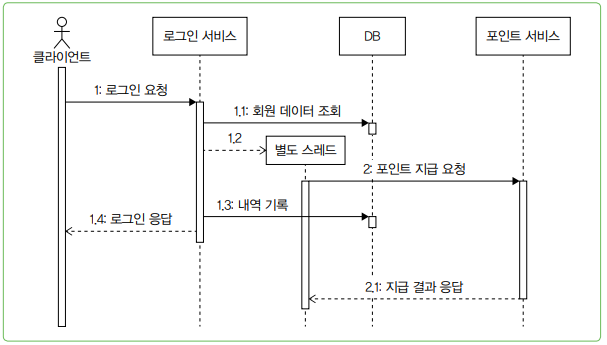

# 비동기 연동, 언제 어떻게 써야 할까

 - 비동기 연동
 - 별도 스레드를 이용한 비동기 연동
 - 메시징을 이용한 비동기 연동
 - 트랜잭션 아웃박스 패턴
 - 배치 전송
 - CDC

## 1. 동기 연동과 비동기 연동

 - `동기 방식`
    - 순차적으로 실행된다.
    - 한 작업이 끝날 때까지 다음 작업이 진행되지 않는다.
    - 코드의 순서가 곧 실행 순서가 된다.
    - 프로그램의 흐름을 직관적으로 이해할 수 있다.
    - 디버깅도 용이하다.
```java
public boolean login(String id, String password) {
    // 회원 조회
    Optional<User> opt = findUser(id);
    if (opt.isEmpty()) {
        return false;
    }

    // 비밀번호 검증
    User u = opt.get();
    if (!u.matchPassword(password)) {
        return false;
    }

    // 포인트 지급 서비스 호출
    PointResult result = pointClient.giveLoginPoint(id);
    if (result.isFailed()) {
        throw new PointException();
    }

    // 로그인 내역 추가
    appendLoginHistory(id);
    return true;
}
```
<br/>

 - `동기 방식2`
    - 동기 방식이 외부 연동을 만나면 고려할 게 있다. 먼저 __외부 연동 실패가 전체 기능의 실패인지 확인해야 한다.__
    - 앞선 예에서 포인트 지급 서비스 연동에 실패하면 로그인에도 실패한다. 만약 포인트 지급 서비스에 장애가 발생하면 그 시간 동안 로그인도 못해서 전체 기능을 사용할 수 없게 된다. 이게 맞는 걸까? 포인트 지급에 실패하더라도 로그인 자체는 정상적으로 동작해야 하고 나머지 기능을 사용할 수 있기를 원할 것이다.
    - 포인트 지급에 실패하면 나중에 후처리할 수 있도록 지급 실패 내역을 따로 남기는 방식으로 코드를 작성할 수 있다.
```java
public boolean login(String id, String password) {
    // 회원 조회
    Optional<User> opt = findUser(id);
    if (opt.isEmpty()) {
        return false;
    }

    // 비밀번호 검증
    User u = opt.get();
    if (!u.matchPassword(password)) {
        return false;
    }

    // 포인트 지급 서비스 호출
    PointResult result = pointClient.giveLoginPoint(id);
    if (result.isFailed()) {
        recordPointFailure(id, resullt);
    }

    // 로그인 내역 추가
    appendLoginHistory(id);
    return true;
}
```

 - `비동기 방식`
    - 외부 연동 결과가 필요한 게 아니라면, 동기 방식 대신 비동기 방식으로 연동하는 것을 고민해볼 필요가 있다.
    - 비동기 방식을 사용하면 외부 연동이 끝날떄까지 기다리지 않고 바로 다음 작업을 진행할 수 있다.
    - __비동기 방식 예시 상황__
        - 쇼핑몰에서 주문이 들어오면 판매자에게 푸시 보내기(푸시 서비스 연동)
        - 학습을 완료하면 학생에게 포인트 지급(포인트 서비스 연동)
        - 컨텐츠를 등록할 때 검색 서비스에도 등록(검색 서비스 연동)
        - 인증 번호를 요청하면 SMS로 인증 메시지 발송(SMS 발송 서비스 연동)
    - __비동기 방식 특징__
        - 연동에 약간의 시차가 생겨도 문제가 되지 않는다.
        - 일부 기능은 실패했을 때 재시도가 가능하다.
            - 인증 번호가 SMS로 오지 않으면 다시 받기 기능을 통해 재시도
        - 연동 실패시 나중에 수동으로 처리 가능
            - 검색 서비스 연동 실패해 컨텐츠가 검색에 노출되지 않는 경우, 컨텐츠 작성자가 검색 미노출 문의가 왔을 때 관리 사이트에서 수동으로 컨텐츠를 검색 서비스로 연동
        - 연동에 실패했을 떄 무시해도 되는 기능
            - 주문 알림 푸시가 발송되지 않더라도, 판매에는 문제가 생기지 않는다. 주문 확인이 늦어질 뿐이다.
<div align="center">
    
</div>
<br/>

## 2. 별도 쓰레드로 실행하기

