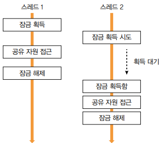

# 동시성, 데이터가 꼬이기 전에 잡아야 한다

 - 동시성 문제
 - 잠금을 이용한 동시 접근 제어
 - 원자적 타입과 동시성 지원 컬렉션
 - DB와 동시성: 선점 잠금과 비선점 잠금
 - 잠금 주의 사항

## 1. 서버와 동시 실행

서버는 클라이언트의 요청을 처리하기 위해 DB에 쿼리를 보내고 그 결과를 받는다. 동시에 여러 클라이언트가 서버에 연결하는 만큼, 서버도 동시에 여러 쿼리를 DB에 보낸다.

 - 서버가 동시에 여러 클라이언트 요청을 처리하는 방법
    - 클라이언트 요청마다 스레드를 할당해서 처리
        - 요청마다 스레드를 할당
        - 서버에 따라 클라이언트 요청을 처리할 때 사용할 스레드 개수를 제한하기도 한다.
    - 비동기 IO(또는 논블로킹 IO)를 사용해서 처리

### 1-1. 동시성 문제 예시 (쓰레드)

```java
public class Counter {
    private int count = 0;

    public void inc() {
        count = count + 1;
    }

    public int getCount() {
        return count;
    }
}

Counter counter = new Counter();
Thread[] threads = new Thread[100];

for (int i = 0; i < 100; i++) {
    Thread t = new Thread(() -> {
        for (int j = 0; < 100; j++) {
            counter.inc();
        }
    });
    threads[i] = t;
    t.start();
}

for (Thread t: threads) {
    t.join();
}

// 10,000이 나와야 하지만, 그렇지 않다.
System.out.println(counter.getCount());
```
<div align="center">
    
</div>
<br/>

## 2. 잘못된 데이터 공유로 인한 문제 예시

 - PayService 인스턴그사 하나뿐인 싱글톤 객체라고 가정
 - 다중 스레드 환경에서 PayService 객체가 동시에 사용되면, payId 값이 변경될 수 있다.
```java
public class PayService {
    private Long payId;

    public PayResp pay(PayRequest req) {
        // genPayId()로 생성한 값을 payId 필드에 할당
        this.payId = genPayId();

        // payId 필드를 이용해서 임시 저장
        saveTemp(this.payId, req);

        // sendPayData()를 호출하고 리턴 결과를 resp 변수에 저장
        PayResp resp = sendPayData(this.payId, ..);

        // applyResponse() 호출
        applyResponse(resp);
        return resp;
    }

    private void applyResponse(PayResp resp) {
        // 파라미터로 받은 resp를 이용해서 PayData를 생성
        PayData payData = createPayDataFromResp(resp);
        
        // updatePayData() 메서드에 payId 필드를 전달
        updatePayData(this.payId, payData);
    }
}
```
<div align="center">
    
</div>
<br/>

## 3. 프로세스 수준에서의 동시 접근 제어

### 3-1. 잠금(lock)을 이용한 접근 제어

프로세스 수준에서 데이터를 동시에 수정하는 것을 막기 위한 일반적인 방법은 잠금을 사용하는 것이다. 잠금을 사용하면 공유 자원에 접근하는 스레드를 한 번에 하나로 제한할 수 있다.

잠금은 한 번에 한 스레드만 획득할 수 있다. 여러 스레드가 동시에 잠금 획득을 시도하면 그중 하나만 획득하고 나머지 스레드를 잠금이 해제될 떄까지 대기하게 된다. 잠금을 획득한 스레드는 공유 자원에 접근한 뒤 사용을 마치면 잠금을 해제한다. 잠금이 해제되면 대기 중이던 스레드 중 하나가 잠금을 획득해 자원에 접근한다.

 - 잠금 획득 > 공유 자원에 접근(임계 영역) > 잠금 해제

<div align="center">
    
</div>
<br/>

 - `잠금 예시 코드`
    - ReentrantLock을 사용해 동시에 HashMap을 수정하는 것을 막는 코드
    - 동시에 여러 스레드가 HashMap의 put() 메서드를 호출하면 데이터가 유실되거나 값이 잘못 저장되는 문제가 발생할 수 있다. 이런 문제를 방지하기 위해 잠금(ReentrantLock)을 사용해서 sessions 필드에 한 번에 한 스레드만 접근할 수 있도록 제한한다.
    - 알아두기
        - synchronized 키워드를 사용하면 더 간단하게 스레드의 동시 접근 제어가 가능하다. 코드 블록이 끝나면 자동으로 잠금을 풀어주기 때문에 unlock() 같은 메서드 호출이 필요없다.
        - ReentrantLock은 synchronized에는 없는 기능을 제공한다. 대표적인 예로 잠금 획득 대기 시간을 지정하는 기능이다.
            - JDK 21 버전에 추가된 가상 스레드에서는 ReentrantLock만 지원.
            - synchronized는 JDK 24 버전부터 지원.
        - synchronized, ReentrantLock 중 무엇을 사용해도 문제는 없다. 단, 두 방식을 섞어서 사용하지 말고 한 가지 방식으로 통일하자.
```java
public class UserSessions {
    private Lock lock = new ReentrantLock();
    private Map<String, UserSession> sessions = new HashMap<>();

    public void addUserSession(UserSession session) {
        lock.lock(); // 잠금 획득할 때까지 대기
        try {
            sessions.put(session.getSessionId(), session); // 공유 자원 접근
        } finally {
            lock.unlock(); // 잠금 해제
        }
    }

    public UserSession getUserSession(String sessionId) {
        lock.lock();
        try {
            return sessions.get(sessionId);
        } finally {
            lock.unlock();
        }
    }
}

// 테스트
class UserSessionsTest {
    @Test
    void concurrentTest() {
        ExecutorService executor = Executors.newFixedThreadPool(500);
        UserSessions userSessions = new UserSessions();

        // 1000개의 UserSession 객체를 UserSessions에 추가
        List<Future<?>> futures = new ArrayList<>();
        int sessionCount = 1_000;
        for (int i = 1; i <= sessionCount; i++) {
            String sessionId = "session-" + i;
            // 실행할 코드 전달
            Future<?> future = executor.submit(() -> {
                UserSession userSession = new UserSession(sessionId);
                userSessions.addUserSession(userSession);
            });
            futures.add(future);
        }

        // 1000개의 작업이 끝날 떄까지 대기
        futures.forEach(f -> {
            try {
                f.get();
            } catch (Exception e) {
                log.error("error", e);
            }
        });

        executor.shutdown();

        // UserSessions 객체에 UserSession 객체가 정상적으로 추가됐는지 검증
        for (int i = 1; i <= sessionCount; i++) {
            String sessionId = "session-" + i;
            UserSession userSession = userSessions.getUserSession(sessionId);
            assertThat(userSession)
                .describedAs("session %s", sessionId)
                .isNotNull();
        }
    }
}
```
<br/>

### 3-2. 동시 접근 제어를 위한 구성 요소

ReentrantLock은 한 번에 1개 스레드만 잠금을 구할 수 있다. 즉, 한 번에 한 스레드만 공유 자원에 접근할 수 있다. 나머지 스레드는 잠금이 해제될 때까지 대기해야 한다.

잠금 외에도 동시 접근을 제어하기 위한 구성 요소로 세마포어와 읽기 쓰기 잠금이 있다.

### 3-3. 세마포어

세마포어는 동시에 실행할 수 있는 스레드 수를 제한한다. 자원에 대한 접근을 일정 수준으로 제한하고 싶을 때 세마포어를 사용할 수 있다.

세마포어에는 이진 세마포어와 개수 세마포어가 있다. 이진 세마포어는 동시에 접근할 수 있는 스레드가 1개인 반면 계수 세마포어는 지정한 수만큼 동시 접근이 가능하다.

 - `세마포어 예시`
    - 세마포어에서 퍼밋 획득(허용 가능 숫자 1감소) > 코드 실행 > 세마포어에 퍼밋 반환(허용 가능 숫자 1 증가)
    - 각 스레드는 세마포어에서 퍼밋을 획득한 뒤에 코드를 실행할 수 있다.
    - 퍼밋 획득에 성공하면 세마포어의 남아 있는 퍼밋 개수가 1 감소한다.
    - 남아 있는 퍼밋 개수가 0인 상태에서 퍼밋을 획득하려는 스레드는 다른 스레드가 퍼밋을 반환할 때까지 대기하게 된다.
```java
public class MyClient {
    private Semaphore semaphore = new Semaphore(5);

    public String getData() {
        try {
            semaphore.acquire(); //퍼밋 획득 시도
        } catch (InterruptedException e) {
            throw new RuntimeException(e);
        }

        try {
            String data = ... // 외부 연동 코드
            return data;
        } finally {
            semaphore.release(); // 퍼밋 반환
        }
    }
}
```

 - `읽기 쓰기 잠금을 이용한 동시 접근 제거`
    - get() 메서드는 여러 스레드가 동시에 실행해도 문제가 되지 않는다.
    - get() 메서드를 실행하는 동안 put() 메서드를 사용해서 변경할 떄가 문제가 된다.
    - get()과 put()을 동시에 실행하지 않고 get()만 동시 실행하는 것은 문제가 되지 않는다.
    - 잠금을 사용하면 데이터를 변경하지 않더라도 동시에 읽기가 안 된다. 한 번에 1개 스레드만 읽기 기능을 실행할 수 있다. (읽기 성능 저하)
    - __읽기 쓰기 잠금__
        - 쓰기 잠금은 한 번에 한 스레드만 구할 수 있다.
        - 읽기 잠금은 한 번에 여러 스레드가 구할 수 있다.
        - 한 스레드가 쓰기 잠금을 획득했다면 쓰기 잠금이 해제될 떄까지 읽기 잠금을 구할 수 없다.
        - 읽기 잠금을 획득한 모든 스레드가 읽기 잠금을 해제할 때까지 쓰기 잠금을 구할 수 없다.
```java
public class UserSessionsRW {
    private ReadWriteLock lock = new ReentrantReadWriteLock();
    private Lock writeLock = lock.writeLock();
    private Lock readLock = lock.readLock();
    private Map<String, UserSession> sessions = new HashMap<>();

    public void addUserSession(UserSession session) {
        writeLock.lock();
        try {
            sessions.put(session.getSessionId(), session);
        } finally {
            writeLock.unlock();
        }
    }

    public UserSession getUserSession(String sessionId) {
        readLock.lock();
        try {
            return sessions.get(sessionId);
        } finally {
            readLock.unlock();
        }
    }
}
```

### 3-4. 원자적 타입(Atomic Type)

잠금을 사용하면 카운터 증가에 대한 동시성 문제를 간단하게 해결할 수 있다. 하지만 해당 방식을 사용하면 CPU 효율이 떨어지는 단점이 있다. 여러 스레드가 동시에 실행할 때 잠금을 확보한 스레드를 제외한 나머지 스레드가 대기하기 때문이다.

잠금을 사용하지 않으면서 동시성 문제없이 카운터를 구현하는 다른 방법으로 원자적 타입을 사용하는 것이 있다. Java에서는 Atomicxx 같은 타입을 사용하면 다중 스레드 환경에서 동시성 문제없이 여러 스레드가 공유하는 데이터를 변경할 수 있다.

```java
// 동시성 문제
public class Counter {
    private int count = 0;

    public void inc() {
        count = count + 1;
    }
}

// Lock을 이용한 동시성 해결
public class Counter {
    private Lock lock = new ReentrantLock();
    private int count = 0;

    public void inc() {
        lock.lock();
        try {
            count = count + 1;
        } finally {
            lock.unlock();
        }
    }
}

// AtomicInteger를 이용한 동시성 해결
// AtomicInteger는 내부적으로 CAS 연산을 사용한다.
// 이를 통해 스레드를 멈추지 않고도 다중 스레드 환경에서 안전하게 값을 변경할 수 있다.
public class Counter {
    private AtomicInteger count = new AtomicInteger(0);

    public void inc() {
        count.incrementAndGet(); // 다중 스레드 문제없이 값을 1 증가
    }

    public int getCount() {
        return count.get();
    }
}
```
<br/>

### 3-5. 동시성 지원 컬렉션

동기화된 컬렉션을 사용하면 데이터를 변경하는 모든 연산에 잠금을 적용해서 한 번에 한 스레드만 접근할 수 있도록 제한할 수 있다. Java의 Collections 클래스는 동기화된 컬렉션을 생성하는 메서드를 제공한다. 이 메서드를 사용하면 기존 컬렉션 객체를 쉽게 동기화된 컬렉션 객체로 변환할 수 있다.

```java
Map<String, String> map = new HashMap<>();
Map<String, String> syncMap = Collections.synchronizedMap(map);
syncMap.put("key1", "value1"); // put 메서드 내부적으로 synchronized로 처리됨
```
<br/>

동시성 문제를 해결하는 또 다른 방법은 동시성 자체를 지원하는 컬렉션 타입을 사용하는 것이다. Java에서는 ConcurrentXxx 타입을 이용하면 동시성을 지원한다.
 - ConcurrentXxx 타입은 데이터를 변경할 때 잠금 범위를 최소화한다.
 - 따라서 키의 해시 분포가 고르고 동시 수정이 많으면, 동기화된 맵을 사용하는 것보다 더 나은 성능을 제공한다.
```java
ConcurrentMap<String, String> map = new ConcurrentHashMap<>();
map.put("key1", "value1"); // 동시성 지원 컬렉션은 잠금 범위를 최소화한다.
```
<br/>

 - __알아두기__
    - 동시성 문제를 피하기 위하나 방법 중 하나는 불변 값을 이용하는 것이다.
    - 값이 바뀌지 않기 때문에 동시에 여러 스레드가 접근해도 문제가 발생하지 않는다.
    - 불변 값은 데이터 변경이 필요한 경우, 기존 값을 수정하는 대신 새로운 값을 생성해서 사용한다.

<br/>

## 4. DB와 동시성

 - `트랜잭션`
    - DB 트랜잭션은 여러 개의 조회나 쓰기를 논리적으로 하나의 연산으로 묶는다.
    - 하나의 트랜잭션에 포함된 모든 쓰기는 모두 적용되거나(커밋) 모두 취소된다.(롤백)
    - 트랜잭션 안의 쿼리 중 하나라도 실패하면 전체 트랜잭션을 롤백함으로써 데이터가 깨지는 것을 방지할 수 있다.
    -  하지만 DB 트랜잭션만으로는 모든 동시성 문제를 해결할 수 없다.
 - `비관적, 낙관적`
    - 비관적은 실패할 가능성이 높아서 비관적이다. 다수가 데이터 변경을 시도하면 데이터를 정상적으로 변경할 기능성이 떨어질 테니 이를 비관적이라고 표현한 것이다.
    - 낙관적은 반대로 성공할 기능성이 높아서 낙관적이다.
    - 실패 가능성이 높은 비관적인 상황에서는 동시성 문제를 해결하기 위해 한 번에 1개 클라이언트만 접근할 수 있는 배타적 잠금을 사용하며, 이게 바로 비관적 잠금이다.
    - 반대로 성공 가능성이 높은 낙관적인 상황에서는 동시성 문제를 해결하기 위해 배타적 잠금까지는 사용하지 않는다. 대신 값을 비교하는 방식으로 동시성 문제를 대응한다.

<br/>

### 4-1. 선점(비관적) 잠금

__선점 잠금은 데이터에 먼저 접근한 트랜잭션이 잠금을 획득하는 방식이다.__

 - 한 트랜잭션이 특정 레코드에 대한 잠금을 획득한 경우, 잠금을 해제할 때까지 다른 트랜잭션은 동일 레코드에 대한 잠금을 획득하지 못하고 대기해야 한다.
 - 레코드에 대한 잠금은 트랜잭션이 종료될 때(커밋, 롤백) 반환된다.
```sql
-- ORACLE의 경우 아래 쿼리는 조건에 해당하는 레코드를 조회하면서 동시에 잠금을 획득한다.
SELECT * FROM 테이블 WHERE 조건
for update
```
<br/>

 - __알아두기(분산 잠금)__
    - 분산 잠금은 여러 프로세스가 동시에 동일한 자원에 접근하지 못하도록 막는 방법이다.
    - 간단한 분산 잠금이 필요한 경우 DB에서 제공하는 선점 잠금을 이용할 수 있다. 대부분 시스템이 DB를 사용하므로 별도의 도구 없이도 구성할 수 있다.
    - 트래픽이 많다면 레디스를 이용해 분산 잠금 구현을 고려한다.

<br/>

### 4-2. 비선점(낙관적) 잠금

__비선점 잠금은 명시적으로 잠금을 사용하지 않는다. 대신 데이터를 조회한 시점의 값과 수정하려는 시점의 값이 같은지 비교하는 방식으로 동시성 문제를 처리한다.__

 - 보통 비선점 잠금 구현시 정수 타입 버전 컬럼을 사용한다.
```sql
-- 1. SELECT 쿼리 실행시 version 컬럼을 함께 조회
SELECT col1, col2, version
FROM table

-- 2. 로직 수행

-- 3. UPDATE 쿼리 실행시 version 컬럼 증가
-- 이때, version 컬럼 값이 1에서 조회한 값과 같은지 비교하는 조건을 where절에 추가
UPDATE table
SET col1 = value1, version = version + 1
WHERE id = 1 AND version = [1에서 조회한 version 값]

-- 4. UPDATE 결과로 변경된 행 개수가 0이면, 이미 다른 트랜잭션이 verison 값을 증가시킨 것으로 데이터 변경 실패 -> 이 경우 트랜잭션 롤백
-- 0보다 크면, 데이터 변경에 성공한 것으로 트랜잭션 커밋
```
<br/>

### 4-3. 외부 연동과 잠금

트랜잭션 범위 내에서 외부 시스템과 연동해야 한다면, 비선점 잠금보다는 선점 잠금을 고려하는 것이 좋다.

 - 결제는 이미 취소됐는데, 데이터 변경에 실패해서 트랜잭션이 롤백되는 문제가 발생할 수 있다.
 - 비선점 잠금을 사용하고 싶다면, 트랜잭션 아웃박스 패턴을 적용해서 외부 연동을 처리하는 방법도 있다.

<div align="center">
    
</div>
<br/>

### 4-4. 증분 쿼리

 - `문제가 되는 코드`
```java
// 주제 조회
Subject subject = jdbcTemplate.queryForObject(
    "select id, joinCount, .. from SUBJECT where id = ?", 매퍼코드, id
);

// 참여 데이터 추가
joinToSubject(joinData, subject); // SUBJECT_JOIN 테이블에 추가

// 주제 데이터의 참여자 수 증가
jdbcTemplate.update(
    "update SUBJECT set joinCount = ? where id = ?",
    subject.getJoinCount() + 1, subject.getId()
);
```

 - `증분 쿼리`
    - DB는 동일 데이터에 대한 원자적 연산이 동시에 실행될 경우 이를 순차적으로 실행한다.
    - 따라서 데이터가 누락되는 문제가 발생하지 않는다.
```sql
update SUBJECT
set joinCount = joinCount + 1
where id = ?
```
<br/>

## 5. 잠금 사용 시 주의 사항

### 5-1. 잠금 해제하기

 - 잠금을 획득한 뒤에는 반드시 잠금을 해제해야 한다.
    - 잠금을 시도하는 스레드가 무한정 대기하게 된다.
 - 세마포어도 마찬가지다. 퍼밋 획득시 반드시 퍼밋을 반환해야 한다.
    - 퍼밋을 얻으려는 스레드가 끝없이 대기하게 된다.

<br/>

### 5-2. 대기 시간 지정하기

임계 영역 코드 실행시 0.5초가 걸리고, 동시에 1_000 개의 스레드가 잠금을 시도한다고 가정한다. 처음으로 잠금을 획득한 스레드는 0.5초만에 코드를 실행할 수 있지만, 마지막으로 잠금을 획득한 스레드는 499.5초를 기다려야 실행할 수 있다.

이처럼 대기 시간이 길어지는 문제를 막기 위한 방법 중 하나는 대기 시간을 지정하는 것이다.

```java
boolean acquired = lock.tryLock(5, TimeUnit.SECONDS);
if (!acquired) {
    // 잠금 획득 실패
    throw new RuntimeException("FAiled to acquire lock");
}

// 잠금 획득 성공
try {
    // 자원 접근 코드 실행
} finally {
    lock.unlock();
}
```
<br/>

### 5-3. 교착 상태(deadlock) 피하기

A 자원에서 B 자원을 이용하고, B 자원에서 A 자원을 이용한다고 가정한다. 이떄, 두 자원에 대한 잠금이 필요할 때 교착 상태에 빠지기 쉽다.

교착 상태는 2개 이상의 스레드가 서로가 획득한 잠금을 대기하면서 무한히 기다리는 상황을 말한다.

<div align="center">
    
</div>
<br/>

교착 상태가 발생하지 않도록 신경 써야 하지만, 복잡한 코드 구조에서 잠금을 사용하면 개발자 자신도 모르게 교착 상태 상황이 발생할 수 있다. __교착 상태를 해소할 수 있는 방법 중 하나는 잠금 대기 시간을 제한하는 것이다.__ 예를 들어, 잠금 대기 시간을 5초로 제한하면 교착 상태가 발생하더라도 5초 뒤에 잠금 획득에 실패하면서 교착 상태가 풀리게 된다.

