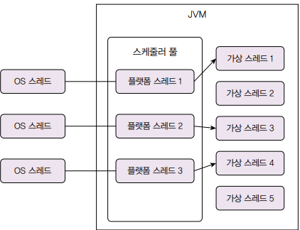
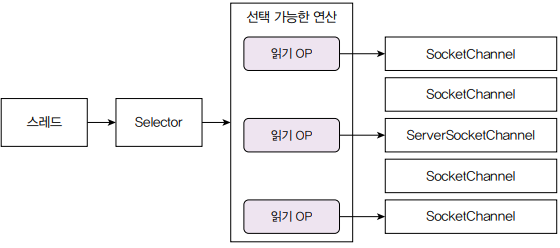

# IO 병목, 어떻게 해결하지

 - 네트워크 IO와 CPU
 - 가상 스레드
 - 논블로킹 IO

## 1. 네트워크 IO와 자원 효율

 - 많은 서버는 HTTP 트로콜을 이용해서 클라이언트와 데이터를 주고 받음
 - DB는 TCP에 기반한 프로토콜을 사용하고, 레디스를 메모리 캐시로 사용할 떄도 네트워크를 통해 데이터를 주고 받음
 - 데이터 입출력이 완료될 때까지 스레드를 아무 작업도 하지 않고 입출력이 끝나기를 기다린다.
 - 네트워크 연동이 많은 프로그램은 전체 실행 시간의 90% 이상을 입출력 대기에 사용하는 경우도 있음
 - `스레드를 늘려 CPU 낭비 줄이기`
    - CPU 사용률을 높이려면 CPU가 실행할 스레드를 많이 만들면 된다.
    - 하지만 스레드를 생성하는 데는 한계가 있음
        - 스레드는 수백 KB ~ 수 MB의 메모리 사용
        - 커넥션당 스레드 방식으로 구현한 웹소켓 서버에 1만 명 사용자가 동시 연결시, 스레드 1만 개를 생성하는 것만으로 10G 메모리 사용
        - 메모리를 늘려 스레드를 많이 만들더라도 컨텍스트 스위칭에 사용되는 시간도 증가
 - `알아두기 (컨텍스트 스위칭)`
    - 운영 체제는 여러 스레드를 번갈아 가면서 CPU에 할당한다.
    - CPU가 스레드를 전환하려면 현재 실행 중인 스레드의 상태를 기록하고 다음에 실행할 스레드의 상태 정보를 불러와야 하는데, 이렇게 상태 정보를 변경하고 스레드를 전환하는 과정을 컨텍스트 스위칭이라고 한다.
 - `트래픽 증가에 따른 자원 효율 문제`
    - IO 대기와 컨텍스트 스위칭에 따른 CPU 낭비
    - 요청마다 스레드를 할당함으로써 메모리 사용량이 높음
 - `자원 효율을 높이는 방법`
    - 가상 스레드나 고루틴 같은 경량 스레드 사용
    - 논블로킹 또는 비동기 IO 사용

<br/>

## 2. 가상 스레드로 자원 효율 높이기

코드를 블로킹 IO로 작성했는데, 입출력 동안 스레드가 대기하지 않고 다른 일을 할 수 있다면 CPU의 유휴 시간이 줄어들고, 더 많은 작업을 처리할 수 있게 된다. 자바의 가상 스레드나 Go 언어의 고루틴을 사용하면 특별한 노력 없이 CPU 효율을 높일 수 있다.

__경량 스레드는 OS가 관리하는 스레드가 아니라 JVM(자바 가상 머신) 같은 언어의 런타임이 관리하는 스레드다. 마치 OS가 CPU로 실행할 스레드를 스케줄링하듯, 언어 런타임이 OS 스레드로 실행할 경량 스레드를 스케줄링한다.__

<div align="center">
    
</div>
<br/>

 - `플랫폼 스레드`
    - __JVM은 플랫폼 스레드로 구성된 풀을 유지한다.__ CPU가 OS 스케줄러에 의해 여러 스레드를 번갈아 실행하는 것처럼 플랫폼 스레드도 JVM 스케줄러에 의해 여러 가상 스레드를 번갈아 실행한다.
    - JVM은 기본적으로 풀에 CPU 코어 개수만큼 플랫폼 스레드를 생성하고 필요에 따라 플랫폼 스레드를 증가시킨다.
 - `가상 스레드`
    - 가상 스레드는 플랫폼 스레드(OS 스레드)보다 더 적은 자원을 사용한다.
    - 가상 슬데ㅡ는 수백 바이트에서 수 KB ~ 수십 KM의 힙 메모리를 사용한다.
    - 호출 스택의 깊이에 따라 사용하는 메모리를 동적으로 늘렸다가 줄인다.
 - `캐리어 스레드`
    - __가상 스레드를 실행하는 플랫폼 스레드를 캐리어 스레드라고 표현한다.__
    - CPU가 여러 스레드를 실행하는 것처럼, 한 개의 캐리어 스레드도 여러 가상 스레드를 실행하게 된다.
 - `스레드 생성 시간 비교 예제`
    - 가상 스레드는 플랫폼 스레드에 비해 훨씬 적은 비용(자원, 시간)이 들기 때문에 한 장비에서 수십만에서 백만 개에 이르는 가상 스레드를 생성할 수 있다.
    - 플랫폼 스레드: 21,467ms
    - 가상 스레드: 196ms
```java
Thread[] threads = new Thread[100_000];
long start = System.currentTimeMillis();
for (int i = 0; i < threads.length; i++) {
    // 가상 스레드는 Thread.ofVirtual()로 생성
    Thread thread = Thread.ofPlatform().start(() -> {
        try {
            Thread.sleep(1000);
        } catch (InterruptedException e) {
            e.printStackTrace();
        }
    });
    threads[i] = thread;
}
long end = System.currentTimeMillis();
```
<br/>

### 2-1. 네트워크 IO와 가상 스레드

가상 스레드는 실행하는 과정에서 블로킹되면 플랫폼 스레드와 언마운트되고 실행이 멈춘다. 이때 언마운트된 플랫폼 스레드는 실행 대기 중인 다른 가상 스레드와 연결된 뒤 실행을 재개한다.

 - 블로킹 연산에는 IO 기능, ReentrantLock, Thread.sleep() 등이 있다.
 - 블로킹 연산으로 가상 스레드가 블로킹되면, 플랫폼 스레드는 대기 중인 다른 가상 스레드를 실행한다.
 - JDK 24 이전 버전에서는 synchronized로 인해 블로킹되면, 가상 스레드는 플랫폼 스레드로부터 언마운트 되지 않는다. 즉, 플랫폼 스레드도 같이 블로킹된다.

<div align="center">
    
</div>
<br/>

### 2-2. 가상 스레드와 성능

 - `IO Bound 작업과 CPU Bound 작업`
    - 우리가 작성하는 코드는 크게 IO 중심(IO-Bound) 작업과 CPU 중심(CPU-Bound) 작업으로 나눌 수 있다.
    - IO Bound 작업: 네트워크 프로그래밍처럼 입출력이 주를 이루는 작업
    - CPU Bound 작업: 정렬처럼 계산이 주를 이루는 작업
 - `가상 스레드를 이용한 성능 개선`
    - __가상 스레드는 IO 중심 작업일 때 효과가 있다.__ IO 중심 작업일 때 플랫폼 스레드가 CPU 낭비 없이 효율적으로 여러 가상 스레드를 실행할 수 있다. (대부분 시간이 IO 대기 상태에 있음)
    - 반면에, CPU 중심 작업에 가상 스레드를 사용하면 성능 개선 효과가 없거나 오히려 성능이 나빠질 수 있다.
    - 또한, IO 중심 작업이라고 해서 무조건 가상 스레드의 이점을 얻는 것은 아니다. 사용되는 플랫폼 스레드 개수보다 가상 스레드의 개수가 많아야 효과를 기대할 수 있다.
    - __가상 스레드를 사용해서 높일 수 있는 것은 처리량이다. 가상 스레드를 사용한다고 해서 실행 속도가 플랫폼 스레드보다 더 빨라지지는 않는다.__
 - `알아두기(가상 스레드와 스레드 풀)`
    - 요청별 스레드 방식을 사용하는 서버는 스레드 풀을 사용할 때가 많다. 미리 스레드를 생성해서 요청이 들어왔을 때 스레드 생성 부하를 줄이기 위함이다.
    - 또한 스레드 풀 크기에 최대치를 설정해서 요청이 급격히 늘어나도 스레드가 무한정 생성되는 것을 막는다. CPU와 메모리 자원을 일정 수준으로 제한해서 서버 자원이 포화되는 것을 방지하려는 목적이다.
    - __가상 스레드는 플랫폼 스레드보다 생성 비용이 적기 때문에 스레드 풀을 미리 구성할 필요가 없다. 필요한 시점에 가상 스레드를 생성하고 필요 없으면 제거하면 된다.__

<br/>

## 3. 논블로킹 IO로 성능 더 높이기

가상 스레드와 고루틴과 같은 경량 스레드를 사용하면 IO 중심 작업을 하는 서버의 처리량을 높일 수 있다. 하지만 __경량 스레드 자체도 메모리를 사용하고 스케줄링이 필요하다. 경량 스레드가 많아질수록 더 많은 메모리를 사용하고 스케줄링에 더 많은 시간을 사용하게 된다. 사용자가 폭발적으로 증가하면 어느 순간 경량 스레드로도 한계가 온다.__

### 3-1. 논블로킹 IO 동작 개요

논블로킹 IO는 입출력이 끝날 때까지 스레드가 대기하지 않는다.

```java
// 논블로킹 IO 코드
// 데이터를 읽을 때까지 대기하지 않음. 읽은 데이터가 없어도 다음 코드 수행
int byteReads = channel.read(buffer);

// 1. 루프 안에서 조회를 반복해서 호출한 뒤 데이터를 읽었을 때만 처리
// CPU 낭비가 심하다. 읽은 데이터가 없어도 while 루프가 무한히 실행된다.
while (true) {
    int byteReads = channel.read(buffer);
    if (byteReads > 0) {
        handleData(channel, buffer);
    }
}

// 2. 어떤 연산을 수행할 수 있는지 확인하고 해당 연산을 실행하는 방식
Selector selector = Selector.open();

ServerSocketChannel serverSocket = ServerSocketChannel.open();
serverSocket.bind(new InetSocketAddress(7031));
serverSocket.configureBlocking(false); // 서버 소켓 비동기 설정
serverSocket.register(selector, SelectionKey.OP_ACCEPT); // 연결 연산 등록

while (true) {
    selector.select(); // 가능한 IO 연산이 있을 때까지 대기
    Set<SelectionKey> selectedKeys = selector.selectedKeys();
    Set<SelectionKey> iterator = selectedKeys.iterator();

    // IO 연산 순회
    while (iterator.hasNext()) {
        SelectionKey key = iterator.next();
        iterator.remove();

        // 클라이언트 연결 처리 가능하면
        if (key.isAcceptable()) {
            SocketChannel client = serverSocket.accept(); // 클라이언트 연결 처리
            client.configureBlocking(false); // 소켓 비동기 설정
            client.register(selector, SelectionKey.OP_READ); // 읽기 연산 등록
        } else if (key.isReadable()) {
            // 읽기 연산 가능하면
            SocketChannel channel = (SocketChannel) key.channel(); // 채널 구함
            int readBytes = channel.read(inBuffer); // 채널에 읽기 연산 실행
            if (readBytes == -1) {
                channel.close();
            } else {
                inBuffer.flip();
                outBuffer.put(inBuffer); // 출력 버퍼에 복사
                inBuffer.clear();
                outBuffer.flip();
                channel.write(outBuffer); // 채널에 쓰기 연산 실행
                outBuffer.clear();
            }
        }
    }
}
```
<br/>

해당 코드의 핵심은 Selector이다. Selector#select() 메서드는 IO 처리가 가능한 연산이 존재할 때까지 대기하낟. 이 메서드가 리턴하면 수행할 수 있는 연산이 존재하는 것이다.

실행 가능한 연산 목록은 Selector#selectedKeys() 메서드로 조회하고, 이렇게 구한 SelectionKey를 이용해서 어떤 연산이 가능한지 확인하고 해당 연산을 수행한다.

 - 일반적으로 블로킹 IO로 구현한 서버는 커넥션별로 스레드를 할당한다. 즉, 동시 연결 클라이언트가 1,000개면 클라이언트를 처리할 스레드를 1,000개 생성한다.
 - 반면에 논블로킹 IO는 클라이언트 수에 상관없이 소수의 스레드를 사용한다. 논블로킹 IO는 동시 접속하는 클라이언트가 증가해도 스레드 개수는 일정하게 유지되므로 같은 메모리로 더 많은 클라이언트 연결을 처리할 수 있다.

<div align="center">
    
</div>
<br/>

논블로킹 IO를 1개 스레드로 구현하면 동시성이 떨어진다. 예제 코드로는 1개 채널에 대한 읽기 처리가 끝나야 다음 채널에 대한 읽기 처리를 실행한다. 

__논블로킹 IO에서 동시성을 높이기 위해서 사용하는 방법은 채널들을 N개 그룹으로 나누고, 각 그룹마다 스레드를 생성하는 것이다. 보통 CPU 개수만큼 그룹을 나누고 각 그룹마다 입출력을 처리할 스레드를 할당한다.__

<br/>

### 3-2. 리액터 패턴

리액터 패턴은 논블로킹 IO를 이용해서 구현할 때 사용하는 패턴 중 하나이다. 리액터 패턴은 동시에 들어오는 여러 이벤트를 처리하기 위한 이벤트 처리 방법이다. __리액터 패턴은 크게 리액터와 핸들러 두 요소로 구성된다. 먼저 리액터는 이벤트가 발생할 때까지 대기하다가 이벤트가 발생하면 알맞은 핸들러에 이벤트를 전달한다. 이벤트를 받은 핸들러는 필요한 로직을 수행한다.__

 - 논블로킹 IO에 기반한 Netty, Nginx, Node.js 등의 프레임워크나 서버는 리액터 패턴을 적용하고 있다.
 - 리액터 패턴에서 이벤트 루프는 단일 스레드로 실행된다. 멀티 코어를 가진 서버에서 단일 스레드만 사용하면 처리량을 최대한 낼 수 없다. 핸들러에서 CPU 연산이나 블로킹을 유발하는 연산을 수행하면 그 시간만큼 전체 이벤트 처리 시간이 지연된다.
 - 이런 한계를 보완하기 위해 핸들러나 블로킹 연산을 별도 스레드 풀에서 실행하기도 한다. 예를 들어 Netty는 여러 개의 이벤트 루프를 생성해서 멀티 코어를 활용한다. Node.js는 이벤트 루프 외에 별도의 스레드 풀을 사용해서 CPU 중심 작업이나 블로킹 연산을 동시에 처리한다.

```java
while (isRunning) {
    List<Event> events = getEvent(); // 이벤트가 발생할 때까지 대기
    for (Event event: events) {
        Handler handler = getHandler(event); // 이벤트를 처리할 핸들러 구함
        handler.handle(event); // 이벤트 처리
    }
}
```
<br/>

## 4. 언제 어던 방법을 택할까

 - `논블로킹 IO나 가상 스레드를 적용할 때는 다음을 검토해야 한다.`
    - __문제가 있는가?__
        - 성능 문제가 없고 당분간 트래픽 증가 가능성이 없다면 논블로킹 IO나 가상 스레드를 검토할 필요가 없다.
        - 문제가 없는데 구현을 변경하는 것은 시간 낭비에 불과하다.
        - 또한, 논블로킹/비동기 IO 방식으로 구현하면 코드가 복잡해지고 유지보수 난이도도 올라간다.
    - __문제가 있다면 네트워크 IO 관련 성능 문제인가?__
        - 트래픽은 그대로인데 DB 쿼리 시간이 느려지면서 서버 응답 시간이 길어지는 경우라면 가상 스레드나 논블로킹 IO를 적용해도 시간을 줄일 수 없다. 이 경우에는 DB 쿼리 최적화나 캐시 사용을 해야한다.
        - 썸네일 생성처럼 CPU 중심 작업도 마찬가지다. 이미지 처리하는 과정에는 블로킹 IO가 없다.
    - __구현 변경이 가능한가?__
        - 웹소켓 서버 동시 접속자가 증가해서 성능 문제 발생시 논블로킹 IO를 적용하면 효과를 볼 수 있지만, 개발자가 관련 기술을 모르면 성능 개선은 어렵다.

