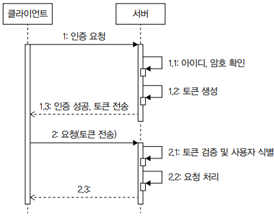
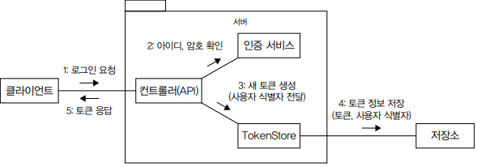

# 실무에서 꼭 필요한 보안 지식

 - 인증과 인가
 - 암호화
 - 방화벽으로 트래픽 제한
 - 감사 로그, 비정상 접근 처리
 - 시큐어 코딩
 - 개인 보안

<br/>

## 1. 인증과 인가

인증은 사용자가 누구인지 확인하는 과정이고, 인가는 사용자에게 자원에 접근할 수 있는 권한을 부여하는 것이다.

 - 인증: 니가 누군데
 - 인가: 니가 뭘 할 수 있는데

<br/>

### 1-1. 인증과 토큰

사용자가 누구인지 확인하는 데 성공하면 서버는 클라이언트에 문자열로 된 토큰을 제공한다. 클라이언트는 이후 각 요청마다 이 토큰을 함께 보내 자신이 누구인지 증명한다. 서버는 사용자 인증이 필요한 기능에 대해 매번 아이디와 암호를 입력받지 않고, 토큰을 사용해서 사용자를 식별한다.

<div align="center">
    
</div>
<br/>

#### 토큰을 통한 사용자 식별

토큰을 이용해서 사용자를 식별하려면 토큰과 사용자 간의 매핑 정보를 어딘가에 저장해야 한다.

 - `서버의 별도 저장소: 별도 저장소에 토큰과 사용자 식별 정보 저장`
    - 서버는 토큰과 사용자 식별 정보를 DB나 레디스와 같은 별도 저장소에 보관할 수 있다.
    - 로그인 성공시 서버는 임의의 토큰 문자열을 만든 뒤 외부 저장소에 매핑 정보를 보관한다.

<div align="center">
    
</div>

 - `메모리에 저장 방식`
    - 외부 저장소가 아닌 서버 메모리에 토큰 데이터를 저장할 수도 있다. 서블릿 세션이 이에 해당한다. 톰캣과 같은 서블릿 컨테이너는 메모리에 세션 객체를 저장한다. 서블릿 세션은 고유의 세션 ID를 생성하는데 이 세션ID가 토큰에 해당한다.
    - 단점: 서버를 재시작하면 토큰 데이터가 사라지고, 생성할 수 있는 세션 개수가 메모리 크기에 제한을 받는다.
    - 해결 방안: 세션 데이터를 별도 저장소에 보관. 예를 들어 스프링 세션은 메모리 대신 DB나 레디스에 세션 데이터를 저장해서 서버 재시작 시에도 세션을 유지.
```java
HttpSession session = request.getSession(false);
if (session == null) {
    throw new AuthenticationException();
}

// 세션에서 로그인한 사용자 정보 추출
UserSessionData data = (UserSessionData) session.getAttribute("userSessionData");
if (data == null) {
    throw new AuthenticationException();
}
```

 - `토큰 자체에 사용자 식별자 정보 저장하기`
    - 토큰 자체에 사용자 식별 정보를 저장할 수도 있다. 대표적인 방식이 JWT를 이용하는 것이다.
    - 별도의 외부 DB에 토큰 데이터를 저장할 필요가 없으므로 서버 구조가 간단하고, 메모리에 토큰 데이터를 저장하지 않기 때문에 서버 수평 확장이 쉽다.
    - 단점: 토큰 안에 데이터가 추가되므로 네트워크 트래픽이 증가하고, 토큰 데이터를 서버에서 제어할 수 없다.
        - 서버에 토큰 데이터가 저장되면 쉽게 토큰 데이터 삭제가 가능하다.
        - 반면에 클라이언트에 전송된 토큰 데이터는 클라이언트에 저장되므로 서버에서 삭제하거나 변경할 수 없다.
```java
// 토큰 만들기
String token = Jwts.builder()
    .subject("userId") // 사용자 식별자
    .signWith(key)
    .compact();

return LoginResponse.of(token);

// 토큰에서 사용자 식별자 얻기
try {
    // 토큰 문자열 파싱
    Jws<Claims> jwt = Jwts.parser().verifyWith(key).build().parseSignedClaims(jws);
    // 토큰에서 사용자 식별자 얻기
    String userId = jwt.getPayload().getSubject();
} catch (JwtException e) {
    // 유효하지 않은 토큰이면 에러 처리
    throw new AuthenticationException();
}
```
<br/>

#### 토큰 송수신

 - `쿠키: 쿠키를 사용해서 토큰 전송`
    - 웹 사이트는 주로 쿠키 방식을 사용한다.
    - 서버는 사용자가 로그인에 성공하면 토큰 문자열을 값으로 갖는 쿠키를 웹 브라우저에 응답한다.
    - 웹 브라우저는 서버가 전송한 쿠키를 모든 요청에 함께 전송하므로 토큰을 서버에 전송하기 위해 별도의 자바스크립트 코드를 작성할 필요가 없다.
 - `헤더: 특정 이름을 갖는 헤더를 사용해서 토큰 전송`
    - 헤더 이름은 Token, X-token, Auth 등 알맞게 정하면 된다.
    - OAuth 2.0처럼 Authorization 헤더를 사용하기도 한다.
    - 클라이언트는 토큰을 로컬에 저장했다가 서버 API 요청을 호출할 때 헤더를 이용해서 토큰을 전송한다.

<br/>

#### 토큰 보안

토큰 탈취에 따른 보안 문제를 완화하는 방법은 토큰 유효 시간에 제한을 두는 것이다. 

 - __토큰 유효 시간 방식 2가지__
    - 토큰 생성 시점 기준
    - 마지막 접근 시간 기준
 - __유효 시간과 함께 클라이언트 IP를 비교하면 토큰 보안이 향상된다.__
    - 토큰을 생성할 때 접근한 클라이언트 IP와 실제 토큰을 전송한 클라이언트 IP가 같은지 비교한다.
    - IP가 다르면 비정상으로 간주하고 요청 처리를 거부한다.
 - __보안 사고 영향을 줄이고 싶다면 토큰을 무효화해서 강제로 로그아웃시키는 기능도 필요하다.__
    - 토큰 데이터를 DB나 레디스와 같은 외부 저장소에 보관하면 토큰 데이터를 삭제하거나 유효하지 않은 상태로 변경해서 토큰을 무효화할 수 있다.

<br/>

### 1-2. 인가와 접근 제어 모델

