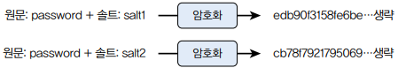
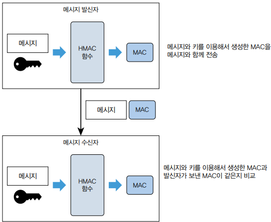

# 실무에서 꼭 필요한 보안 지식

 - 인증과 인가
 - 암호화
 - 방화벽으로 트래픽 제한
 - 감사 로그, 비정상 접근 처리
 - 시큐어 코딩
 - 개인 보안

<br/>

## 1. 인증과 인가

인증은 사용자가 누구인지 확인하는 과정이고, 인가는 사용자에게 자원에 접근할 수 있는 권한을 부여하는 것이다.

 - 인증: 니가 누군데
 - 인가: 니가 뭘 할 수 있는데

<br/>

### 1-1. 인증과 토큰

사용자가 누구인지 확인하는 데 성공하면 서버는 클라이언트에 문자열로 된 토큰을 제공한다. 클라이언트는 이후 각 요청마다 이 토큰을 함께 보내 자신이 누구인지 증명한다. 서버는 사용자 인증이 필요한 기능에 대해 매번 아이디와 암호를 입력받지 않고, 토큰을 사용해서 사용자를 식별한다.

<div align="center">
    
</div>
<br/>

#### 토큰을 통한 사용자 식별

토큰을 이용해서 사용자를 식별하려면 토큰과 사용자 간의 매핑 정보를 어딘가에 저장해야 한다.

 - `서버의 별도 저장소: 별도 저장소에 토큰과 사용자 식별 정보 저장`
    - 서버는 토큰과 사용자 식별 정보를 DB나 레디스와 같은 별도 저장소에 보관할 수 있다.
    - 로그인 성공시 서버는 임의의 토큰 문자열을 만든 뒤 외부 저장소에 매핑 정보를 보관한다.

<div align="center">
    
</div>

 - `메모리에 저장 방식`
    - 외부 저장소가 아닌 서버 메모리에 토큰 데이터를 저장할 수도 있다. 서블릿 세션이 이에 해당한다. 톰캣과 같은 서블릿 컨테이너는 메모리에 세션 객체를 저장한다. 서블릿 세션은 고유의 세션 ID를 생성하는데 이 세션ID가 토큰에 해당한다.
    - 단점: 서버를 재시작하면 토큰 데이터가 사라지고, 생성할 수 있는 세션 개수가 메모리 크기에 제한을 받는다.
    - 해결 방안: 세션 데이터를 별도 저장소에 보관. 예를 들어 스프링 세션은 메모리 대신 DB나 레디스에 세션 데이터를 저장해서 서버 재시작 시에도 세션을 유지.
```java
HttpSession session = request.getSession(false);
if (session == null) {
    throw new AuthenticationException();
}

// 세션에서 로그인한 사용자 정보 추출
UserSessionData data = (UserSessionData) session.getAttribute("userSessionData");
if (data == null) {
    throw new AuthenticationException();
}
```

 - `토큰 자체에 사용자 식별자 정보 저장하기`
    - 토큰 자체에 사용자 식별 정보를 저장할 수도 있다. 대표적인 방식이 JWT를 이용하는 것이다.
    - 별도의 외부 DB에 토큰 데이터를 저장할 필요가 없으므로 서버 구조가 간단하고, 메모리에 토큰 데이터를 저장하지 않기 때문에 서버 수평 확장이 쉽다.
    - 단점: 토큰 안에 데이터가 추가되므로 네트워크 트래픽이 증가하고, 토큰 데이터를 서버에서 제어할 수 없다.
        - 서버에 토큰 데이터가 저장되면 쉽게 토큰 데이터 삭제가 가능하다.
        - 반면에 클라이언트에 전송된 토큰 데이터는 클라이언트에 저장되므로 서버에서 삭제하거나 변경할 수 없다.
```java
// 토큰 만들기
String token = Jwts.builder()
    .subject("userId") // 사용자 식별자
    .signWith(key)
    .compact();

return LoginResponse.of(token);

// 토큰에서 사용자 식별자 얻기
try {
    // 토큰 문자열 파싱
    Jws<Claims> jwt = Jwts.parser().verifyWith(key).build().parseSignedClaims(jws);
    // 토큰에서 사용자 식별자 얻기
    String userId = jwt.getPayload().getSubject();
} catch (JwtException e) {
    // 유효하지 않은 토큰이면 에러 처리
    throw new AuthenticationException();
}
```
<br/>

#### 토큰 송수신

 - `쿠키: 쿠키를 사용해서 토큰 전송`
    - 웹 사이트는 주로 쿠키 방식을 사용한다.
    - 서버는 사용자가 로그인에 성공하면 토큰 문자열을 값으로 갖는 쿠키를 웹 브라우저에 응답한다.
    - 웹 브라우저는 서버가 전송한 쿠키를 모든 요청에 함께 전송하므로 토큰을 서버에 전송하기 위해 별도의 자바스크립트 코드를 작성할 필요가 없다.
 - `헤더: 특정 이름을 갖는 헤더를 사용해서 토큰 전송`
    - 헤더 이름은 Token, X-token, Auth 등 알맞게 정하면 된다.
    - OAuth 2.0처럼 Authorization 헤더를 사용하기도 한다.
    - 클라이언트는 토큰을 로컬에 저장했다가 서버 API 요청을 호출할 때 헤더를 이용해서 토큰을 전송한다.

<br/>

#### 토큰 보안

토큰 탈취에 따른 보안 문제를 완화하는 방법은 토큰 유효 시간에 제한을 두는 것이다. 

 - __토큰 유효 시간 방식 2가지__
    - 토큰 생성 시점 기준
    - 마지막 접근 시간 기준
 - __유효 시간과 함께 클라이언트 IP를 비교하면 토큰 보안이 향상된다.__
    - 토큰을 생성할 때 접근한 클라이언트 IP와 실제 토큰을 전송한 클라이언트 IP가 같은지 비교한다.
    - IP가 다르면 비정상으로 간주하고 요청 처리를 거부한다.
 - __보안 사고 영향을 줄이고 싶다면 토큰을 무효화해서 강제로 로그아웃시키는 기능도 필요하다.__
    - 토큰 데이터를 DB나 레디스와 같은 외부 저장소에 보관하면 토큰 데이터를 삭제하거나 유효하지 않은 상태로 변경해서 토큰을 무효화할 수 있다.

<br/>

### 1-2. 인가와 접근 제어 모델

 - 접근 제어의 기본은 접근한 사용자를 토큰이나 세션으로 식별하는 것이다.
 - API 요청 파라미터로 로그인한 사용자의 식별자를 받으면 안 된다.
 - 사용자가 접근할 수 있는 기능을 관리하기 위한 모델을 접근 제어 모델이라고 한다.
 - 대표적인 접근 제어 모델로는 역할 기반 접근 제어 모델이 있다.
    - RBAC는 역할별로 실행 가능한 기능 집합을 할당하고, 사용자에게는 역할을 부여한다.
 - 역할별 권한 부여 방식과 사용자별 권한 부여 방식은 각각 장단점이 있기 때문에 단독으로 사용하기 보다는 함께 사용하는 경우가 많다.
    - 역할별 권한 부여 방식을 사용하면 권한을 체계적으로 관리할 수 있다. 사용자에게 권한을 일일이 부여할 필요 없이 역할만 부여하면 되므로 권한 관리가 쉽다.
 - RBAC를 사용할 대는 역할ㄹ의 설계와 관리에 신경써야 한다.
    - 역할을 무분별하게 정의하면 중복된 기능을 가진 유사한 역할이 계속 생기기 쉽다.
 - 사용자의 속성을 이용해서 접근을 제어하는 속성 기반 접근 제어 모델도 있다.
    - 속성을 활용하면 보다 정교한 접근 제어가 가능하지만, 그만큼 구현이 복잡해지고, 사용할 속성과 규칙을 정의하는 데도 많은 시간이 소요된다.

<br/>

## 2. 데이터 암호화

암호화된 상태로 저장된 비밀번호는 유출되더라도 원래 값을 알아내기 어렵고, 알아내더라도 상당한 시간이 소요된다. 이를 통해 실제 피해가 발생하기 전까지 비밀번호를 변경하는 등 사후 대응할 수 있는 시간을 벌 수 있다.

<br/>

### 2-1. 단방향 암호화

__단방향 암호화는 암호화한 데이터를 복호화할 수 없는 암호화 방식이다. 단방향 암호화는 해시 함수를 사용해서 데이터를 해시 값으로 변환한다. 해시 알고리즘에는 SHA-256, MD5, BCrypt 등이 있다.__

 - SHA-256과 같은 해시 함수 알고리즘은 원본 데이터를 유추하기 어렵게 하기 위해 원본 데이터가 조금만 달라도 완전히 다른 해시 값을 생성한다.
 - 단방향 암호화는 로그인 비밀번호 같은 문자열을 암호화하는 데 주로 사용되지만, 실제 암호화는 바이트 데이터를 기준으로 동작한다.
    - 문자열 암호화시 바이트 배열로 변환해서 전달. 바이트 배열로 변환할 때는 문자열에 알맞는 캐릭터셋 이용
    - 암호화한 결과를 DB와 같은 저장소에 읽을 수 있는 형태로 저장하려면 바이트 배열을 문자열로 표현해야 한다.
        - 이를 위해 바이트 배열을 16진수 표기법이나 Base64 표기법을 사용해서 문자열로 표현한다.
```java
// 문자열 암호화시 바이트 배열로 변환해서 암호화
byte[] origin = input.getBytes("UTF-8");
MessageDigest digest = MessageDigest.getInstance("SHA-256");
byte[] hash = digest.digest(origin); // 입력 파라미터가 바이트 배열

// 
public static String encrypt(String input) {
    StringBuilder hexString = new StringBuilder();
    try {
        MessageDigest digest = MessageDigest.getInstance("SHA-256");
        byte[] hash = digest.digest(input.getBytes("UTF-8"));
        for (byte b : hash) {
            String hex = Integer.toHexString(0xff & b);
            if (hex.length() == 1) hexString.append('0');
            hexString.append(hex);
        }
    } catch (Exception e) {
        throw new RuntimeException(e);
    }
    return hexString.toString();
}
```
<br/>

 - `알아두기(충돌 저항성)`
    - 해시 함수는 원본 데이터에 상관없이 일정 길이의 해시 값을 생성한다.
    - __길이가 제한되기 떄문에 서로 다른 데이터가 동일한 해시 값을 가질 수 있다.__
    - 서로 다른 데이터에 대해 최대한 다른 해시 값을 생성하는 해시 알고리즘이 좋다고 할 수 있다. 동일한 해시 값을 갖는 서로 다른 데이터를 찾기 어려울 때 해시 함수는 충돌 저항성을 갖는다.
    - 해시 함수의 생성 결과가 길수록 충돌 날 가능성이 줄어든다.
<br/>

 - `값의 비교`
    - 단방향 암호화는 해시 함수로 생성한 해시 값이 같다면 두 데이터가 같다고 간주한다.
    - 회원가입시 입력한 비밀번호를 암호화한 해시 값을 DB에 저장하고, 로그인 시에는 입력한 비밀번호를 암호화해서 DB에 저장된 값과 비교한다.
    - 단방향 암호화는 원본 데이터로 복호화할 수 없기 때문에, 사용자가 비밀번호를 잊었을 때 기존 비밀번호를 알려주는 기능은 구현할 수 없다.
    - 대신 시스템은 임의의 문자열로 비밀번호를 초기화하고, 사용자는 등록된 이메일이나 문자 메시지를 통해 초기화된 비밀번호를 받아 로그인하도록 한다.
```java
String inputPasswordHash = encodePassword(inputPassword);
String dbPasswordHash = selectDbPassword(userId);
if (inputPasswordHash.equals(dbPasswordHash)) {
    // 두 값이 같으면 비밀번호를 올바르게 입력함
}
```
<br/>

 - `Salt로 보안 강화하기`
    - 같은 해시 알고리즘을 사용하면 동일한 원본 데이터에 대해 항상 동일한 해시 값이 생성된다.
    - 이 특성은 해시 값이 유출됐을 떄 원본을 유추하기 쉽게 만든다. (문자열과 해시 값을 미리 계산해 만든 레인보우 테이블)
    - __해시 알고리즘은 이 취약점을 보완하기 위해 솔트를 사용한다. 솔트는 임의의 값이며, 암호화할 때 솔트를 함꼐 사용하면 솔트 값에 따라 결과 해시값이 달라진다.__
```java
public static String encryptWithSalt(String input, String salt) {
    StringBuilder hexString = new StringBuilder();
    try {
        MessageDigest digest = MessageDigest.getInstance("SHA-256");
        digest.update(salt.getBytes()); // salt 추가

        byte[] hash = digest.digest(input.getBytes("UTF-8"));

        for (byte b : hash) {
            String hex = Integer.toHexString(0xff & b);
            if (hex.length() == 1) hexString.append('0');
            hexString.append(hex);
        }
    } catch (Exception e) {
        throw new RuntimeException(e);
    }
    return hexString.toString();
}
```

<div align="center">
    
</div>
<br/>

### 2-2. 양방향 암호화

__양방향 암호화는 암호화와 복호화가 모두 가능한 방식이다. 서버에 접속할 때 사용하는 SSH 프로토콜이나 API 호출 시 사용하는 HTTPS처럼 보안이 중요한 데이터 송수신 과정에서 주로 사용된다. 대표적인 양방향 암호화 알고리즘으로는 AES와 RSA가 있다.__

 - 양방향 암호화는 암호화와 복호화할 때 키를 사용한다.
 - `대칭 키 암호화`
    - 암호화와 복호화시 동일한 키를 사용.
    - 키가 유출되면 누구나 암호화된 데이터를 복호화할 수 있음.
 - `비대칭 키 암호화`
    - 암호화와 복호화시 서로 다른 키를 사용.
    - 공개키와 개인키를 생성하며, 공개키는 누구에게나 공개할 수 있는 키, 개인키는 키 소유자만 접근할 수 있음.
    - 공개 키는 데이터를 암호화할 때 사용되며, 개인 키는 암호화된 데이터를 복호화할 때 사용됨.
    - 공개키로 암호화한 데이터는 개인키로만 복호화할 수 있어 공개키가 유출되더라도 암호화한 데이터를 복호화할 수 없음.
    - 보통 개인키로 데이터를 암호화하는 것은 신원 확인이나 서명과 같은 인증 목적으로 사용된다.
        - SSH 서버에 공개키를 등록하고, 클라이언트는 서버에 접속할 때 개인키를 이용해서 인증함
 - `알아두기 (SSH의 키 쌍을 이용한 사용자 인증 과정)`
    - 클라이언트는 인증에 사용할 키 쌍의 ID를 서버에 전송
    - 서버는 키 ID에 해당하는 공개 키를 authorized_keys 파일에서 찾음
    - 공개 키가 존재하면 임의의 숫자를 생성해서 공개 키로 암호화
    - 암호화한 숫자를 클라이언트에 전송
    - 클라이언트는 개인 키로 암호화된 숫자를 복호화
    - 클라이언트는 복호화한 숫자와 공유 세션 키를 결합한 값의 해시를 구함
    - 클라이언트는 해시 값을 서버에 전송
    - 서버는 클라이언트가 전송한 해시 값과 서버가 임의 숫자와 공유 세션 키로 생성한 해시 값이 같은지 비교
    - 두 값이 일치하면 클라이언트를 인증
<br/>

 - `AES 대칭 키 암호화`
    - AES는 키 값으로 128, 192, 256 비트 중 하나를 사용한다. (바이트로는 16, 24, 32 바이트)
    - 생성한 키는 바이너리 파일이나 문자열 형식으로 변환해서 보관하고 공유한다.
        - 보관돤 키를 이용해 암호화하려면, 해당 키 데이터로부터 SecretKey 객체를 만들어야 한다.
    - 같은 키를 사용해서 같은 데이터를 암호화하면 항상 같은 결과가 생성된다. 이런 패턴 노출을 막기 위해 IV(초기화 벡터)를 사용한다.
        - IV는 임의의 바이트 배열로서, 암호화할 때 함께 사용되면 같은 키를 쓰더라도 결과값이 매번 달라져 패턴이 드러나는 것을 방지할 수 있다.
        - 복호화할 때는 키와 함꼐 IV도 필요하다.
```java
// 임의의 키 생성
public static byte[] generateSecretKey() throws Exception {
    KeyGenerator keyGenerator = KeyGenerator.getInstance("AES");
    keyGenerator.init(256); // 256 비트 키 생성
    SecretKey secretKey = keyGenerator.generatorKey();
    return secretKey.getEncoded(); // 길이 32 바이트의 배열 반환
}

// Byte 배열 -> SecretKey 변환
SecretKey key = new SecretKeySpec(bytes, "AES");

// 임의의 IV 생성
public static byte[] genIv() {
    byte[] iv = new byte[16];
    new SecureRandom().nextBytes(iv);
    return iv;
}

// 키와 IV를 이용한 암호화/복호화
public static String encrypt(String plain, SecretKey key, byte[] iv) throws Exception {
    Cipher cipher = Cipher.getInstance("AES/CBC/PKCS5Padding"); // 알고리즘
    IvParameterSpec parameterSpec = new IvParameterSpec(iv);
    cipher.init(Cipher.ENCRYPT_MODE, key, parameterSpec);
    byte[] encrypted = cipher.doFinal(plain.getBytes("UTF-8")); // 암호화
    return Base64.getEncoder().encodeToString(encrypted);
}
public static String decrypt(String encrypted, SecretKey key, byte[] iv) throws Exception {
    Cipher cipher = Cipher.getInstance("AES/CBC/PKCS5Padding"); // 알고리즘
    IvParameterSpec parameterSpec = new IvParameterSpec(iv);
    cipher.init(Cipher.DECRYPT_MODE, key, parameterSpec);
    byte[] decoded = Base64.getDecoder().decode(encrypted);
    byte[] decrypted = cipher.doFinal(decoded); // 복호화 실행
    return new String(decrypted, "UTF-8");
}
```
<br/>

 - `비대칭 키 암호화 예`
    - 비대칭 키 암호화는 공개 키/개인 키 쌍을 생성한 뒤에 공개 키를 공유한다.
    - 공개키와 개인키는 바이트 배열을 Base64 형식으로 인코딩해서 문자열로 공유하거나, 바이트 배열 자체를 파일로 저장해서 공유한다.
```java
// RSA 알고리즘을 위한 키 쌍 생성
KeyPairGenerator keyGen = KeyPairGenerator.getInstance("RSA");
keyGen.initialize(2048); // 키 길이 2048 비트로 설정
KeyPair keyPair = keyGen.generateKeyPair();
PublicKey publicKey = keyPair.getPublic(); // 공개 키
PrivateKey privateKey = keyPair.getPrivate(); // 개인 키
byte[] publicKeyBytes = publicKey.getEncoded(); // 공개 키 바이트 배열
byte[] privateKeyBytes = privateKey.getEncoded(); // 개인 키 바이트 배열

// 바이트 배열 -> PublicKey/PrivateKey 타입 변환
public static KeyPair getKeyPairFromBytes(
    byte[] publicKeyBytes,
    byte[] privateKeyBytes
) throws NoSuchAlgorithmException, InvalidKeySpecException {
    KeyFactory keyFactory = KeyFactory.getInstance("RSA");
    PublicKey publicKey = keyFactory.generatePublic(new X509EncodedKeySpec(publicKeyBytes));
    PrivateKey privateKey = keyFactory.generatePrivate(new PKCS8EncodedKeySpec(privateKeyBytes));
    return new KeyPair(publicKey, privateKey);
}

// 공개 키와 개인 키로 암호화/복호화
public static String encrypt(String plain, PublicKey publicKey) {
    Cipher cipher = Cipher.getInstance("RSA");
    cipher.init(Cipher.ENCRYPT_MODE, publicKey);
    byte[] encryptedBytes = cipher.doFinal(plain.getBytes("UTF-8"));
    return Base64.getEncoder().encodeToString(encryptedBytes);
}
public static String decrypt(String encrypted, PrivateKey privateKey) {
    Cipher cipher = Cipher.getInstance("RSA");
    cipher.init(Cipher.DECRYPT_MODE, privateKey);
    byte[] decodedBytes = Base64.getDecoder().decode(encrypted);
    byte[] decryptedBytes = cipher.doFinal(decodedBytes);
    return new String(decryptedBytes, "UTF-8");
}
```

## 3. HMAC을 이용한 데이터 검증

API 통신을 할 때 클라이언트는 데이터를 알맞게 생성해서 서버에 전송한다. 클라이언트가 전송한 데이터가 중간에 누군가가 위변조하지 않았다는 것을 확인할 수단이 필요한데, 이때 HMAC을 주로 사용한다.

HMAC은 Hash-based Message Authentication Code의 약자로, 메시지의 무결성과 인증을 보장하기 위해 사용하는 암호화 기술이다.

 - 메시지 무결성: 메시지가 중간에 위변조되지 않았음
 - 인증: 메시지 발신자를 인증할 수 있음(발신자만 비밀 키 접근)

<br/>

메시지의 발신자와 수신자는 둘만 알고 있는 비밀 키를 공유한다. 메시지 발신자는 메시지를 비밀 키로 해싱해서 생성한 HMAC(메시지 인증 코드)를 원본 메시지와 함께 수신자에게 전송한다. 수신자는 수신한 메시지와 비밀키를 이용해 MAC을 다시 생성한 뒤, 발신자가 보낸 MAC과 비교한다. 두 값이 같으면 메시지가 변경되지 않았음을 보장할 수 있다.

 - HMAC의 장점은 단순함과 효율성이다.
 - 발신자와 수신자가 비밀키만 공유하면 정해진 해시 알고리즘을 이용해서 MAC을 생성할 수 있다.
 - 단점은 비밀키 관리이다.

<div align="center">
    
</div>
<br/>

```java
@AllArgsConstructor
public static class HMAC {
    private String secretKey;

    public String hmac(String message) {
        try {
            Mac mac = Mac.getInstance("HmacSHA256");
            SecretKeySpec secretKeySpec = new SecretKeySpec(secretKey.getBytes(), "HmacSHA256");
            mac.init(secretKeySpec);
            byte[] hash = mac.doFinal(message.getBytes("UTF-8"));
            return Base64.getEncoder().encodeToString(hash);
        } catch (Exception e) {
            throw new RuntimeException(e);
        }
    }
}
```
<br/>

## 4. 방화벽으로 필요한 트래픽만 허용하기

서버가 외부에 노출되기 시작하면 포트 스캔부터 다양한 공격이 들어온다. 이를 방지하기 위해 필요한 만큼만 네트워크 접근을 허용하고 나머지는 차단해야 한다.

 - 인바운드 트래픽
    - 외부에서 내부로 유입되는 것
    - 기본적으로 인바운드는 필수 트래픽만 허용하고 나머지는 차단할 것을 권한다. 모든 외부 IP의 모든 포트에 접근을 허용하기보다는, 특정 서버 IP의 443 포트만 허용하고 나머지는 차단하는 식으로 외부 노출을 최소화해야 한다. 또한 접속을 허용할 클라이언트 IP도 가능한 최소 범위로 지정한다.
    - 서비스 API: 외부의 모든 IP에서 서버 A IP에 443 포트로 접근 가능
    - 관리자 API: 사내 IP만 서버 B IP의 443 포트로 접근 가능
 - 아웃바운드 트래픽
    - 내부에서 외부로 유출되는 것
    - 아웃바운드 역시 가능하면 필수만 허용하고 나머지는 차단한다. 아웃바운드를 모두 허용하면 서버가 해킹당했을 때 해커의 중간 경유지로 악용될 수 있다.
 - 방화벽은 단순히 트래픽을 제어하는 것 외에도, DDoS나 포트 스캔 같은 네트워크 공격을 차단하는 기능도 제공한다.
    - 웹 방화벽을 사용하면 HTTP/HTTPS 수준에서 발생하는 공격도 방어할 수 있다. 웹 방화벽은 SQL 인젝션, XSS 같은 웹 기반 위협을 감지하고 차단한다.
    - 개별 서버 자체도 방화벽 기능을 제공한다. 우분투, 로키, 윈도우 서버 등 서버 OS도 방화벽 기능을 통해 트래픽 제어가 가능하다.

<br/>

## 5. 감사 로그 남기기

감사 로그는 데이터 조회 및 변겨 이력, 작업자,  시점 등의 정보를 기록해 활동을 입증하는 증거로 사용된다.

 - 사용자의 로그인/로그아웃 내역
 - 암호 초기화 등 설정 변경 내역
 - 환자 기록을 조회한 의료진 정보
 - 계약서의 수정 이력
<br/>

 - `알아두기(감사 로그와 일반 로그)`
    - 감사 로그는 컴플라이언스나 정책을 지키기 위해 활동 내역을 기록
    - 일반 로그는 개발자가 버그나 오류 같은 문제 해결을 도움받기 위한 목적으로 기록
    - 감사 로그는 필수로 기록해야 한다. 일반 로그는 로그 레벨을 두어 필요에 따라 남기기도 생략하기도 한다.
    - 감사 로그는 정해진 기간 동안 보관해야 한다. 일반 로그는 상황에 따라 지우기도 한다.

<br/>

## 6. 데이터 노출 줄이기

서비스 운영자는 백오피스에서 다양한 고객 정보를 조회할 수 있다. 고객 이름, 휴대폰 번호, 주소 등 고객을 특정할 수 있는 민감 정보가 노출된다. 개인 정보가 많이 표시될수록 고객 정보를 쉽게 취득할 수 있다.

 - __다수의 고객 정보를 쉽게 획득하지 못하게 만드는 방법으로 마스킹이 있다.__
    - 서버에서 클라이언트로 응답하는 데이터 자체가 마스킹되어야 한다. 프론트 코드에서만 마스킹 처리하면 안된다.

<br/>

## 7. 비정상 접근 처리

사용자가 평소와 다른 행동 패턴을 보이면 비정상 접근으로 판단하고 사용자에게 내용을 알릴 수 있다. 알리는 것을 넘어 연속적으로 로그인 실패시 일시적으로 계정을 잠그기도 한다.

 - 평소와 다른 장소에서 로그인함
 - 평소와 다른 기기에서 로그인함
 - 로그인에 여러 차례 실패함

<br/>

동일한 URL이나 API 반복 접근도 부정 사용으로 간주할 수 있다. 또한, 권한이 없는 URL이나 API에 대한 접근 시도를 하는 경우에도 부정 사용으로 간주할 수 있다.

