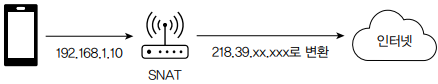
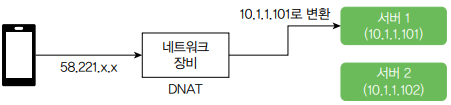
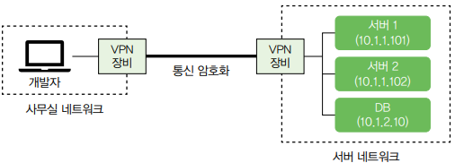
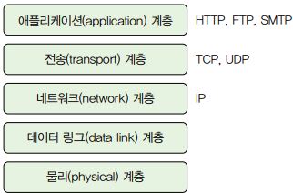

# 모르면 답답해지는 네트워크 기초

 - 네트워크와 라우터
 - IP 주소와 도메인
 - NAT
 - VPN
 - 프로토콜

 

## 1. 네트워크 문제 사례

서버에서 외부 업체가 제공한 API 연결이 안되는 문제

 - 코드에 적혀 있는 API 주소가 유효한지 확인
 - 방화벽의 아웃바운드 설정이 잘못됐는지 확인
 - API 제공자 측의 인바운드 허용 정책 확인 (서버에서 외부로 나가는 IP를 허용해야 함)

 

## 2. 노드, 네트워크, 라우터

 - 노드: 데이터를 송수신하는 모든 장치를 노드라고 표현한다. (휴대폰, 노트북, 서버 장비 등)
 - 네트워크: 노드가 서로 데이터를 주고받기 위해 연결된 시스템을 네트워크라고 한다.
 - 패킷: 노드가 네트워크를 통해 전송하는 데이터의 단위를 패킷이라고 한다. 패킷은 헤더와 페이로드로 구성된다. 헤더는 패킷의 발신자와 수신자 정보를 포함하며 페이로드에는 데이터가 포함된다. 데이터는 일정 크기를 가진 여러 패킷으로 나뉘어 전송된다.

 

## 3. IP 주소와 도메인

네트워크에서 각 노드를 구분하기 위해 사용하는 주소를 IP 주소라고 한다. 현재 일반적으로 사용하는 IP 주소는 1바이트(8비트) 4개의 숫자 블록으로 구성된 IPv4 주소이다.

 - `IPv6 주소`
    - IPv4 주소는 32비트로 구성되어 약 43억 개의 고유한 주소가 존재.
    - 1990년대 초부터 IP 주소가 고갈될 것을 예측하여 더 많은 노드에 고유한 주소를 부여할 수 있는 IPv6 주소가 만들어짐.
    - IPv6 주소는 128비트를 사용.
 - `도메인`
    - 각 노드이 IP 주소를 기억하기 쉽지 않음.
    - 도메인 이름은 계층 구조를 가짐. 각 계층은 점(.)으로 구분되며 오른쪽이 상위 계층이고 왼쪽이 하위 계층임.
        - 최상위 계층: com, org, net, gov, app, biz, tech 등
        - 2차 도메인: 주로 회사 이름이나 브랜드 이름을 사용 (naver.com, google.com)
        - 3차 도메인: cafe.naver.com, www.google.com
 - `DNS`
    - 도메인 이름과 IP 주소로 변환하는 체계
    - DNS를 일종의 인터넷 전화번호부로 볼 수 있음
    - 도메인 이름에 해당하는 IP 주소는 DNS 서버를 통해 확인한다.
        - 브라우저에 www.naver.com를 입력시 -> 브라우저는 DNS 서버에 www.naver.com의 IP 주소를 질의 -> DNS 서버는 응답으로 대응하는 IP 주소 반환 -> 브라우저는 응답으로 받은 IP 주소에 패킷 전송
 - `hosts 파일`
    - 각 컴퓨터는 hosts 파일을 가진다.
    - 리눅스에서는 /etc 디렉토리에 위치하고, 윈도우즈 에서는 C:/Windows/System32/drivers/etc 디렉토리에 위치한다.
    - 해당 파일은 호스트 이름과 IP 주소에 대한 매핑을 정의한 파일이다.
    - 도메인 서버보다 hosts 파일에 매핑된 설정이 우선이다.
    - localhost에 대한 IP 매핑도 해당 파일에 정의되어 있다.
 - `도메인 이름과 IP 주소 개수`
    - 도메인 이름에 매핑되는 IP 주소는 여러 개일 수 있다.
    - nslookup 명령어를 사용하면 도메인의 IP 주소를 확인할 수 있다.
    - 한 도메인 이름에 IP 주소를 여러 개 매핑하는 이유 중 하나는 부하 분산에 있다.

 

### 3-1. 공인 IP와 사설 IP

브라우저에 www.google.com 같은 도메인 이름을 입력하면 DNS 서버로부터 IP 주소를 받아와 해당 IP 주소에 접속한다. 이때 IP 주소는 인터넷에서 접근 가능한 IP 주소로서 공인 IP 주소라고 부른다. 공인 IP 주소는 인터넷에 접속하는 모든 네트워크에 적용되는 주소이며 공용 IP 주소라고도 한다.

 

모든 네트워크에 적용되는 공인 IP 주소와 달리 네트워크 내부에만 적용되는 사설 IP 주소도 있다. 사설 IP 주소는 특정 네트워크에 속한 노드에 할당하는 주소로서 네트워크 외부에서 접근할 수 없다. 공유기에 연결된 휴대폰, 태블릿, 컴퓨터가 사설 IP 주소를 갖는다.

서로 같은 주소를 가질 수 없는 공인 IP와 달리 사설 IP는 네트워크가 다르면 같은 주소를 가질 수 있다. 노드에 할당된 사설 IP는 네트워크 내부에서만 고유하다.

 

## 4. NAT

NAT는 네트워크 주소를 변환하는 기술이다. 인터넷에 연결하려면 내부에서 사용하는 사설 IP와 인터넷에서 사용하는 공인 IP 주소 간의 변환이 필요한데, NAT가 이 변환을 담당한다.

 - NAT는 주로 인터넷에 연결된 라우터 같은 네트워크 장비가 담당한다.
 - 라우터는 내부 네트워크에서 나가는 패킷의 사설 IP를 공인 IP로 변환한다.
 - 소스 IP의 주소를 변환한다고 해서 이를 SNAT라고 한다.

   

 

 - 공인 IP로 들어온 패킷의 목적지를 사설 IP로 변환하기도 하는데 목적지 IP의 주소를 변환한다고 해서 이를 DNAT라고 한ㄷ,

   

 

## 5. VPN

서버 네트워크에 존재하는 노드는 사설 IP를 사용한다. 외부 네트워크에서는 사설 IP에 직접 접근할 수 없다. NAT를 사용하면 공인 IP를 통해서 사설 IP를 가진 서버에 접근할 수 있지만, 노드 개수가 많은 경우 모든 사설 IP마다 공인 IP를 매핑할 수 없고, 가능하더라도 서버 네트워크의 모든 노드가 공인 IP로 노출되는 것은 보안 문제가 생길 수 있다.

서버를 운영하려면 서버 네트워크에 구성된 노드에 안전하게 접근할 수 있어야 하는데 VPN(가상 사설 네트워크)를 이용할 수 있다. VPN은 인터넷과 같은 공용 네트워크에서 서로 다른 네트워크 간에 암호화된 연결을 제공한다. 두 네트워크는 마치 하나의 사설 네트워크에 존재하는 것처럼 연결될 수 있다.

 - 개발자는 전용 VPN 클라이언트를 통해 VPN에 접근할 수 있다.
 - 집이나 카페 같은 외부 공간에서 서버 네트워크에 접근해야 할 떄 이방식을 사용한다.

   

 

## 6. 프로토콜과 TCP, UDP, QUIC

네트워크 상에서 두 노드가 데이터를 주고받기 위해 정의한 규칙을 프로토콜이라고 한다. 네트워크는 여러 계층으로 구성되며 각 계층마다 사용하는 프로토콜이 존재한다.

    
   TCP/IP 4계층

 

개발자는 주로 전송 계층과 애플리케이션 계층의 프로토콜을 사용한다.
 - `TCP`
   - 연결 기반 프로토콜
   - 두 노드 간에 먼저 연결을 맺은 뒤에 데이터를 주고 받음
   - TCP에서 두 노드가 연결을 맺기 위한 과정을 3-Way Handshake라고 부름
   - 패킷 순서를 보장하고 패킷이 유실될 경우 재전송하는 기능을 제공하고 있어 안정적으로 데이터를 전송할 수 있음(신뢰성)
   - 전송을 보장하기 위해 사용하는 시퀀스 번호, 확인 응답, 재전송 등이 추가되면서 전송 속도는 UDP 대비 상대적으로 느림
   - 예시: HTTP, SMTP
 - `UDP`
   - 연결 과정 없이 바로 데이터 전송
   - 데이터가 정상적으로 전송됐는지 알 수 없고, 순서를 보장하지 않음
   - UDP를 사용하는 애플리케이션은 데이터 유실과 같은 상황이 발생할 수 있음
   - 응답 확인이나 패킷 정렬과 같은 과정을 거치지 않기 떄문에 전송 속도는 TCP 대비 빠름
   - 예시: DNS, VoIP
 - `QUIC`
   - TCP는 신뢰성이 있지만 느리고, UDP는 빠르지만 신뢰성이 없음. 이 둘을 합쳐 빠르면서도 신뢰성있는 프로토콜을 목적으로 QUIC가 개발됨
   - UDP를 기반으로 하며 QUIC 프로토콜 수준에서 TCP의 연결 관리 기능을 제공
      - 데이터 연결 ID를 포함시키는데, 이 연결 ID를 이용해서 두 노드 간의 연결을 유지
      - TCP의 혼잡 제어나 패킷 유실 복구와 같은 기능을 QUIC 프로토콜 수준에서 제어
   - TLS를 통합하여 기본적으로 암호화되어 전송
   - 멀티플렉싱 지원
      - 한 연결에서 여러 스트림을 동시에 처리할 수 있음
      - 1개 스트림에서 HOL 블로킹이 발생해도 다른 스트림에 영향을 주지 않음
 - `TCP 연결은 65,535개가 한계인가?`
   - 포트 번호는 16비트 정수를 사용하여 65,535개를 가질 수 있다.
   - 포트 번호 최대 값이 65,535이다 보니 OS에서 생성할 수 있는 TCP 연결 개수가 65,535개라고 오해하는 경우가 있다. 하지만 실제로 한 장비에서 생성할 수 있는 TCP 연결 개수는 이론적으로 2^96 개의 연결을 생성할 수 있을만큼 많다.
   - TCP의 각 연결은 로컬IP, 로컬포트, 원격IP, 원격포트로 구분된다.
      - IP는 32비트, 포트는 16비트이다.
      - 따라서 로컬 IP가 고정되어 있을 때 한 장비가 생성할 수 있는 연결 개수는 아래와 같다.
      - 2^16(로컬포트) * 2^32(원격IP) * 2^16(원격포트) = 2^44 (약 1,844경)
      - 하나의 로컬 IP에서 특정 원격 IP의 1개 포트에 연결할 수 있는 TCP 연결 개수가 65,535이다.
   - __이론적으로 생성할 수 있는 TCP 연결 개수는 매우 크지만, 실제로 생성할 수 있는 연결 개수는 OS 설정 (파일 디스크립터 개수, 포트 범위 설정 등)에 따라 제약을 받는다.__
