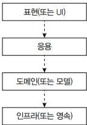
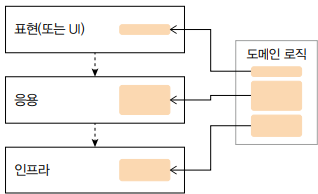
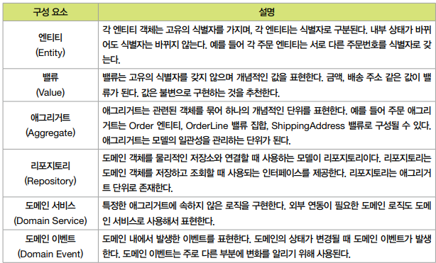
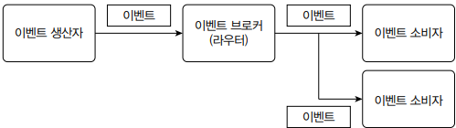
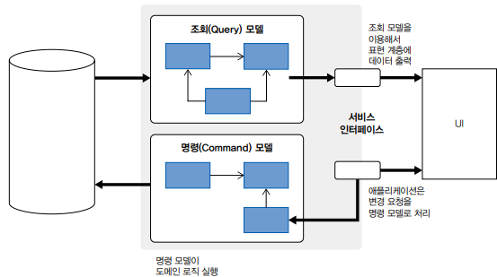

# 자주 쓰는 서버 구조와 설계 패턴

 - MVC 패턴
 - 계층형 아키텍처
 - DDD와 전술 패턴
 - 마이크로서비스 아키텍처
 - 이벤트 기반 아키텍처
 - CQRS

## 1. MVC 패턴

MVC는 Model-View-Controller의 약자로, 3개의 요소로 구성된 패턴이다.

 - 모델: 회원 가입, 암호 변경 등 __비즈니스 영역의 로직__ 을 처리한다.
 - 뷰: __사용자가 보게 될 결과__ 를 생성해서 사용자에 응답한다.
 - 컨트롤러: __사용자의 입력 처리와 흐름 제어__ 를 담당한다.

사용자는 원하는 기능을 처리하기 위한 요청을 컨트롤러에 보낸다. 컨트롤러는 사용자의 요청을 알맞게 해석한 뒤, 모델에 비즈니스 로직 실행을 위임한다. 모델은 사용자가 요청한 기능을 실행한다. 모델은 처리한 결과를 컨트롤러에 리턴한다. 컨트롤러는 모델의 처리 결과를 기준으로 사용자에게 보여줄 뷰를 선택한다. 뷰는 사용자에게 결과 화면을 보여준다. API를 구현한 컨트롤러는 JSON 응답을 생성하는 뷰를 선택하고, 웹 페이지를 구현한 컨트롤러는 HTML 결과를 응답하는 뷰를 선택한다.

<br/>

## 2. 계층형 아키텍처

계층형 아키텍처에서 하위 계층은 상위 계층에 대한 의존을 갖지 않는다. 오직 상위 계층에서 하위 계층으로의 의존만 허용한다.

계층형 아키텍처는 바로 하위의 계층에만 의존하도록 강제하는 경우가 있고, 하위에 있는 계층이면 모든 의존을 허용하는 경우도 있다.

웹 애플리케이션을 계층형 아키텍처로 구현할 때는 일반적으로 4개 계층을 구성한다.

 - 표현(또는 UI) 계층
    - 사용자와의 상호 작용을 담당
    - MVC 패턴에서 컨트롤러와 뷰가 표현 계층에 속함
 - 응용 계층
    - 사용자의 요청을 실제로 처리
    - 모델 계층이나 인프라 계층을 사용해서 필요한 기능을 구현하고 결과를 표현 계층에 반환
    - 서비스라고 부르는 기능이 응용 계층에 속함
 - 도메인/모델 계층
    - 도메인 로직을 구현
    - 주문 모델의 취소 제약 조건과 상태 변경과 같은 로직이 이 계층에 속함
 - 인프라/영속 계층
    - DB 연동이나 문자 발송과 같은 구현 기술을 지원
    - DB 연동을 처리하는 DAO가 인프라 계층에 속함

<div align="center">
    
</div>
<br/>

### 2-1. 흩어지는 도메인 로직

도메인 영역이 없는 계층 구조에서는 도메인 로직이 인프라와 응용 계층으로 분산되는 경향이 있어 코드 유지보수를 어렵게 만들기도 한다.

<div align="center">
    
</div>
<br/>

#### 쿼리에 도메인 로직이 들어간 예시

``` java
/**
 * MemberDao.updateMemberStatus(id) 쿼리
 * UPDATE member
 * SET status = 20
 * WHERE member_id = ? AND status = 10
 */

int cnt = mdao.updateMemberStatus(id);
if (cnt == 0) {
    // 변경 건이 없으므로 변경 실패 처리
}
```

위 코드에는 어떤 도메인 로직도 없다. 단지 회원 상태를 변경하는 DAO 메서드를 실행하고 결과 건수가 0이면 변경 실패 처리를 한다. 어떤 조건일 때 상태가 변경되는지 확인하려면 쿼리를 보아야 한다.

__도메인 로직이 쿼리나 컨트롤러와 같은 다른 계층에 흩어지는 것을 방지하려면 도메인 로직을 최대한 한 계층으로 모아야 한다.__

<br/>

## 3. DDD와 전술 패턴


<div align="center">
    <br/>
    DDD에서 도메인 모델의 구성 요소
</div>
<br/>

```java
// DDD의 전술 패턴은 도메인 로직을 한 곳에 모으는 데 도움이 된다.
public class CancelOrderService {
    private OrderRepository orderRepository;

    @Transactional
    public void cancel(OrderNumber orderNum) {
        // 응용 서비스는 도메인 모델을 사용해서 사용자아 요청을 처리한다.
        Optional<Order> orderOpt = orderRepository.findById(orderNum);
        Order order = orderOpt.orElseThrow(() -> new NoOrderException());

        // 주문 취소 로직은 Order 애그리거트에 위치한다.
        order.cancel();
    }
}
```
<br/>

## 4. 마이크로서비스 아키텍처

마이크로서비스 아키텍처는 더 작은 단위로 서비스를 분리하고 각 서비스가 연동되는 구조를 갖는다.

 - 독립적 배포: 다른 마이크로서비스를 배포하지 않고도 마이크로서비스를 변경, 배포, 출시할 수 있어야 한다.
 - 도메인 중심 모델링: 각 마이크로서비스는 도메인을 기준으로 구분해야 한다. 한 도메인의 기능 구현이 여러 마이크로서비스에 걸쳐 있으면 출시 비용이 증가한다.
 - 자신의 상태를 가짐: 마이크로서비스는 DB를 공유하지 않는다. 다른 마이크로서비스의 데이터를 사용할 경우 DB에 직접 접근하지 않고 API 등을 통해 접근한다.
 - 크기: 마이크로서비스의 크기에 절대적인 기준은 없다. 마이크로서비스의 크기를 정할 때는 조직이 감당할 수 있는 수준과 마이크로서비스 경계 정의에 집중해야 한다.
 - 유연함: 마이크로서비스는 비용을 들여 기술, 확장, 견고함과 같은 유연함을 얻는 구조다. 비용을 감당할 수 있는 수준에서 도입을 고려해야 한다.
 - 아키텍처와 조직을 맞춤: 조직 구조는 아키텍처에 영향을 준다. 비즈니스 도메인이 시스템 아키텍처를 주도하는 주요 원동력이 되도록 설계한다.

<br/>

## 5. 이벤트 기반 아키텍처

이벤트 기반 아키텍처는 두 시스템 간에 통신할 때 이벤트를 사용하는 구조다.

 - 이벤트 생산자는 이벤트를 생성해서 브로커에 전달
 - 브로커는 해당 이벤트에 관심 있는 소비자에게 이벤트를 전달
 - 이벤트 소비자는 이벤트를 받아 적절하게 반응

<div align="center">
    
</div>
<br/>

이벤트 기반 아키텍처의 장점 중 하나는 생산자와 소비자가 직접 연결되지 않고 브로커를 통해 간접적으로 연결된다는 점이다. 덕분에 서로 간섭하지 않고 독립적으로 배포할 수 있으며, 새로운 소비자 추가도 용이하다. 반면, 이벤트가 중간 브로커를 거치기 때문에 이벤트의 처리 상태를 추적하려면 별도의 추가 수단이 필요할 수 있다.
<br/>

## 6. CQRS 패턴

CQRS는 Command Query Responsibility Segregation의 약자로 명령을 위한 모델과 조회를 위한 모델을 분리하는 패턴이다. 여기서 명령은 시스템의 상태를 변경하는 것을, 조회는 상태를 조회하는 것을 의미한다.

 - CQRS는 명령 모델과 조회 모델을 구분하므로 각 기능에 맞게 모델을 구현할 수 있다. 단일 모델을 사용할 경우 조회 기능 때문에 명령 기능이 영향 받거나, 반대로 명령 기능 떄문에 조회 기능이 영향 받을 수 있다. CQRS는 두 모델을 분리함으로써 이런 상호 영향 문제를 최소화할 수 있다.
 - 조회 모델이 별도로 존재하므로 조회 성능을 향상시키기 쉽다. 조회 모델에 캐시를 적용하거나, 조회 전용 DB를 확장하는 방식이 이에 해당한다.

<div align="center">
    
</div>
<br/>
