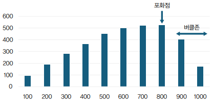

# 처음 해보는 성능 테스트를 위한 기본 정리

 - 성능 테스트 종류
 - 테스트 설계 고려 사항
 - 성능 테스트 도구
 - 실행 주의 사항

 

## 1. 성능 테스트 종류

성능 테스트는 일반적으로 특정 작업 부하 상태에서 응답성과 안정성 측면에서 시스템이 어떻게 작동하는지를 확인하기 위해 수행하는 테스트 관행이다. 응답 시간, 처리량, 자원 사용량(CPU, 메모리)을 주로 측정한다.

 - 부하 테스트
    - 특정한 예상 부하에서 시스템이 어떻게 동작하는지 확인
    - 이 테스트를 통해 주요 기능의 응답 시간과 처리량 등의 성능 지표를 확인할 수 있고, 병목을 파악하는데 도움이 된다.
 - 스트레스 테스트
    - 시스템의 최대 성능을 확인하기 위한 테스트
    - 예상을 뛰어넘는 부하가 발생했을 때, 시스템이 어디까지 성능을 낼 수 있는지를 확인한다.
 - 지속 부하 테스트
    - 시스템이 지속적인 부하를 견딜 수 있는지를 검증
    - 장시간 동안 일정 수준의 부하를 주어 성능 저하가 발생했는지 확인하며 메모리 누수도 탐지할 수 있다.
 - 스파이크 테스트
    - 급격하게 트래픽이 변화할 때 시스템의 반응성과 안정성을 검증하는 테스트
    - 순간적으로 트래픽이 급증했을 때, 성능 저하나 실패가 발생하는지를 확인한다.

 

## 2. 포화점과 버클존

성능 테스트시 일반적으로 낮은 부하에서 점진적으로 부하를 높인다. 부하를 증가시키면 초기에 처리량이 증가하면서, 일정 부하 구간에 도달하면 처리량의 증가 폭이 줄어들기 시작하고, 어느 시점부터 처리량과 응답 시간이 급격히 저하된다. 이때 성능이 저하되기 전의 최대 처리량을 포화점이라고 한다. 포화점은 시스템이 감당할 수 있는 성능 한계 지점이다.

 - 버클존: 포화점을 지나 성능이 꺾이기 시작하는 구간

    

 

## 3. 주요 측정 지표

 - `응답 시간`
    - 평균, 최대, 최소, 중앙, 99%나 95% 백분위
    - 응답 시간의 평균과 최대 값의 차이가 크다면 99%나 95% 백분위 값을 함께 확인해야 한다. 이 백분위 값이 최대 응답 시간보다 평균 값에 가깝다면 최대 값은 이상치일 수 있다.
    - 중앙 값과 평균 값의 차이도 중요하다. 응답 시간이 중앙 값보다 평균 값이 더 큰 좌편향 분포를 보인다면 이는 응답 시간이 전반적으로 평균보다 느리다는 것을 의미한다.
 - `처리량`
    - 처리량은 TSP처럼 초 단위로 얼마나 많은 요청을 처리했는지를 나타낸다.
 - `에러율`
    - 에러율은 전체 요청 중에서 에러가 발생한 비율을 의미한다.
    - 에러가 발생한다는 건 시스템이 부하를 감당하지 못하고 있다는 신호일 수 있다.
 - `CPU 사용률`
    - 일반적으로 웹 서버의 성능 문제는 DB나 외부 연동에서 발생하지만 높은 CPU 사용률로 인해 문제가 생기는 경우도 있다.

 

## 4. 성능 테스트 설계 시 고려 사항

 - 시스템의 트래픽 패턴
    - 특정 시스템은 업무 시작부터 종료 시간까지 고른 트래픽, 특정 서비스는 주중 오후 시간대에 트래픽이 급증하는 패턴을 보일 수 있다.
    - 트래픽이 짧은 시간에 증가하는 패턴을 보인다면 그에 맞춰 성능 테스트도 짧은 시간 간격으로 부하를 늘리는 방식으로 설계하고, 특정 시간에 목표하는 부하가 발생하는 경우 이에 맞는 부하가 발생하도록 성능 테스트를 설계한다.
 - 동시 요청 사용자 수/트래픽 규모
    - 한 사용자의 인증 토큰을 사용해서 모든 요청을 생성하면 시스템은 실제보다 더 좋은 성능을 낼 수 있다. (DB 캐시)
    - 사용자에 따라 조회하는 데이터가 다르다면 목표로 하는 동시 사용자 수에 맞춰 요청을 발생시킬 수 있도록 테스트를 설계한다.
  - 기능별 요청 비율
    - 자주 불리는 API 목록을 추리고 최대한 실제 호출되는 비율에 맞게 부하가 발생하도록 테스트를 설계한다.
    - 실제 불리는 비율을 고려하지 않고 1개 API에 대해서만 부하를 발생시키면 결과가 실제보다 잘 나올 수 있다.
 - 데이터 크기
    - 데이터가 100만 건이 예상되는 서비스에 대해 부하 테스트를 하는데, DB에 50건만 넣고 진행하면 의미가 없다.
    - 예상되는 규모게 맞게 테스트 데이터를 만들어야 실제에 근접한 성능 테스트 결과를 얻을 수 있다.
 - 워밍업
    - 레디스 같은 캐시를 사용시 최초에 아무 데이터가 존재하지 않으면 초기 요청은 캐시에 데이터가 없으므로 전반적으로 성능이 떨어질 것이다.
    - 부하 테스트의 목적이 트래픽이 몰리는 상황에서 캐시를 비울 때 어느 정도 성능이 나오는지 확인하기 위한 것이 아니라면 캐시가 어느정도 찬 다음에 부하 테스트를 진행해야 올바른 결과를 얻을 수 있다.
 - 적절한 목표치 설정
    - 실제 예상되는 사용자 수와 요청 건수를 감안해서 성능 목표치를 설정

 

## 5. 성능 테스트 도구

 - `nGrinder`
    - 네이버에서 개발한 부하 테스트 도구
    - 1개의 컨트롤러와 다수의 에이전트로 구성되어 있음
        - 컨트롤러는 웹 UI를 제공하고 있어 사용이 쉬움
        - 에이전트는 실제로 부하를 발생하고 테스트 대상 서버의 시스템 지표를 모니터링
        - 2개 이상의 에이전트를 사용할 수 있어 여러 장비를 활용해서 대량의 부하를 발생시킬 수 있음
 - `k6`
    - Grafana Labs에서 개발한 부하 테스트 도구
    - 고 언어로 개발됐지만 테스트 스크립트는 자바스크립트를 이용해서 작성
    - 고루틴을 사용해서 부하를 발생시키기 때문에 스레드를 사용하는 도구 대비 더 적은 자원으로 더 많은 부하를 발생할 수 있음
    - 동시에 여러 장비에서 부하를 발생시키고 싶다면 유료 버전인 k6 클라우드를 사용
    - CLI로 실행하며, 부하 테스트 결과를 콘솔에 출력
    - Prometheus나 InfluxDB 같은 곳에 결과를 저장해서 실시간 테스트 상황을 모니터링할 수 있고, 별도의 리포트 플러그인을 사용해서 HTML과 같은 형식으로 생성할 수도 있음
 - `Locust`
    - 파이썬 코드를 사용해서 테스트를 정의하며 명령행과 웹기반 UI로 테스트를 실행할 수 있음
    - 분산 환경에서 부하를 발생하는 기능을 제공하며 클라우드 버전도 제공
 - `Gatling`
    - 자바 스칼라 코틀린 자바스크립트를 이용해서 테스트 스크립트 작성
    - 웹 요청 외에 AMQP나 카프카 등 다양한 프로토콜 지원
    - 엔터프라이즈 버전을 사용하면 분산 환경에서 부하를 발생시킬 수 있음
 - `JMeter`
    - GUI 환경과 CLI 환경 지원
    - 웹 요청 외에 FTP나 DB나 TCP 등 다양한 애플리케이션과 프로토콜에 대한 테스트 지원

## 6. 성능 테스트 실행 시 주의사항

성능 테스트를 진행할 때 흔히 하는 실수 중 하나가 테스트 대상 시스템과 부하기를 한 장비에서 실행하는 것이다. 부하 생성은 그 자체로 많은 자원을 사용한다. 즉, 테스트 대상 시스템이 자원을 온전히 활용하지 못해 실제 성능보다 낮은 결과가 나온다.

서버 설정 제한을 걸고 부하 테스트를 실행하는 것도 실수이다. 예를 들어, Nginx를 사용해서 DDoS 공격을 막기 위해 limit_req_zone 설정을 사용해서 IP 당 초당 요청 개수를 10개로 제한하는 경우 많은 요청에 대한 오류 응답이 발생할 것이다.
