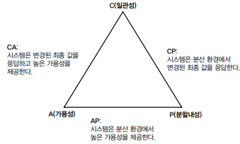

# NoSQL 이해하기

 - NoSQL이란
 - NoSQL 종류
 - 도입 고려 사항
 - CAP 정리

 

## 1. NoSQL이란

초기 NoSQL 기술은 SQL을 사용하지 않고 기존 관계형 데이터베이스와는 완전히 다른 방식을 사용했기에 NoSQL을 Non-SQL로 이해했다. 이때는 관계형 데이터베이스를 NoSQL로 대체하려는 성격이 강했다. 그러나 시간이 지나면서 필요에 따라 NoSQL과 SQL을 함께 사용하는 방식으로 발전했고 NoSQL 기술도 SQL과 유사한 언어를 지원하기 시작했다. NoSQL은 Not Only SQL의 의미로 확장되었다.

 - 대용량 데이터나 분산 처리
 - 고속의 읽기와 쓰기 성능
 - 특정한 요구 사항에 맞는 데이터 설계
 - 비정형 데이터 처리 또는 유연한 스키마

RDBMS가 고정된 스키마를 갖는 것과 비교해 NoSQL은 고정된 스키마가 없거나 유연한 스키마를 갖는다. 이는 데이터의 신규 속성 추가와 같은 구조 변화에 좀 더 유연하게 대처할 수 있도록 한다.

 

## 2. NoSQL 종류

 - `키-값 DB`
    - 자바의 Map처럼 키에 값을 매핑해서 저장한다.
    - 대표적인 키-값 DB로는 DynamoDB와 레디스가 있다.
    - 주요 용도: 세션 관리(인증 토큰), 캐시(자주 사용하는 데이터 캐싱), 설정 관리(키-값 형태의 설정값)
 - `문서 DB`
    - JSON과 유사한 문서에 저장
    - 대표적인 문서 DB로는 MongoDB가 있다.
    - 문서 모델의 특징은 스키마가 고정되어 있지 않다는 점이다.
        - 새로운 속성이 필요하면 추가하면 되고 중첩된 구조나 배열을 사용할 수 있다.
        - 애플리케이션에서 사용하는 데이터 모델과 DB에서 사용하는 데이터 모델이 거의 일치한다.
    - 주요 용도: 컨텐츠 관리(유연한 스키마를 이용해 다양한 종류의 컨텐츠 관리), 제품 카탈로그(다양한 메타데이터를 가진 카탈로그 제공)
 - `컬럼 패밀리 DB`
   - 키-값 DB의 확장 버전
   - 대표적인 컬럼 패밀리 DB로는 Cassandra와 HBase가 있다.
   - 각 DB마다 데이터 구조에는 약간의 차이가 있지만, 각 행은 여러 컬럼을 가질 수 있는데 여러 컬럼들을 그룹으로 묶어 관리한다는 공통점이 있다.
   - __알아두기 (컬럼 기반 DB)__
      - __컬럼 기반 DB 도는 컬럼형 DB는 컬럼 패밀리 DB와 다르다.__
         - RDBMS에서 테이블은 일반적으로 행 단위로 데이터를 저장하는 반면 컬럼 기반 DB는 컬럼 단위로 데이터를 저장한다.
      - 컬럼 기반 DB는 OLAP와 같이 데이터 분석 목적으로 주로 사용
      - 컬럼 기반 DB에는 Clickhouse와 MariaDB의 ColumnStore 등이 있다.
 - `그래프 DB`
   - 데이터를 그래프 형태로 관리
   - 노드 데이터가 있고 노드와 노드를 연결하는 엣지 데이터가 존재. 노드와 엣지로 데이터의 관계를 표현하며 노드와 엣지는 필요한 프로퍼티를 가짐.
   - 대표적인 그래프 DB로는 Neo4J가 있다.
   - 주요 용도: 소셜 (소셜 네트워크), 추천 (사용자 관계에 기반한 친구 추천, 사용자 활동에 기반한 상품 추천), 부정 탐지(관계에 대한 패턴 이용)

 

## 3. NoSQL 도입 시 고려 사항

 - `1. 트랜잭션 지원 여부`
   - 다수의 NoSQL은 RDBMS가 지원하는 수준의 트랜잭션을 지원하지 않음
   - 도입하려는 NoSQL이 ACID를 지원하는지 확인하고 검증 필요
   - RDBMS와 NoSQL을 함께 사용할 경우 두 데이터 저장소 간의 데이터 동기화 고려
 - `2. 데이터 모델이 요구사항에 적합한지 확인`
   - NoSQL마다 지원하는 데이터 모델이 있음
   - 질둡, 답변 같은 계층 관계를 갖고 있는 모델은 문서 DB를 사용하면 알맞게 표현 가능하지만, 단순 캐시가 필요한 경우에는 문서 DB보다 키-값 DB가 적당
 - `3. 확장성과 성능 요구`
   - 대부분 NoSQL은 RDBMS보다 확장성과 속도가 빠른 반면, 높은 일관성 대신 궁극적 일관성을 지원
   - 성능보다 일관성이 중요한 서비스에서는 NoSQL의 일관성 특징이 요구를 충족하는지 검증 필요
 - `4. 운영과 개발 역량`
   - NoSQL을 도입할 때 팀이 가진 경험을 고려

 

## 4. CAP 정리

 - 일관성(C, Consistency): 모든 노드가 같은 순간에 같은 데이터를 볼 수 있다. 한 노드의 데이터가 변경되면 모든 노드의 데이터도 동일한 값으로 바뀐다.
 - 가용성 (A, Availability): 모든 요청이 성공 또는 실패 결과를 반환할 수 있다.
 - 분할내성 (P, Partition tolerance): 네트워크 장애가 발생해도 시스템이 계속 동작할 수 있다.

   

 

 - CA
   - 모든 노드에서 일관성과 가용성 제공
   - 모든 노드에서 변경된 최종 값을 사용하고 일부 노드가 다운되어도 나머지 노드가 정상 동작
   - RDBMS가 CA에 해당
 - AP
   - 가용성을 우선하며 분할내성을 제공
   - 노드 간에 네트워크 분할이 발생하면 일관성을 포기하고 기능을 계속 (가용성)
   - Cassandra가 AP에 해당
 - CP
   - 일관성을 우선하며 분할내성을 제공
   - 네트워크 분할이 발생하면 일관성을 보장할 수 없으므로 분할이 해결될 때까지 기능 차단
   - MongoDB가 CP에 해당

NoSQL은 가용성(AP)이나 일관성(CP)을 우선하는 설계를 선택
